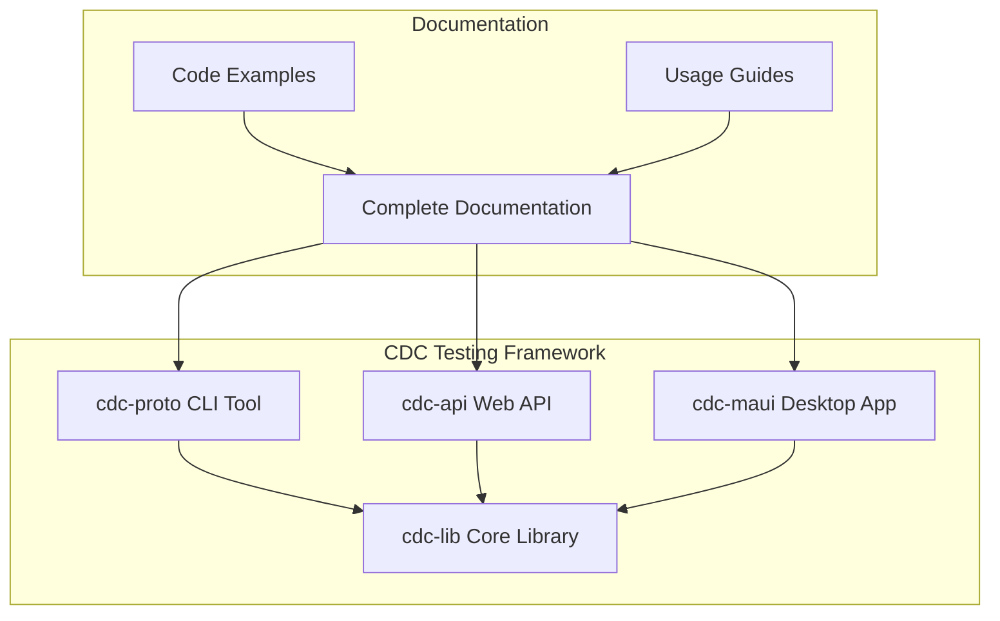

# CDC Testing Framework Documentation

Welcome to the comprehensive documentation for the CDC Testing Framework. This documentation covers all aspects of the framework, from basic setup to advanced deployment scenarios.

## 📚 Documentation Index

### Getting Started

- **[Getting Started Guide](getting-started.md)** - Complete setup instructions and first-run tutorial
- **[Database Setup](database-setup.md)** - SQL Server and CDC configuration requirements
- **[Architecture Overview](architecture.md)** - System design and component relationships

### Component Documentation

- **[CDC Library](cdc-library.md)** - Core library API reference and functionality
- **[CLI Tool](cli-tool.md)** - Command-line interface complete reference
- **[Web API](web-api.md)** - REST API endpoints and usage guide
- **[MAUI Application](maui-app.md)** - Desktop application features and usage

### Advanced Topics

- **[Usage Examples](usage-examples.md)** - Practical workflows and real-world scenarios
- **[Code Examples](code-examples.md)** - Implementation patterns and sample code
- **[Deployment Guide](deployment.md)** - Production deployment strategies and configuration
- **[Troubleshooting](troubleshooting.md)** - Common issues and solutions

## 🚀 Quick Navigation

### For Developers

1. Start with [Getting Started Guide](getting-started.md)
2. Review [Architecture Overview](architecture.md)
3. Explore [Code Examples](code-examples.md)
4. Check [CLI Tool](cli-tool.md) for automation

### For DevOps/Infrastructure

1. Review [Database Setup](database-setup.md)
2. Study [Deployment Guide](deployment.md)
3. Configure monitoring using [Troubleshooting](troubleshooting.md)

### For End Users

1. Begin with [Getting Started Guide](getting-started.md)
2. Use [MAUI Application](maui-app.md) for GUI operations
3. Reference [Usage Examples](usage-examples.md) for workflows

## 🎯 Key Concepts

### Change Data Capture (CDC)

The framework leverages SQL Server's built-in Change Data Capture functionality to monitor and record all data modifications in real-time.

### Profile Generation

Profiles are JSON snapshots of database changes that can be compared to validate data consistency across different scenarios.

### Difference Analysis

The framework provides sophisticated comparison tools to identify and analyze differences between profiles, ensuring data integrity.

### Repeatable Testing

The core workflow enables teams to create reproducible testing environments for validating database changes and optimizations.

## 🔧 Framework Components

## 📖 Documentation Features

### Comprehensive Coverage

- **Complete API Reference** - Every class, method, and property documented
- **Step-by-Step Guides** - Detailed instructions for all operations
- **Real-World Examples** - Practical scenarios and use cases
- **Troubleshooting** - Solutions to common issues and problems

### Multiple Formats

- **Markdown Documentation** - Easy to read and navigate
- **Code Examples** - Copy-paste ready implementations
- **Mermaid Diagrams** - Visual architecture and workflow representations
- **Configuration Samples** - Ready-to-use configuration files

### Target Audiences

- **Developers** - Implementation guides and API references
- **DevOps Engineers** - Deployment and configuration documentation
- **Database Administrators** - CDC setup and maintenance guides
- **End Users** - Application usage and workflow documentation

## 🛠️ Common Workflows

### Basic Testing Workflow

1. [Initialize CDC](cli-tool.md#init---initialize-cdc) on your database
2. Run your test scenarios
3. [Generate a profile](cli-tool.md#profile---generate-data-profile) to capture changes
4. Reset your database state
5. Run optimized/alternative scenarios
6. [Generate another profile](cli-tool.md#profile---generate-data-profile)
7. [Compare profiles](cli-tool.md#diff---compare-profiles) to validate consistency

### Performance Testing Workflow

1. Capture baseline performance and data changes
2. Apply optimizations or changes
3. Capture optimized performance and data changes
4. Compare to ensure data consistency while measuring performance improvements

### Multi-Environment Testing

1. Run identical scenarios across development, staging, and production environments
2. Generate profiles for each environment
3. Compare profiles to ensure consistency across environments

## 🔍 Finding Information

### By Task

- **Setting up the framework**: [Getting Started Guide](getting-started.md)
- **Understanding the architecture**: [Architecture Overview](architecture.md)
- **Using the CLI**: [CLI Tool Documentation](cli-tool.md)
- **Building integrations**: [Web API Documentation](web-api.md)
- **Deploying to production**: [Deployment Guide](deployment.md)
- **Solving problems**: [Troubleshooting Guide](troubleshooting.md)

### By Component

- **Core Library**: [CDC Library Documentation](cdc-library.md)
- **Command Line**: [CLI Tool Documentation](cli-tool.md)
- **Web API**: [Web API Documentation](web-api.md)
- **Desktop App**: [MAUI Application Documentation](maui-app.md)

### By Skill Level

- **Beginner**: Start with [Getting Started Guide](getting-started.md)
- **Intermediate**: Review [Usage Examples](usage-examples.md)
- **Advanced**: Study [Code Examples](code-examples.md) and [Deployment Guide](deployment.md)

## 📋 Prerequisites Summary

### System Requirements

- **.NET 6.0** or later
- **SQL Server 2016+** (Standard/Enterprise/Developer Edition)
- **SQL Server Agent** (must be running)
- **Windows/macOS/Linux** (component dependent)

### Permissions Required

- **Database**: `db_owner` role or specific CDC permissions
- **File System**: Read/write access for profile storage
- **Network**: Connectivity to SQL Server instances

## 🤝 Contributing to Documentation

The documentation is written in Markdown and stored in the `docs/` folder. To contribute:

1. **Fork the repository**
2. **Make your changes** to the relevant documentation files
3. **Test your changes** by reviewing the rendered Markdown
4. **Submit a pull request** with a clear description of your improvements

### Documentation Standards

- Use clear, concise language
- Include code examples where appropriate
- Add diagrams for complex concepts
- Test all code examples before submitting
- Follow the existing structure and formatting

## 📞 Getting Help

### Documentation Issues

- **Missing Information**: Check if it's covered in another section
- **Unclear Instructions**: Refer to [Code Examples](code-examples.md) for implementation details
- **Technical Problems**: Consult [Troubleshooting Guide](troubleshooting.md)

### Community Support

- **GitHub Issues**: Report bugs and request features
- **Discussions**: Ask questions and share experiences
- **Pull Requests**: Contribute improvements and fixes

---

**Note**: This documentation covers a research project exploring repeatable database testing environments. While functional, evaluate and test thoroughly in your specific environment before production use.

## 📄 License

This documentation is part of the CDC Testing Framework project and is licensed under the MIT License.
