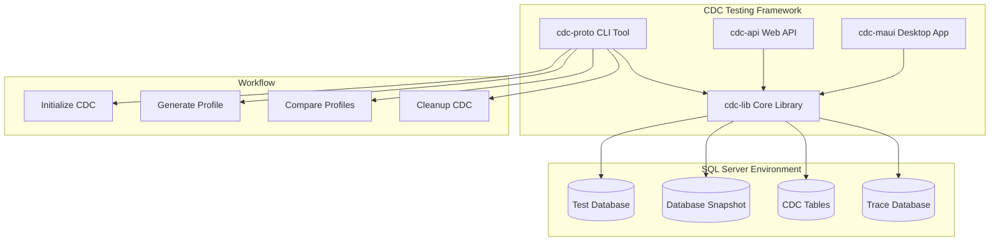
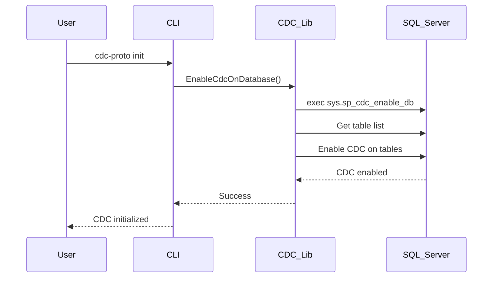
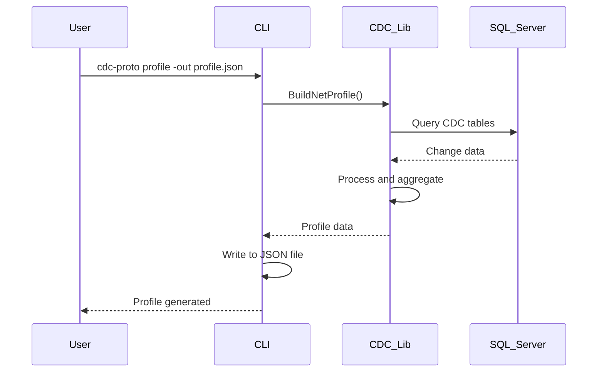
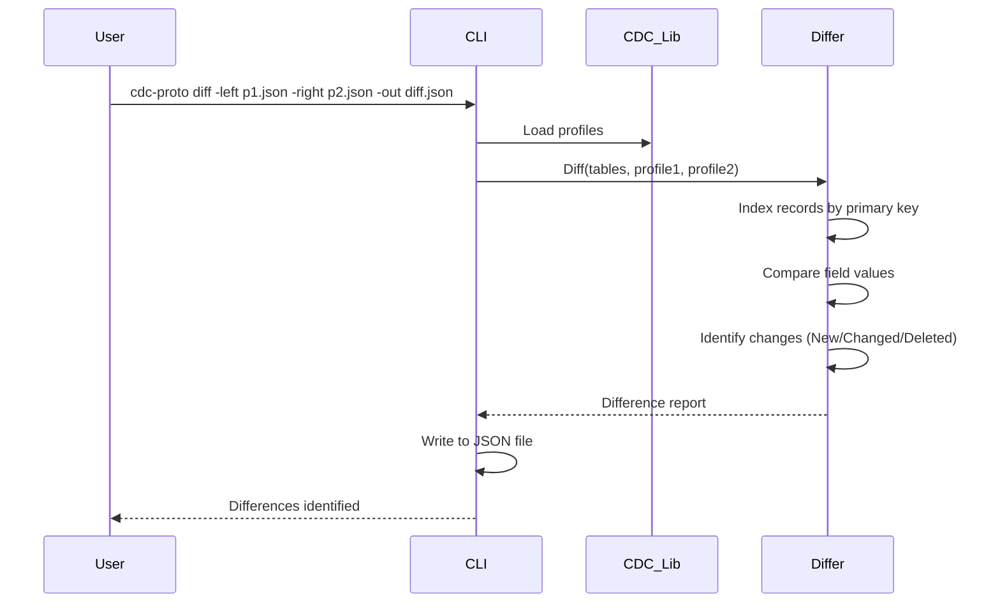

# CDC Testing Framework - Architecture Overview

## Project Overview

The CDC Testing Framework is a research project designed to create a repeatable testing environment for database change validation using SQL Server's Change Data Capture (CDC) functionality. The framework enables teams to capture, replay, and compare database changes to ensure data consistency across different implementations and performance optimizations.

## Core Concept

The framework implements a sophisticated workflow for database testing:

1. **Snapshot Creation**: Create named database snapshots as baseline states
2. **Change Capture**: Enable CDC and trace functionality to monitor data modifications
3. **Scenario Execution**: Run test scenarios while capturing all changes
4. **Data Profiling**: Extract and store CDC data for analysis
5. **Replay & Validation**: Restore snapshots, replay changes, and compare results
6. **Performance Testing**: Validate that optimized procedures produce identical data changes

## Solution Architecture



## Project Structure

### [`cdc-lib`](../cdc-lib/) - Core Library

The foundational library containing all CDC functionality and data models.

**Key Components:**

- **CDC Data Utilities**: Core CDC operations (enable/disable, table management)
- **Profile Generation**: Create data profiles from CDC tables
- **Difference Engine**: Compare profiles and identify changes
- **Data Access Layer**: SQL Server connectivity and query execution
- **Schema Utilities**: Database schema introspection and manipulation

### [`cdc-proto`](../cdc-proto/) - Command Line Interface

A console application providing command-line access to CDC operations.

**Available Commands:**

- `init` - Initialize CDC on a database
- `profile` - Generate data profiles from CDC tables
- `diff` - Compare two profiles and generate difference reports
- `teardown` - Clean up CDC configuration

### [`cdc-api`](../cdc-api/) - Web API

ASP.NET Core Web API providing HTTP endpoints for CDC operations.

**Features:**

- RESTful API for CDC operations
- Process spawning capabilities for external tools
- Swagger/OpenAPI documentation
- Development and production configurations

### [`cdc-maui`](../cdc-maui/) - Desktop Application

.NET MAUI cross-platform desktop application for visual CDC management.

**Platforms:**

- Windows
- macOS (via Mac Catalyst)
- iOS (future)
- Android (future)

## Key Technologies

- **.NET 6+**: Modern .NET framework
- **SQL Server**: Database platform with CDC support
- **System.CommandLine**: Modern command-line parsing
- **ASP.NET Core**: Web API framework
- **.NET MAUI**: Cross-platform UI framework
- **Newtonsoft.Json**: JSON serialization
- **Microsoft.Extensions.Logging**: Structured logging

## Data Flow

### 1. Initialization Phase



### 2. Profile Generation



### 3. Difference Analysis



## Core Models

### SqlTable

Represents a database table with its schema information and indexes.

```csharp
public class SqlTable
{
    public string Catalog { get; set; }
    public string Schema { get; set; }
    public string Name { get; set; }
    public IEnumerable<SqlIndex> Indexes { get; set; }
    public bool HasPrimaryKey { get; }
    public SqlIndex? GetPrimaryIndex();
}
```

### SqlIndex

Represents a database index with its properties.

```csharp
public class SqlIndex
{
    public string IndexName { get; }
    public string IndexType { get; }
    public string IndexKeys { get; }
}
```

### ProfileDiffer

Compares two data profiles and identifies differences.

```csharp
public class ProfileDiffer
{
    public IDictionary<string, IDictionary<string,object>> Diff(
        IEnumerable<SqlTable> tables,
        IDictionary<string, IEnumerable<IDictionary<string, object>>> leftProfile,
        IDictionary<string, IEnumerable<IDictionary<string, object>>> rightProfile);
}
```

## Configuration

### Connection Strings

The framework uses SQL Server connection strings for database connectivity:

```csharp
var connectionString = "Server=192.168.1.76,5433;Database=sbcrm;User Id=sa;Password=A123_Z321!;";
```

### CDC Table Naming Convention

CDC tables follow SQL Server's standard naming pattern:

- Format: `[cdc].[{schema}_{table}_CT]`
- Example: `[cdc].[dbo_Customers_CT]`

### Profile Storage

Profiles are stored as JSON files containing:

- Table-level change data
- Record-level modifications
- Metadata about changes (LSN, operation type)

## Security Considerations

- **Database Permissions**: Requires `db_owner` or CDC-specific permissions
- **Connection Security**: Uses SQL Server authentication (consider Windows Auth for production)
- **File System Access**: CLI tools require write access for profile storage
- **Network Security**: API endpoints should be secured in production environments

## Performance Considerations

- **CDC Overhead**: Enabling CDC adds overhead to DML operations
- **Storage Requirements**: CDC tables can grow large with high-volume changes
- **Query Performance**: Profile generation queries can be resource-intensive
- **Memory Usage**: Large profiles may require significant memory for processing

## Extensibility Points

The framework is designed for extensibility:

1. **Custom Comparers**: Implement custom logic for specific data types
2. **Additional Commands**: Extend the CLI with new operations
3. **API Endpoints**: Add new HTTP endpoints for specific workflows
4. **UI Components**: Extend the MAUI application with additional views
5. **Data Exporters**: Add support for different output formats

## Future Enhancements

Based on the research goals, potential enhancements include:

1. **Trace Integration**: Capture and replay SQL traces alongside CDC data
2. **Snapshot Management**: Automated database snapshot creation and restoration
3. **Performance Metrics**: Capture timing and resource usage data
4. **Automated Testing**: Integration with testing frameworks
5. **Reporting**: Enhanced visualization and reporting capabilities
