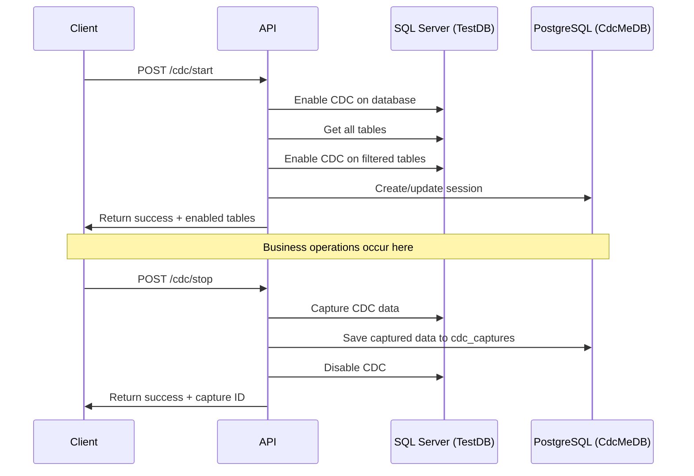

# CDC API Design Document

## Overview

This document outlines the design for exposing CDC (Change Data Capture) capabilities through REST API endpoints in the CDC Testing Framework. The API will provide three main operations: starting CDC, stopping CDC with data capture, and optional real-time data capture.

## Background

The CDC Testing Framework uses SQL Server's Change Data Capture functionality to monitor and capture database changes during testing scenarios. Currently, these capabilities are only available through the [`CdcDataUtilities`](../cdc-lib/Cdc/CdcDataUtilities.cs) class. This design exposes these capabilities through a REST API for easier integration and automation.

## API Endpoints

### 1. POST /cdc/start

**Purpose**: Enable CDC on the database and specified tables

**Request Body**:

```json
{
  "sessionName": "my-cdc-session", // Required: Name for the CDC session
  "tablesToInclude": ["dbo.Orders"], // Optional: specific tables to include
  "tablesToExclude": ["dbo.AuditLog"] // Optional: tables to exclude
}
```

**Response**:

```json
{
  "success": true,
  "sessionName": "my-cdc-session",
  "message": "CDC enabled successfully",
  "tablesEnabled": ["dbo.Orders", "dbo.Customers"],
  "tablesSkipped": ["dbo.AuditLog"],
  "errors": []
}
```

**Behavior**:

- Calls [`CdcDataUtilities.EnableCdcOnDatabase()`](../cdc-lib/Cdc/CdcDataUtilities.cs#L12)
- Gets all tables using [`CdcDataUtilities.GetTables()`](../cdc-lib/Cdc/CdcDataUtilities.cs#L166)
- Applies table filtering logic (include/exclude)
- Calls [`CdcDataUtilities.EnableTableCdc()`](../cdc-lib/Cdc/CdcDataUtilities.cs#L143) for filtered tables
- Creates or updates session in [`trace_sessions`](../scripts/create-trace-database-postgresql-part2.sql#L12) table

### 2. POST /cdc/stop

**Purpose**: Capture CDC data, save to CdcMe database, and disable CDC

**Request Body**:

```json
{
  "sessionName": "my-cdc-session", // Required: Session name to save under
  "captureName": "baseline-capture", // Required: Name for this capture
  "captureType": "Baseline" // Optional: Baseline, Replay, Optimized
}
```

**Response**:

```json
{
  "success": true,
  "sessionName": "my-cdc-session",
  "captureName": "baseline-capture",
  "captureHeaderId": "uuid-for-header",
  "message": "CDC data captured and CDC disabled successfully",
  "tablesEnabled": ["dbo.Orders", "dbo.Customers"],
  "tablesSkipped": ["dbo.AuditLog"],
  "tablesWithChanges": ["dbo.Orders", "dbo.Customers"],
  "totalRecords": 150,
  "tableDetails": [
    {
      "tableName": "dbo.Orders",
      "recordCount": 100,
      "captureId": "uuid-for-table-capture"
    },
    {
      "tableName": "dbo.Customers",
      "recordCount": 50,
      "captureId": "uuid-for-table-capture"
    }
  ],
  "errors": []
}
```

**Behavior**:

- Calls [`CdcDataUtilities.BuildProfile()`](../cdc-lib/Cdc/CdcDataUtilities.cs#L24) to capture CDC data
- Creates header record in `cdc_capture_headers` with capture metadata
- For each table with CDC data:
  - Transforms data to JSON and calculates SHA256 hash
  - Creates detail record in `cdc_captures` table
- Calls [`CdcDataUtilities.DisableCdcOnDatabase()`](../cdc-lib/Cdc/CdcDataUtilities.cs#L18)
- Returns capture header ID and table details for future reference

### 3. POST /cdc/capture (Optional)

**Purpose**: Capture CDC data without stopping CDC (for intermediate captures)

**Request Body**:

```json
{
  "sessionName": "my-cdc-session",
  "captureName": "intermediate-capture",
  "captureType": "Intermediate"
}
```

**Response**: Similar to stop endpoint but without disabling CDC

## Database Integration

### Database Roles

- **TestDatabase** (SQL Server): Where CDC operations are performed
- **CdcMeDatabase** (PostgreSQL): Where captured data is stored

### Data Storage Schema

The captured CDC data will be stored using a header-detail pattern with two tables:

#### CDC Capture Headers (NEW)

```sql
CREATE TABLE cdc_capture_headers (
    capture_header_id UUID PRIMARY KEY DEFAULT gen_random_uuid(),
    session_id UUID NOT NULL REFERENCES trace_sessions(session_id),
    capture_name VARCHAR(255) NOT NULL,
    capture_type VARCHAR(50) NOT NULL,
    capture_time TIMESTAMP WITH TIME ZONE NOT NULL DEFAULT NOW(),
    tables_to_include JSONB,
    tables_to_exclude JSONB,
    tables_enabled JSONB NOT NULL,
    tables_skipped JSONB,
    total_records INTEGER NOT NULL DEFAULT 0,
    status VARCHAR(50) NOT NULL DEFAULT 'Completed',
    error_messages JSONB,
    created_by VARCHAR(128) NOT NULL DEFAULT current_user,
    description TEXT
);
```

#### CDC Captures (MODIFIED)

```sql
CREATE TABLE cdc_captures (
    capture_id UUID PRIMARY KEY DEFAULT gen_random_uuid(),
    capture_header_id UUID NOT NULL REFERENCES cdc_capture_headers(capture_header_id),
    table_name VARCHAR(256) NOT NULL,
    capture_data JSONB NOT NULL,
    record_count INTEGER NOT NULL,
    data_hash VARCHAR(64)
);
```

### Session Management

Sessions will be managed through the existing [`trace_sessions`](../scripts/create-trace-database-postgresql-part2.sql#L12) table. Each CDC capture operation creates:

1. **Header Record**: Overall capture metadata in `cdc_capture_headers`
2. **Detail Records**: Per-table CDC data in `cdc_captures`

## Table Filtering Logic

The API will support flexible table filtering:

1. **Default Behavior**: If no filters specified, include all user tables (excluding system tables)
2. **Include Filter**: If `tablesToInclude` is provided, only enable CDC on those tables
3. **Exclude Filter**: If `tablesToExclude` is provided, exclude those tables from the default set
4. **Combined Filters**: If both are provided, start with `tablesToInclude` and then remove `tablesToExclude`

**Filter Format**: Tables should be specified as `"schema.tablename"` (e.g., `"dbo.Orders"`)

## Error Handling

- **Per-table errors**: If CDC enablement fails for individual tables, capture the error but continue with other tables
- **Database-level errors**: If database-level CDC enablement fails, return error immediately
- **Session errors**: If session creation/update fails, return error with details
- **Persistence errors**: If saving to CdcMe database fails, return error with captured data details

## Workflow Example



## Implementation Considerations

### Dependencies

- [`IDatabaseConnectionFactory`](../cdc-lib/Data/DatabaseConnectionFactory.cs#L23) for database connections
- [`CdcDataUtilities`](../cdc-lib/Cdc/CdcDataUtilities.cs#L9) for CDC operations
- JSON serialization for data transformation
- SHA256 hashing for data integrity

### Performance

- CDC data capture can be large; consider streaming for large datasets
- Table filtering reduces overhead by only monitoring relevant tables
- Hash calculation enables quick data comparison

### Security

- Validate session names to prevent injection attacks
- Sanitize table names in filters
- Ensure proper database permissions for CDC operations

## Open Questions

1. **Session Lifecycle**: Should sessions be automatically cleaned up after a certain period?
2. **Data Retention**: How long should captured CDC data be retained in the CdcMe database?
3. **Concurrent Sessions**: Should multiple CDC sessions be allowed simultaneously?
4. **Capture Size Limits**: Should there be limits on the amount of data captured?
5. **Real-time Monitoring**: Should there be endpoints to monitor CDC status in real-time?

## Next Steps

1. Review and approve this design
2. Create detailed implementation plan
3. Implement request/response models
4. Update CdcController with new endpoints
5. Add comprehensive error handling
6. Create unit tests
7. Update API documentation
