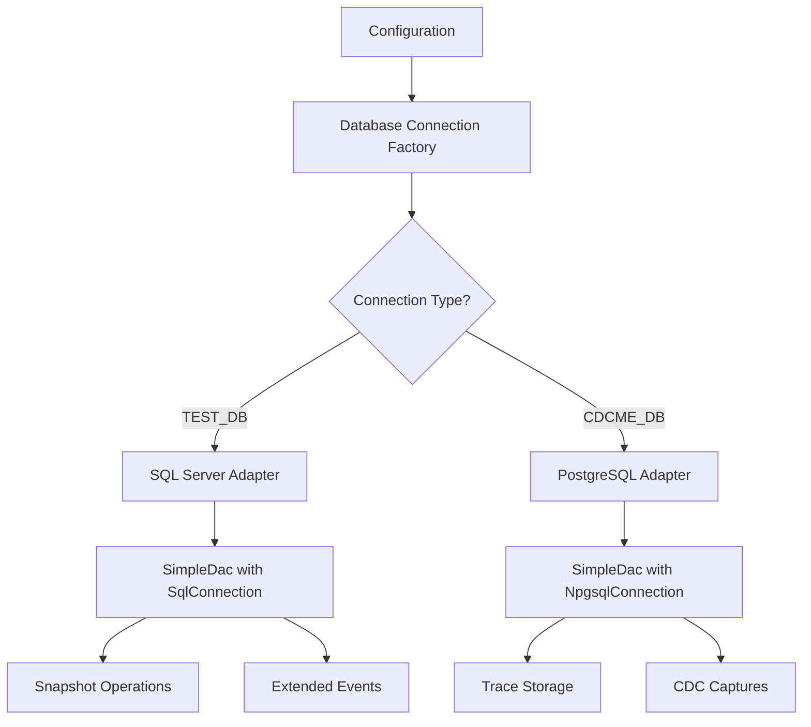

# Database Configuration Cleanup Implementation Plan

## Overview

This document outlines the comprehensive plan to clean up and fix database configuration issues in the CDC-ME project. The current system has confusing connection strings and inconsistent database adapter selection that needs to be centralized and clarified.

## Current Problems

### 1. Confusing and Redundant Connection Strings

The current `.env` file contains:

- `POSTGRES_CONNECTION_STRING` - unclear purpose
- `SQLSERVER_CONNECTION_STRING` - unclear purpose
- `CDC_TEST_CONNECTION` - should be TEST_DB
- `CDC_TRACE_CONNECTION` - should be CDCME_DB
- `CDC_SQL_CONNECTION` - redundant with CDC_TEST_CONNECTION

### 2. Hardcoded Database Types

- `SimpleDac` always creates `SqlConnection` regardless of connection string
- No abstraction for different database providers at the data access level

### 3. Inconsistent Adapter Selection

- `Program.cs` selects trace provider based on `TraceProvider` config
- But `SimpleDac` is hardcoded to SQL Server
- `TraceManager` uses SimpleDac for TEST_DB operations but ITraceDataProvider for CDCME_DB

### 4. Mixed Responsibilities

- `SnapshotManager` uses SimpleDac but snapshots should always operate against TEST_DB (SQL Server)
- `TraceManager` mixes TEST_DB operations (Extended Events) with CDCME_DB operations (trace storage)

### 5. CLI Tool Issues

- `cdc-proto/Program.cs` has hardcoded connection string
- No proper configuration management for different database types

## Architecture Design

### Database Role Clarification

- **TEST_DB**: Always SQL Server - the database being tested with CDC/traces enabled
- **CDCME_DB**: PostgreSQL - stores trace sessions, events, CDC captures, and comparison results

### Centralized Adapter Selection Strategy



### Key Design Principles

1. **Single Responsibility**: Each database connection serves a specific purpose
2. **Centralized Decision Making**: One place determines which adapter to use
3. **Clear Configuration**: Environment variables clearly indicate database roles
4. **Type Safety**: Compile-time guarantees about database operations
5. **Testability**: Easy to mock and test different database scenarios

## Implementation Plan

### Phase 1: Configuration & Infrastructure

#### Step 1: Clean up .env file structure

**New .env structure:**

```env
# TEST_DB - SQL Server database under test (CDC/traces enabled)
TEST_DB_CONNECTION=Server=blue.local;Database=master;User Id=sa;Password=A123_Z321!;TrustServerCertificate=true;

# CDCME_DB - PostgreSQL database for storing trace data and CDC snapshots
CDCME_DB_CONNECTION=Host=blue.local;Database=cdcme;Username=postgres;Password=A123_Z321!

# Optional: Override database types (defaults: TEST_DB=SqlServer, CDCME_DB=PostgreSQL)
TEST_DB_PROVIDER=SqlServer
CDCME_DB_PROVIDER=PostgreSQL
```

**Update .env.example:**

```env
# TEST_DB - SQL Server database under test (CDC/traces enabled)
TEST_DB_CONNECTION=Server=your-sqlserver-host;Database=your-test-database;User Id=your-username;Password=your-password;TrustServerCertificate=true;

# CDCME_DB - PostgreSQL database for storing trace data and CDC snapshots
CDCME_DB_CONNECTION=Host=your-postgres-host;Database=cdcme;Username=your-postgres-username;Password=your-postgres-password

# Optional: Override database types (defaults: TEST_DB=SqlServer, CDCME_DB=PostgreSQL)
TEST_DB_PROVIDER=SqlServer
CDCME_DB_PROVIDER=PostgreSQL
```

#### Step 2: Create Database Connection Factory

**New file: `cdc-lib/Data/DatabaseConnectionFactory.cs`**

```csharp
using System;
using System.Data;
using System.Data.SqlClient;
using Microsoft.Extensions.Configuration;
using Microsoft.Extensions.Logging;
using Npgsql;

namespace Softbase.Cdc.Data
{
    public enum DatabaseRole
    {
        TestDatabase,    // The database being tested (always SQL Server)
        CdcMeDatabase   // Storage for traces/snapshots (PostgreSQL)
    }

    public enum DatabaseProvider
    {
        SqlServer,
        PostgreSQL
    }

    public interface IDatabaseConnectionFactory
    {
        IDbConnection CreateConnection(DatabaseRole role);
        SimpleDac CreateDac(DatabaseRole role, ILogger logger);
        string GetConnectionString(DatabaseRole role);
        DatabaseProvider GetProvider(DatabaseRole role);
        Task<bool> TestConnectionAsync(DatabaseRole role);
    }

    public class DatabaseConnectionFactory : IDatabaseConnectionFactory
    {
        private readonly IConfiguration _configuration;
        private readonly ILogger<DatabaseConnectionFactory> _logger;

        public DatabaseConnectionFactory(IConfiguration configuration, ILogger<DatabaseConnectionFactory> logger)
        {
            _configuration = configuration ?? throw new ArgumentNullException(nameof(configuration));
            _logger = logger ?? throw new ArgumentNullException(nameof(logger));
        }

        public IDbConnection CreateConnection(DatabaseRole role)
        {
            var connectionString = GetConnectionString(role);
            var provider = GetProvider(role);

            return provider switch
            {
                DatabaseProvider.SqlServer => new SqlConnection(connectionString),
                DatabaseProvider.PostgreSQL => new NpgsqlConnection(connectionString),
                _ => throw new NotSupportedException($"Provider {provider} not supported")
            };
        }

        public SimpleDac CreateDac(DatabaseRole role, ILogger logger)
        {
            var connectionString = GetConnectionString(role);
            var provider = GetProvider(role);
            return new SimpleDac(connectionString, provider, logger);
        }

        public string GetConnectionString(DatabaseRole role)
        {
            var key = role switch
            {
                DatabaseRole.TestDatabase => "TEST_DB_CONNECTION",
                DatabaseRole.CdcMeDatabase => "CDCME_DB_CONNECTION",
                _ => throw new ArgumentException($"Unknown database role: {role}")
            };

            var connectionString = _configuration.GetConnectionString(key)
                                 ?? _configuration[key];

            if (string.IsNullOrEmpty(connectionString))
            {
                throw new InvalidOperationException($"Connection string for {role} not found. Expected key: {key}");
            }

            return connectionString;
        }

        public DatabaseProvider GetProvider(DatabaseRole role)
        {
            var key = role switch
            {
                DatabaseRole.TestDatabase => "TEST_DB_PROVIDER",
                DatabaseRole.CdcMeDatabase => "CDCME_DB_PROVIDER",
                _ => throw new ArgumentException($"Unknown database role: {role}")
            };

            var providerString = _configuration[key];

            // Default providers based on role
            var defaultProvider = role switch
            {
                DatabaseRole.TestDatabase => DatabaseProvider.SqlServer,
                DatabaseRole.CdcMeDatabase => DatabaseProvider.PostgreSQL,
                _ => throw new ArgumentException($"Unknown database role: {role}")
            };

            if (string.IsNullOrEmpty(providerString))
            {
                return defaultProvider;
            }

            return Enum.Parse<DatabaseProvider>(providerString, ignoreCase: true);
        }

        public async Task<bool> TestConnectionAsync(DatabaseRole role)
        {
            try
            {
                using var connection = CreateConnection(role);
                await connection.OpenAsync();
                _logger.LogInformation("Successfully tested connection for {Role}", role);
                return true;
            }
            catch (Exception ex)
            {
                _logger.LogError(ex, "Failed to test connection for {Role}", role);
                return false;
            }
        }
    }
}
```

#### Step 3: Update SimpleDac to support multiple providers

**Modify `cdc-lib/Data/SimpleDac.cs`:**

```csharp
// Add new constructor and provider support
private readonly DatabaseProvider _provider;

public SimpleDac(string connectionString, DatabaseProvider provider, ILogger logger)
{
    _connectionString = connectionString;
    _provider = provider;
    _logger = logger;
}

// Keep existing constructor for backward compatibility
public SimpleDac(string connectionString, ILogger logger)
    : this(connectionString, DatabaseProvider.SqlServer, logger)
{
}

private IDbConnection OpenConnection()
{
    if (_connectionString != null)
    {
        _connection = _provider switch
        {
            DatabaseProvider.SqlServer => new SqlConnection(_connectionString),
            DatabaseProvider.PostgreSQL => new NpgsqlConnection(_connectionString),
            _ => throw new NotSupportedException($"Provider {_provider} not supported")
        };
        _connection.Open();
        return _connection;
    }
    else if (_connection != null)
    {
        if (_connection.State != ConnectionState.Open && _connection.State != ConnectionState.Connecting)
            _connection.Open();
        return _connection;
    }

    throw new InvalidOperationException("No connection string or connection specified!");
}
```

### Phase 2: API Integration

#### Step 4: Update Program.cs dependency injection

**Modify `cdc-api/Program.cs`:**

```csharp
// Add database connection factory
builder.Services.AddSingleton<IDatabaseConnectionFactory, DatabaseConnectionFactory>();

// Register TEST_DB SimpleDac (for snapshots and Extended Events)
builder.Services.AddScoped<SimpleDac>(serviceProvider =>
{
    var factory = serviceProvider.GetRequiredService<IDatabaseConnectionFactory>();
    var logger = serviceProvider.GetRequiredService<ILogger<SimpleDac>>();
    return factory.CreateDac(DatabaseRole.TestDatabase, logger);
});

// Register TraceStorageConfiguration for CDCME_DB
builder.Services.AddScoped<TraceStorageConfiguration>(serviceProvider =>
{
    var factory = serviceProvider.GetRequiredService<IDatabaseConnectionFactory>();
    var connectionString = factory.GetConnectionString(DatabaseRole.CdcMeDatabase);
    var provider = factory.GetProvider(DatabaseRole.CdcMeDatabase);

    return new TraceStorageConfiguration
    {
        Provider = provider.ToString(),
        ConnectionString = connectionString,
        AutoCreateSchema = true,
        CommandTimeout = 30,
        SchemaName = provider == DatabaseProvider.PostgreSQL ? "public" : "dbo"
    };
});

// Register trace data provider (always PostgreSQL for CDCME_DB)
builder.Services.AddScoped<ITraceDataProvider, PostgreSqlTraceProvider>(serviceProvider =>
{
    var config = serviceProvider.GetRequiredService<TraceStorageConfiguration>();
    var logger = serviceProvider.GetRequiredService<ILogger<PostgreSqlTraceProvider>>();
    return new PostgreSqlTraceProvider(config, logger);
});

// Update other services to use factory
builder.Services.AddScoped<SnapshotManager>(serviceProvider =>
{
    var factory = serviceProvider.GetRequiredService<IDatabaseConnectionFactory>();
    var logger = serviceProvider.GetRequiredService<ILogger<SnapshotManager>>();
    var testDbDac = factory.CreateDac(DatabaseRole.TestDatabase, logger);
    return new SnapshotManager(testDbDac, logger);
});

builder.Services.AddScoped<TraceManager>(serviceProvider =>
{
    var factory = serviceProvider.GetRequiredService<IDatabaseConnectionFactory>();
    var traceProvider = serviceProvider.GetRequiredService<ITraceDataProvider>();
    var logger = serviceProvider.GetRequiredService<ILogger<TraceManager>>();
    var testDbDac = factory.CreateDac(DatabaseRole.TestDatabase, logger);
    return new TraceManager(testDbDac, traceProvider, logger);
});
```

#### Step 5: Update Controllers

Controllers should not need changes as they use the injected services, but we should verify they work correctly with the new configuration.

### Phase 3: CLI Tool Updates

#### Step 6: Update CLI tool configuration

**Modify `cdc-proto/Program.cs`:**

```csharp
private static ServiceProvider BuildServiceProvider()
{
    var services = new ServiceCollection();

    // Load configuration from environment variables
    var config = new ConfigurationBuilder()
        .AddEnvironmentVariables()
        .Build();

    services.AddLogging(c => c.AddConsole().AddDebug());
    services.AddSingleton<IConfiguration>(config);

    // Add database connection factory
    services.AddSingleton<IDatabaseConnectionFactory, DatabaseConnectionFactory>();

    // Register SimpleDac for TEST_DB operations
    services.AddScoped<SimpleDac>(sp =>
    {
        var factory = sp.GetRequiredService<IDatabaseConnectionFactory>();
        var logger = sp.GetRequiredService<ILogger<SimpleDac>>();
        return factory.CreateDac(DatabaseRole.TestDatabase, logger);
    });

    services.AddCliCommands();
    return services.BuildServiceProvider();
}
```

### Phase 4: Validation & Documentation

#### Step 7: Create configuration validation

**New file: `cdc-lib/Configuration/DatabaseConfigurationValidator.cs`**

```csharp
using Microsoft.Extensions.Configuration;
using Microsoft.Extensions.Logging;
using Softbase.Cdc.Data;

namespace Softbase.Cdc.Configuration
{
    public class ValidationResult
    {
        public bool IsValid => !Errors.Any();
        public List<string> Errors { get; set; } = new();
        public List<string> Warnings { get; set; } = new();
    }

    public class DatabaseConfigurationValidator
    {
        private readonly IDatabaseConnectionFactory _factory;
        private readonly ILogger<DatabaseConfigurationValidator> _logger;

        public DatabaseConfigurationValidator(
            IDatabaseConnectionFactory factory,
            ILogger<DatabaseConfigurationValidator> logger)
        {
            _factory = factory;
            _logger = logger;
        }

        public async Task<ValidationResult> ValidateAsync()
        {
            var result = new ValidationResult();

            // Validate TEST_DB configuration
            await ValidateTestDatabase(result);

            // Validate CDCME_DB configuration
            await ValidateCdcMeDatabase(result);

            return result;
        }

        private async Task ValidateTestDatabase(ValidationResult result)
        {
            try
            {
                var provider = _factory.GetProvider(DatabaseRole.TestDatabase);
                if (provider != DatabaseProvider.SqlServer)
                {
                    result.Errors.Add("TEST_DB must use SQL Server provider for snapshot and Extended Events support");
                }

                var connectionString = _factory.GetConnectionString(DatabaseRole.TestDatabase);
                if (string.IsNullOrEmpty(connectionString))
                {
                    result.Errors.Add("TEST_DB_CONNECTION is required");
                    return;
                }

                var canConnect = await _factory.TestConnectionAsync(DatabaseRole.TestDatabase);
                if (!canConnect)
                {
                    result.Errors.Add("Cannot connect to TEST_DB");
                }
            }
            catch (Exception ex)
            {
                result.Errors.Add($"TEST_DB configuration error: {ex.Message}");
            }
        }

        private async Task ValidateCdcMeDatabase(ValidationResult result)
        {
            try
            {
                var provider = _factory.GetProvider(DatabaseRole.CdcMeDatabase);
                if (provider != DatabaseProvider.PostgreSQL)
                {
                    result.Warnings.Add("CDCME_DB should use PostgreSQL provider (recommended)");
                }

                var connectionString = _factory.GetConnectionString(DatabaseRole.CdcMeDatabase);
                if (string.IsNullOrEmpty(connectionString))
                {
                    result.Errors.Add("CDCME_DB_CONNECTION is required");
                    return;
                }

                var canConnect = await _factory.TestConnectionAsync(DatabaseRole.CdcMeDatabase);
                if (!canConnect)
                {
                    result.Errors.Add("Cannot connect to CDCME_DB");
                }
            }
            catch (Exception ex)
            {
                result.Errors.Add($"CDCME_DB configuration error: {ex.Message}");
            }
        }
    }
}
```

#### Step 8: Update appsettings.json

**Modify `cdc-api/appsettings.json`:**

```json
{
  "Logging": {
    "LogLevel": {
      "Default": "Information",
      "Microsoft.AspNetCore": "Warning"
    }
  },
  "AllowedHosts": "*",
  "ConnectionStrings": {
    "TEST_DB_CONNECTION": "Server=(localdb)\\mssqllocaldb;Database=CdcTestDb;Trusted_Connection=true;MultipleActiveResultSets=true;",
    "CDCME_DB_CONNECTION": "Host=localhost;Database=cdcme;Username=postgres;Password=postgres;"
  },
  "TEST_DB_PROVIDER": "SqlServer",
  "CDCME_DB_PROVIDER": "PostgreSQL"
}
```

## Component Responsibilities

| Component            | Database Role      | Operations                                   |
| -------------------- | ------------------ | -------------------------------------------- |
| `SnapshotManager`    | TEST_DB            | Create/restore/drop snapshots                |
| `TraceManager`       | TEST_DB            | Extended Events management                   |
| `TraceManager`       | CDCME_DB           | Export trace data to storage                 |
| `ITraceDataProvider` | CDCME_DB           | All trace storage operations                 |
| `CdcComparator`      | TEST_DB + CDCME_DB | Read from TEST_DB, store results in CDCME_DB |

## Migration Strategy

### Phase 1: Infrastructure (Steps 1-3)

- Update configuration files
- Create database connection factory
- Enhance SimpleDac with provider support

### Phase 2: API Integration (Steps 4-5)

- Update dependency injection
- Verify controller operations

### Phase 3: CLI Updates (Step 6)

- Update CLI tool configuration
- Test CLI commands

### Phase 4: Validation (Steps 7-8)

- Add configuration validation
- Update settings files
- Comprehensive testing

## Testing Strategy

1. **Unit Tests**: Test database factory with different configurations
2. **Integration Tests**: Test each component with both database types
3. **End-to-End Tests**: Test complete workflows (snapshot → trace → compare)
4. **Configuration Tests**: Test various configuration scenarios

## Rollback Strategy

If issues arise during implementation:

1. **Immediate Rollback**: Revert to original .env file structure
2. **Gradual Rollback**: Keep new factory but use original configuration keys
3. **Component Rollback**: Revert individual components while keeping infrastructure

## Benefits

- **Eliminates Confusion**: Clear naming and purpose for each connection
- **Prevents Errors**: Type-safe database operations with compile-time checks
- **Improves Maintainability**: Single place to manage database connections
- **Enables Testing**: Easy to mock different database scenarios
- **Future-Proof**: Easy to add support for other database types

## Risk Assessment

### Low Risk

- Configuration file changes (easily reversible)
- Adding new factory classes (doesn't break existing code)

### Medium Risk

- Modifying SimpleDac (but maintaining backward compatibility)
- Updating dependency injection (tested incrementally)

### High Risk

- CLI tool changes (requires thorough testing)
- Integration testing across all components

## Success Criteria

1. ✅ Clear separation between TEST_DB and CDCME_DB
2. ✅ All components use appropriate database connections
3. ✅ Configuration is self-documenting and validated
4. ✅ No hardcoded connection strings or database types
5. ✅ All existing functionality works without regression
6. ✅ Easy to add new database providers in the future

## Implementation Timeline

- **Week 1**: Phase 1 (Infrastructure)
- **Week 2**: Phase 2 (API Integration)
- **Week 3**: Phase 3 (CLI Updates)
- **Week 4**: Phase 4 (Validation & Testing)

This plan provides a comprehensive, safe, and systematic approach to cleaning up the database configuration issues while maintaining system stability and improving maintainability.
