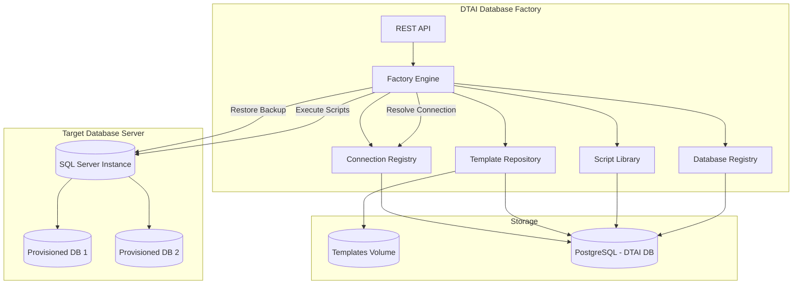

# Database Factory — Phase 1 MVP Design Document

## Overview

The **Database Factory** is a new DTAI feature that transforms the platform from a CDC testing tool into a **database provisioning and hydration system**. DTAI becomes a "made-to-order" database factory: given a template (backup), a collection of hydration scripts, and a set of parameters, DTAI provisions a fully configured database ready for delivery to any environment.

### The Problem

Teams managing complex applications (e.g., an ERP system supporting heavy-duty trucking, yellow bus, and IT industries) need databases configured differently for each customer, environment, or test scenario. Manually restoring backups and running setup scripts is error-prone, time-consuming, and not repeatable. There is no single source of truth for what scripts were run, in what order, with what parameters. Connection details are scattered across scripts, configs, and tribal knowledge.

### The Solution

DTAI manages the full lifecycle:

1. **Connections** — named, registered database server instances that everything else references by name
2. **Templates** — database backups registered in DTAI as starting points
3. **Script Library** — SQL scripts organized into groups and layers that hydrate a database with configuration and data
4. **Orders** — a request to provision a new database from a template, running specified script groups with provided parameters, targeting a registered connection
5. **Registry** — audit trail of every database DTAI has provisioned

### Example Scenario

> *"I want HD trucking, DTNA integrations, 10 branch setup, bill split/merge dataset, version 14.3.5."*

This translates to:

1. Restore the `blank-v14.3.5` template backup to a new database on the `dev-sqlserver` connection
2. Run the `dtna-integrations` script group (Layer 0)
3. Run the `10branches` script group with `BranchCount=10` (Layer 1)
4. Run the `bill-split-merge` script group (Layer 1, depends on `10branches`)
5. Deliver the database — it's ready

---

## Architecture



### Component Responsibilities

| Component | Responsibility |
|---|---|
| **Connection Registry** | Central registry of named database server connections. Everything else references connections by ID. No raw connection strings scattered across orders or scripts. |
| **Template Repository** | Manages database backup files (templates). Supports upload and register-by-path. Stores metadata in PostgreSQL, files on volume. |
| **Script Library** | Manages SQL scripts and script groups. Organizes by layers and dependencies. Resolves parameters. |
| **Factory Engine** | Orchestrates the full provisioning workflow: resolve connection → validate → restore → hydrate → deliver. |
| **Database Registry** | Tracks all provisioned databases for audit and future cleanup capabilities. References connections by ID. |
| **REST API** | Exposes all functionality through HTTP endpoints. |

---

## 1. Connection Registry

### Concept

A **Connection** is a named, registered database server instance. It is the foundational component — templates, orders, and the provisioned database registry all reference connections by ID rather than embedding raw connection strings. This ensures connection details (including credentials) live in one place, making it easy to update hosts, rotate passwords, or swap environments without touching orders or scripts.

### Connection Record

| Field | Type | Description |
|---|---|---|
| `Id` | UUID | Unique identifier |
| `Name` | string | Human-readable name (e.g., `dev-sqlserver`, `qa-sqlserver`) |
| `Platform` | string | Database platform (`SqlServer`, `PostgreSQL`, `SQLite`) |
| `Host` | string | Server host |
| `Port` | int | Server port |
| `ConnectionString` | string | Full connection string (with credentials) |
| `Description` | string | What this server is for |
| `IsDefault` | bool | One connection can be marked as the default target |
| `CreatedAt` | timestamp | When registered |
| `UpdatedAt` | timestamp | Last modified |

### Default Connection

At most one connection can have `IsDefault = true`. When an order does not specify a `targetConnectionId`, the factory resolves the default connection. If no default is set and no connection is specified, the order is rejected at validation time. Setting a new connection as default automatically clears the flag on the previous default.

### Platform Compatibility

Each connection declares its platform. Templates also declare a platform. At order time, the factory validates that the template's platform matches the target connection's platform — a SQL Server template cannot be restored to a PostgreSQL connection.

### Connection Endpoints

| Method | Path | Description |
|---|---|---|
| `POST` | `/api/factory/connections` | Register a connection |
| `GET` | `/api/factory/connections` | List all connections |
| `GET` | `/api/factory/connections/{id}` | Get connection details |
| `PUT` | `/api/factory/connections/{id}` | Update connection |
| `DELETE` | `/api/factory/connections/{id}` | Delete connection |
| `POST` | `/api/factory/connections/{id}/test` | Test the connection (ping) |

---

## 2. Template Repository

### Concept

A **Template** is a database backup file that serves as the starting point for provisioning. Templates are platform-specific (e.g., a SQL Server `.bak` file). DTAI restores a template to create a new database, then hydrates it with scripts.

### Template Record

| Field | Type | Description |
|---|---|---|
| `Id` | UUID | Unique identifier |
| `Name` | string | Human-readable name (e.g., `blank-v14.3.5`) |
| `Version` | string | Version label (e.g., `14.3.5`) |
| `Platform` | string | Database platform (e.g., `SqlServer`) — must match target connection platform |
| `FilePath` | string | Path to backup file on the volume |
| `Description` | string | Human-readable description |
| `Checksum` | string | File checksum for integrity verification |
| `CreatedAt` | timestamp | When the template was registered |
| `CreatedBy` | string | Who registered it |

### Getting Templates Into DTAI

Two mechanisms, both producing the same `Template` record:

#### Upload

Accepts a file upload plus metadata. DTAI saves the file to the templates volume and creates the metadata record.

```
POST /api/factory/templates/upload
Content-Type: multipart/form-data
  file: <backup file>
  name: blank-v14.3.5
  version: 14.3.5
  platform: SqlServer
  description: Blank database for v14.3.5
```

#### Register by Path

Creates a template entry pointing to a file already on the mounted volume. No upload needed — for cases where team automation drops backup files into the volume directly.

```
POST /api/factory/templates
{
  "name": "blank-v14.3.5",
  "version": "14.3.5",
  "platform": "SqlServer",
  "filePath": "/data/templates/blank-v14.3.5.bak",
  "description": "Blank database for v14.3.5"
}
```

### Template Endpoints

| Method | Path | Description |
|---|---|---|
| `POST` | `/api/factory/templates/upload` | Upload a backup file + register |
| `POST` | `/api/factory/templates` | Register an existing file by path |
| `GET` | `/api/factory/templates` | List all templates |
| `GET` | `/api/factory/templates/{id}` | Get template details |
| `DELETE` | `/api/factory/templates/{id}` | Delete template (metadata + file) |
| `POST` | `/api/factory/templates/{id}/verify` | Verify file checksum |

### Storage

Templates are stored on a **volume-mounted directory** (configurable, e.g., `/data/templates`). This is abstracted behind `ITemplateStorageProvider` so cloud storage (S3, Azure Blob) can be added later without changing the API or factory engine.

---

## 3. Script Library

### Concept

Scripts are the hydration instructions that configure and populate a database after it's been restored from a template. Scripts are organized into **Script Groups**, which are ordered within **Layers**.

### Script

A single executable unit — in Phase 1, a SQL script. The type system is designed so that process spawning (Shogun, Playwright) can be added as the very next step without redesigning anything.

| Field | Type | Description |
|---|---|---|
| `Id` | UUID | Unique identifier |
| `Name` | string | Human-readable name (e.g., `create-branches`) |
| `Description` | string | What this script does |
| `Type` | string | Script type: `SqlScript` (Phase 1). Future: `ProcessSpawn`, `ShogunCollection`, `PlaywrightSuite` |
| `Content` | string | Inline SQL text |
| `FilePath` | string | Alternative: path to script file on volume |
| `ScriptGroupId` | UUID | Which group this script belongs to |
| `Order` | int | Execution order within the group |
| `CreatedAt` | timestamp | When created |
| `UpdatedAt` | timestamp | Last modified |

### Script Group

A **Script Group** bundles multiple scripts that share a common set of parameters. This is the "10branches" concept — one logical hydration step that may run several individual scripts with shared configuration.

| Field | Type | Description |
|---|---|---|
| `Id` | UUID | Unique identifier |
| `Name` | string | Human-readable name (e.g., `10branches`, `bill-split-merge`) |
| `Description` | string | What this group accomplishes |
| `Layer` | int | Numeric layer — lower numbers execute first |
| `Order` | int | Execution order within the layer |
| `Dependencies` | UUID[] | Other group IDs that must complete first |
| `CreatedAt` | timestamp | When created |
| `UpdatedAt` | timestamp | Last modified |

### Layer — Numeric, Opinionated on Order, Not on Values

Layers use a numeric `int` field. **DTAI enforces execution order by sorting layers ascending** — all groups in Layer 0 complete before any group in Layer 1 starts, and so on. DTAI does not define what the numbers *mean*; that's up to the user.

A typical convention might be:

| Layer | Typical Purpose |
|---|---|
| 0 | Base — bare minimum boot data for all systems |
| 1 | Company configuration — branches, company profile |
| 2 | Module configuration — chart of accounts, customers, vendors |
| 3 | Transactional data — sample/inherited transactions |
| 99 | Custom / catch-all |

But users are free to use whatever numbering scheme they want. The only rule: **lower layers complete before higher layers start.** Within a layer, `Order` and `Dependencies` control sequencing.

### Execution Ordering Model

```
For each layer (ascending: 0, 1, 2, ...):
  For each group in layer (sorted by Order, dependencies satisfied):
    For each script in group (sorted by Order):
      IScriptExecutor.ExecuteAsync(script, resolvedParameters, connectionString)
```

### Dependencies

A group can declare dependencies on other groups. Dependencies are checked across layers — a group in Layer 2 can depend on a group in Layer 1. DTAI validates that all dependencies are in a lower-or-equal layer and that there are no circular dependencies.

### Parameters

Parameters come in two forms:

#### Inline JSON

Passed directly in the order request:

```json
{
  "parameters": {
    "BranchCount": 10,
    "Industry": "HD",
    "CompanyName": "Acme Trucking"
  }
}
```

#### Parameter File

A JSON or YAML file provided alongside the order. This supports the **customer onboarding** flow: collect setup information during customer interaction → save as a parameter file → submit as part of the order.

File format is determined by extension:
- `.json` → JSON deserialization
- `.yaml` / `.yml` → YAML deserialization (via YamlDotNet)

Both deserialize into the same `Dictionary<string, object>` parameter bag.

**Parameter resolution**: group-level shared parameters apply to all scripts in the group. Individual scripts can declare additional specific parameters. At execution time, all parameters are merged into a single bag and made available to the script executor.

### Script Library Endpoints

| Method | Path | Description |
|---|---|---|
| `POST` | `/api/factory/scripts` | Create a script |
| `GET` | `/api/factory/scripts` | List scripts (optional `groupId` filter) |
| `GET` | `/api/factory/scripts/{id}` | Get script details |
| `PUT` | `/api/factory/scripts/{id}` | Update script |
| `DELETE` | `/api/factory/scripts/{id}` | Delete script |

### Script Group Endpoints

| Method | Path | Description |
|---|---|---|
| `POST` | `/api/factory/script-groups` | Create a script group |
| `GET` | `/api/factory/script-groups` | List groups (optional `layer` filter) |
| `GET` | `/api/factory/script-groups/{id}` | Get group details (including scripts) |
| `PUT` | `/api/factory/script-groups/{id}` | Update group |
| `DELETE` | `/api/factory/script-groups/{id}` | Delete group |

---

## 4. Database Factory (Order Processing)

### Concept

The Factory Engine is the heart of DTAI. It takes a template, a set of script groups, and parameters, then produces a hydrated database on a target connection.

### Order Request

```
POST /api/factory/orders
{
  "templateId": "uuid",
  "targetConnectionId": "uuid",
  "targetDatabaseName": "acme_{industry}_{templateVersion}_{date}",
  "scriptGroupIds": ["uuid1", "uuid2", "uuid3"],
  "parameters": {
    "BranchCount": 10,
    "Industry": "HD",
    "CompanyName": "Acme Trucking"
  },
  "parameterFilePath": null
}
```

| Field | Type | Description |
|---|---|---|
| `templateId` | UUID | Which template to restore from |
| `targetConnectionId` | UUID? | Which registered connection to provision on. If null, uses the default connection. |
| `targetDatabaseName` | string | Template string with variables (`{industry}`, `{templateVersion}`, `{date}`, `{user}`, etc.) |
| `scriptGroupIds` | UUID[] | Which script groups to execute |
| `parameters` | object | Inline parameters (JSON key/value) |
| `parameterFilePath` | string | Alternative: path to a `.json` or `.yaml` parameter file |

If both `parameters` and `parameterFilePath` are provided, they are merged (inline values take precedence).

### Factory Process

```
1. Resolve Connection
   - If targetConnectionId is null, resolve the default connection
   - If no default exists, reject the order

2. Validate
   - Template exists and file is accessible
   - Template platform matches connection platform
   - All script groups resolve and exist
   - Dependencies are satisfiable (no circular, no missing)
   - Required parameters are present

3. Resolve Parameters
   - Merge inline parameters + parameter file
   - Resolve target database name template string

4. Restore
   - IDatabaseProvider.RestoreBackupAsync(template, targetDatabaseName, connectionString)
   - New database created from template backup on the target connection

5. Hydrate (by layer, respecting group order + dependencies)
   For each layer (ascending):
     For each group in layer (sorted by Order, deps satisfied):
       For each script in group (sorted by Order):
         IScriptExecutor.ExecuteAsync(script, mergedParams, connectionString)

6. Deliver
   - Mark order as Delivered
   - Record provisioned database in registry (with connectionId)
   - Optionally: create a backup of the finished database for external delivery
```

### Order Status Lifecycle

```
Pending → Resolving → Validating → Restoring → Hydrating → Delivered
                                                      ↘ Failed (at any step)
```

| Status | Description |
|---|---|
| `Pending` | Order received, not yet started |
| `Resolving` | Resolving target connection (default or specified) |
| `Validating` | Checking template, scripts, dependencies, parameters, platform compatibility |
| `Restoring` | Restoring template backup to new database |
| `Hydrating` | Executing script groups in order |
| `Delivered` | Database is built and ready for use |
| `Failed` | Something went wrong; error details captured |

### Order Endpoints

| Method | Path | Description |
|---|---|---|
| `POST` | `/api/factory/orders` | Create a new order |
| `GET` | `/api/factory/orders` | List all orders |
| `GET` | `/api/factory/orders/{id}` | Get order details + status |
| `GET` | `/api/factory/orders/{id}/status` | Lightweight status polling |

### "Delivered" vs "Shipped"

"Delivered" means the database is built and ready on the target connection. It does not mean a file has been shipped elsewhere. However, DTAI is designed to support a future "ship" step — creating a backup of the finished database for injection into a cloud environment. The architecture doesn't box us in here; the delivery mechanism can be extended without redesigning the factory engine.

---

## 5. Database Registry

### Concept

DTAI keeps track of every database it has provisioned — for audit, operational awareness, and future cleanup capabilities. Each provisioned database is linked to the connection it was created on.

### Provisioned Database Record

| Field | Type | Description |
|---|---|---|
| `Id` | UUID | Unique identifier |
| `OrderId` | UUID | Which order created this database |
| `DatabaseName` | string | Name on the target server |
| `ConnectionId` | UUID | Which registered connection it lives on |
| `TemplateId` | UUID | Which template it was created from |
| `Status` | string | `Active`, `Decommissioned`, `Failed` |
| `CreatedAt` | timestamp | When provisioned |
| `DecommissionedAt` | timestamp | When decommissioned (if applicable) |

### Registry Endpoints

| Method | Path | Description |
|---|---|---|
| `GET` | `/api/factory/databases` | List all provisioned databases |
| `GET` | `/api/factory/databases/{id}` | Get database details |

Cleanup and decommission logic is explicitly out of Phase 1 scope, but the registry provides the foundation for it.

---

## 6. Abstraction Layer

### Interfaces

```
IConnectionRegistry
  ├── GetByIdAsync(id) → Connection
  ├── GetDefaultAsync() → Connection?
  ├── ListAsync() → Connection[]
  ├── CreateAsync(request) → Connection
  ├── UpdateAsync(id, request) → Connection
  ├── DeleteAsync(id) → void
  └── TestConnectionAsync(id) → bool

IDatabaseProvider
  ├── RestoreBackupAsync(template, databaseName, connectionString) → Result
  ├── CreateDatabaseAsync(name, connectionString) → Result
  ├── DropDatabaseAsync(name, connectionString) → Result
  ├── TestConnectionAsync(connectionString) → bool
  └── ExecuteSqlAsync(connectionString, sql, parameters) → SqlResult

ITemplateStorageProvider
  ├── StoreAsync(stream, fileName) → string   // returns stored path
  ├── RetrieveAsync(filePath) → Stream
  ├── DeleteAsync(filePath) → void
  └── ExistsAsync(filePath) → bool

IScriptExecutor
  └── ExecuteAsync(script, parameters, connectionString) → ScriptResult

IScriptLibrary
  ├── GetScriptAsync(id) → Script
  ├── ListScriptsAsync(groupId?) → Script[]
  ├── CreateScriptAsync(request) → Script
  ├── UpdateScriptAsync(id, request) → Script
  └── DeleteScriptAsync(id) → void

IScriptGroupRepository
  ├── GetGroupAsync(id) → ScriptGroup
  ├── ListGroupsAsync(layer?) → ScriptGroup[]
  ├── CreateGroupAsync(request) → ScriptGroup
  ├── UpdateGroupAsync(id, request) → ScriptGroup
  └── DeleteGroupAsync(id) → void

IDatabaseTemplateRepository
  ├── GetByIdAsync(id) → Template
  ├── ListAsync() → Template[]
  ├── RegisterAsync(request) → Template
  ├── UploadAsync(stream, metadata) → Template
  ├── DeleteAsync(id) → void
  └── VerifyAsync(id) → bool

IDatabaseFactory
  └── OrderAsync(orderRequest) → Order

IDatabaseRegistry
  ├── ListAsync() → ProvisionedDatabase[]
  └── GetByIdAsync(id) → ProvisionedDatabase
```

### Connection Resolution Flow

The factory engine is the single place that resolves connections. It does not scatter connection strings across components:

```
1. Factory receives order with targetConnectionId (or null for default)
2. Factory calls IConnectionRegistry.GetByIdAsync(targetConnectionId)
   - or IConnectionRegistry.GetDefaultAsync() if null
3. Factory validates template.Platform == connection.Platform
4. Factory passes connection.ConnectionString to IDatabaseProvider and IScriptExecutor
5. Factory records connection.Id in the provisioned database registry
```

Neither `IDatabaseProvider` nor `IScriptExecutor` know about the connection registry. They receive a connection string and do their job. The registry is an orchestration-layer concern.

### IScriptExecutor vs IDatabaseProvider

These are deliberately separated:

- **`IDatabaseProvider`** handles database lifecycle — restore a backup, create/drop a database, test a connection, run raw SQL. It is platform-specific (SQL Server vs PostgreSQL vs SQLite).
- **`IScriptExecutor`** handles running a hydration step — take a script, resolve its parameters, execute it, report the result. It is script-type-specific.

The factory engine only talks to `IScriptExecutor`. It doesn't know whether the executor is running SQL through a database provider or spawning a Shogun process.

```
SqlScriptExecutor : IScriptExecutor
  └── uses IDatabaseProvider.ExecuteSqlAsync()
       (resolves parameters, substitutes into SQL, calls provider)

ProcessSpawnExecutor : IScriptExecutor    ← Phase 2 (next addition)
  └── spawns process with connectionString as env var
       (doesn't touch IDatabaseProvider at all)
```

When process spawning is added, the factory engine doesn't change — we just register a new `IScriptExecutor` implementation.

### Phase 1 Implementations

| Interface | Implementation | Notes |
|---|---|---|
| `IConnectionRegistry` | `ConnectionRegistry` | PostgreSQL for metadata, resolves default connection |
| `IDatabaseProvider` | `SqlServerDatabaseProvider` | Uses `RESTORE DATABASE` via ADO.NET |
| `ITemplateStorageProvider` | `LocalFileStorageProvider` | Reads/writes on mounted volume |
| `IScriptExecutor` | `SqlScriptExecutor` | Runs SQL via `IDatabaseProvider.ExecuteSqlAsync()` |
| `IDatabaseTemplateRepository` | `DatabaseTemplateRepository` | PostgreSQL for metadata, volume for files |
| `IScriptLibrary` | `ScriptLibrary` | PostgreSQL for script metadata |
| `IScriptGroupRepository` | `ScriptGroupRepository` | PostgreSQL for group metadata |
| `IDatabaseFactory` | `DatabaseFactory` | Orchestrates full workflow, resolves connections |
| `IDatabaseRegistry` | `DatabaseRegistry` | PostgreSQL for registry records |

---

## 7. DTAI Database Schema (PostgreSQL)

All factory metadata is stored in DTAI's existing PostgreSQL database.

### Tables

```sql
-- Connections (registered database server instances)
CREATE TABLE factory_connections (
    id                UUID PRIMARY KEY DEFAULT gen_random_uuid(),
    name              VARCHAR(255) NOT NULL UNIQUE,
    platform          VARCHAR(50) NOT NULL DEFAULT 'SqlServer',
    host              VARCHAR(255) NOT NULL,
    port              INT,
    connection_string TEXT NOT NULL,
    description       TEXT,
    is_default        BOOLEAN NOT NULL DEFAULT FALSE,
    created_at        TIMESTAMPTZ NOT NULL DEFAULT NOW(),
    updated_at        TIMESTAMPTZ NOT NULL DEFAULT NOW()
);

-- Templates
CREATE TABLE factory_templates (
    id              UUID PRIMARY KEY DEFAULT gen_random_uuid(),
    name            VARCHAR(255) NOT NULL,
    version         VARCHAR(50) NOT NULL,
    platform        VARCHAR(50) NOT NULL DEFAULT 'SqlServer',
    file_path       VARCHAR(500) NOT NULL,
    description     TEXT,
    checksum        VARCHAR(128),
    created_at      TIMESTAMPTZ NOT NULL DEFAULT NOW(),
    created_by      VARCHAR(255)
);

-- Script Groups (Layers)
CREATE TABLE factory_script_groups (
    id              UUID PRIMARY KEY DEFAULT gen_random_uuid(),
    name            VARCHAR(255) NOT NULL,
    description     TEXT,
    layer           INT NOT NULL DEFAULT 0,
    "order"         INT NOT NULL DEFAULT 0,
    created_at      TIMESTAMPTZ NOT NULL DEFAULT NOW(),
    updated_at      TIMESTAMPTZ NOT NULL DEFAULT NOW()
);

-- Script Group Dependencies (DAG edges)
CREATE TABLE factory_script_group_dependencies (
    group_id        UUID NOT NULL REFERENCES factory_script_groups(id) ON DELETE CASCADE,
    depends_on_id   UUID NOT NULL REFERENCES factory_script_groups(id) ON DELETE CASCADE,
    PRIMARY KEY (group_id, depends_on_id)
);

-- Scripts
CREATE TABLE factory_scripts (
    id              UUID PRIMARY KEY DEFAULT gen_random_uuid(),
    name            VARCHAR(255) NOT NULL,
    description     TEXT,
    type            VARCHAR(50) NOT NULL DEFAULT 'SqlScript',
    content         TEXT,
    file_path       VARCHAR(500),
    script_group_id UUID NOT NULL REFERENCES factory_script_groups(id) ON DELETE CASCADE,
    "order"         INT NOT NULL DEFAULT 0,
    created_at      TIMESTAMPTZ NOT NULL DEFAULT NOW(),
    updated_at      TIMESTAMPTZ NOT NULL DEFAULT NOW()
);

-- Orders
CREATE TABLE factory_orders (
    id                    UUID PRIMARY KEY DEFAULT gen_random_uuid(),
    template_id           UUID NOT NULL REFERENCES factory_templates(id),
    target_connection_id  UUID REFERENCES factory_connections(id),
    target_database_name  VARCHAR(255) NOT NULL,
    status                VARCHAR(50) NOT NULL DEFAULT 'Pending',
    error_message         TEXT,
    created_at            TIMESTAMPTZ NOT NULL DEFAULT NOW(),
    started_at            TIMESTAMPTZ,
    completed_at          TIMESTAMPTZ
);

-- Order → Script Groups (many-to-many)
CREATE TABLE factory_order_script_groups (
    order_id           UUID NOT NULL REFERENCES factory_orders(id) ON DELETE CASCADE,
    script_group_id    UUID NOT NULL REFERENCES factory_script_groups(id),
    PRIMARY KEY (order_id, script_group_id)
);

-- Order Parameters
CREATE TABLE factory_order_parameters (
    order_id           UUID NOT NULL REFERENCES factory_orders(id) ON DELETE CASCADE,
    key                VARCHAR(255) NOT NULL,
    value              TEXT,
    PRIMARY KEY (order_id, key)
);

-- Provisioned Databases (Registry)
CREATE TABLE factory_provisioned_databases (
    id                  UUID PRIMARY KEY DEFAULT gen_random_uuid(),
    order_id            UUID NOT NULL REFERENCES factory_orders(id),
    database_name       VARCHAR(255) NOT NULL,
    connection_id       UUID NOT NULL REFERENCES factory_connections(id),
    template_id         UUID NOT NULL REFERENCES factory_templates(id),
    status              VARCHAR(50) NOT NULL DEFAULT 'Active',
    created_at          TIMESTAMPTZ NOT NULL DEFAULT NOW(),
    decommissioned_at   TIMESTAMPTZ
);
```

### Schema Management

Schema creation is handled by **DbUp**, a lightweight .NET-native migration runner. Migration scripts live in version control as numbered SQL files:

```
cdc-lib/Migrations/Factory/
  001_create_connections_table.sql
  002_create_templates_table.sql
  003_create_script_groups_table.sql
  004_create_script_group_dependencies_table.sql
  005_create_scripts_table.sql
  006_create_orders_table.sql
  007_create_order_script_groups_table.sql
  008_create_order_parameters_table.sql
  009_create_provisioned_databases_table.sql
```

A `FactorySchemaRunner` class invokes DbUp on application startup, targeting the PostgreSQL connection string. DbUp tracks applied migrations in a `SchemaVersions` table and applies only unapplied migrations in order. This provides:

- Full audit trail of schema changes
- Controlled schema evolution (add new tables/columns via new migration files)
- No manual intervention needed on deployment
- Schema lives in version control alongside code

---

## 8. Project Structure

New code is organized across existing projects, following the established pattern:

| Project | Responsibility | New Content |
|---|---|---|
| `cdc-lib` | Core library: interfaces, domain models, factory engine, provider implementations | `Factory/` directory with all factory logic |
| `cdc-models` | Request/response DTOs | `Factory/` DTOs for all factory endpoints |
| `cdc-api` | Web API controllers | `Controllers/Factory/` with 5 controllers |
| `cdc-api.Tests` | Unit + integration tests | `Factory/` test classes |

### cdc-lib/Factory/ Structure

```
cdc-lib/Factory/
  Interfaces/
    IConnectionRegistry.cs
    IDatabaseProvider.cs
    ITemplateStorageProvider.cs
    IScriptExecutor.cs
    IScriptLibrary.cs
    IScriptGroupRepository.cs
    IDatabaseTemplateRepository.cs
    IDatabaseFactory.cs
    IDatabaseRegistry.cs
  Models/
    Connection.cs
    Template.cs
    Script.cs
    ScriptGroup.cs
    Order.cs
    OrderStatus.cs
    ProvisionedDatabase.cs
    ScriptResult.cs
    ValidationResult.cs
  Providers/
    SqlServerDatabaseProvider.cs
    LocalFileStorageProvider.cs
  Executors/
    SqlScriptExecutor.cs
  Engine/
    DatabaseFactory.cs
    ParameterResolver.cs
    DependencyValidator.cs
  Repositories/
    ConnectionRegistry.cs
    DatabaseTemplateRepository.cs
    ScriptLibrary.cs
    ScriptGroupRepository.cs
    DatabaseRegistry.cs
  Migrations/
    Factory/
      001_create_connections_table.sql
      ...
    FactorySchemaRunner.cs
```

### cdc-api/Controllers/Factory/ Structure

```
cdc-api/Controllers/Factory/
  ConnectionsController.cs
  TemplatesController.cs
  ScriptsController.cs
  ScriptGroupsController.cs
  FactoryController.cs        // Orders
  DatabasesController.cs       // Registry
```

### cdc-models/Factory/ Structure

```
cdc-models/Factory/
  ConnectionDto.cs
  CreateConnectionDto.cs
  TemplateDto.cs
  CreateTemplateDto.cs
  ScriptDto.cs
  CreateScriptDto.cs
  ScriptGroupDto.cs
  CreateScriptGroupDto.cs
  CreateOrderDto.cs
  OrderDto.cs
  OrderStatusDto.cs
  ProvisionedDatabaseDto.cs
```

---

## 9. API Summary

### Connections

| Method | Path | Description |
|---|---|---|
| `POST` | `/api/factory/connections` | Register a connection |
| `GET` | `/api/factory/connections` | List all connections |
| `GET` | `/api/factory/connections/{id}` | Get connection details |
| `PUT` | `/api/factory/connections/{id}` | Update connection |
| `DELETE` | `/api/factory/connections/{id}` | Delete connection |
| `POST` | `/api/factory/connections/{id}/test` | Test the connection (ping) |

### Templates

| Method | Path | Description |
|---|---|---|
| `POST` | `/api/factory/templates/upload` | Upload backup file + register |
| `POST` | `/api/factory/templates` | Register existing file by path |
| `GET` | `/api/factory/templates` | List all templates |
| `GET` | `/api/factory/templates/{id}` | Get template details |
| `DELETE` | `/api/factory/templates/{id}` | Delete template |
| `POST` | `/api/factory/templates/{id}/verify` | Verify file checksum |

### Scripts

| Method | Path | Description |
|---|---|---|
| `POST` | `/api/factory/scripts` | Create a script |
| `GET` | `/api/factory/scripts` | List scripts (optional `groupId` query param) |
| `GET` | `/api/factory/scripts/{id}` | Get script details |
| `PUT` | `/api/factory/scripts/{id}` | Update script |
| `DELETE` | `/api/factory/scripts/{id}` | Delete script |

### Script Groups

| Method | Path | Description |
|---|---|---|
| `POST` | `/api/factory/script-groups` | Create a group |
| `GET` | `/api/factory/script-groups` | List groups (optional `layer` query param) |
| `GET` | `/api/factory/script-groups/{id}` | Get group details (includes scripts) |
| `PUT` | `/api/factory/script-groups/{id}` | Update group |
| `DELETE` | `/api/factory/script-groups/{id}` | Delete group |

### Orders

| Method | Path | Description |
|---|---|---|
| `POST` | `/api/factory/orders` | Create a new order |
| `GET` | `/api/factory/orders` | List all orders |
| `GET` | `/api/factory/orders/{id}` | Get order details + status |
| `GET` | `/api/factory/orders/{id}/status` | Lightweight status polling |

### Databases

| Method | Path | Description |
|---|---|---|
| `GET` | `/api/factory/databases` | List all provisioned databases |
| `GET` | `/api/factory/databases/{id}` | Get database details |

---

## 10. End-to-End Example

### Step 1: Register a Connection

```
POST /api/factory/connections
{
  "name": "dev-sqlserver",
  "platform": "SqlServer",
  "host": "sqlserver",
  "port": 1433,
  "connectionString": "Server=sqlserver;User Id=sa;Password=YourStrong@Passw0rd;TrustServerCertificate=true;",
  "description": "Development SQL Server instance",
  "isDefault": true
}
```

### Step 2: Register a Template

Team automation drops `blank-v14.3.5.bak` into the templates volume at `/data/templates/`.

```
POST /api/factory/templates
{
  "name": "blank-v14.3.5",
  "version": "14.3.5",
  "platform": "SqlServer",
  "filePath": "/data/templates/blank-v14.3.5.bak",
  "description": "Blank database schema for v14.3.5"
}
```

### Step 3: Create Script Groups and Scripts

```
POST /api/factory/script-groups
{
  "name": "dtna-integrations",
  "description": "Install DTNA integration configuration",
  "layer": 0,
  "order": 1
}

POST /api/factory/scripts
{
  "name": "install-dtna-config",
  "description": "Install DTNA configuration tables",
  "type": "SqlScript",
  "content": "INSERT INTO dbo.IntegrationConfig ...",
  "scriptGroupId": "<uuid-from-above>",
  "order": 1
}

POST /api/factory/script-groups
{
  "name": "10branches",
  "description": "Create 10 branch locations",
  "layer": 1,
  "order": 1
}

POST /api/factory/scripts
{
  "name": "create-branches",
  "description": "Create N branch records",
  "type": "SqlScript",
  "content": "DECLARE @BranchCount INT = ${BranchCount}; ...",
  "scriptGroupId": "<10branches-group-uuid>",
  "order": 1
}

POST /api/factory/script-groups
{
  "name": "bill-split-merge",
  "description": "Enable bill split and merge features",
  "layer": 1,
  "order": 2,
  "dependencies": ["<10branches-group-uuid>"]
}
```

### Step 4: Place an Order

```
POST /api/factory/orders
{
  "templateId": "<template-uuid>",
  "targetConnectionId": null,
  "targetDatabaseName": "{companyName}_{industry}_v{templateVersion}_{date}",
  "scriptGroupIds": [
    "<dtna-integrations-uuid>",
    "<10branches-uuid>",
    "<bill-split-merge-uuid>"
  ],
  "parameters": {
    "BranchCount": 10,
    "Industry": "HD",
    "CompanyName": "Acme"
  }
}
```

Since `targetConnectionId` is null, the factory resolves the default connection (`dev-sqlserver`).

### Step 5: Poll for Status

```
GET /api/factory/orders/{id}/status

→ { "status": "Delivered", "databaseName": "Acme_HD_v14.3.5_20260826" }
```

### Step 6: Verify in Registry

```
GET /api/factory/databases

→ [{
     "databaseName": "Acme_HD_v14.3.5_20260826",
     "status": "Active",
     "connectionName": "dev-sqlserver",
     "connectionId": "<uuid>"
   }]
```

---

## 11. Phase 1 Scope

### In Scope

- Connection registry (CRUD + test + default connection)
- Template management (upload + register-by-path)
- Script management (SQL scripts only)
- Script group management with layers and dependencies
- Parameter resolution (inline JSON + parameter files in JSON/YAML)
- Order processing with connection resolution and full lifecycle tracking
- Platform compatibility validation (template platform must match connection platform)
- Database registry for audit
- SQL Server provider implementation
- Local file storage provider
- DbUp schema migrations for DTAI's PostgreSQL metadata tables
- REST API for all operations
- Unit and integration tests

### Out of Scope (Designed For, Not Built)

| Feature | Status |
|---|---|
| Process spawning script types (Shogun, Playwright) | **Next addition** — type system is ready |
| Cross-platform script translation (agent-based) | Future |
| Automatic cleanup/decommission of provisioned databases | Future — registry is the foundation |
| External script repositories (Git, S3) | Future |
| Version compatibility matrix (script ↔ template) | Future |
| CDC replay as a hydration step | Future |
| Cloud storage for templates (S3, Azure Blob) | Future — `ITemplateStorageProvider` is ready |
| Per-platform default connections | Future — single global default for Phase 1 |

---

## 12. Technical Decisions Summary

| Decision | Choice | Rationale |
|---|---|---|
| Connection management | Central registry, referenced by ID | Single source of truth for connection details; no scattered secrets; environment portability |
| Default connection | Single global `IsDefault` flag | Simplest for Phase 1; per-platform defaults deferred to future |
| Layer model | Numeric `int`, ascending execution | Flexible, no hardcoded enum, user defines meaning |
| Parameter files | JSON + YAML | JSON for API integration, YAML for human readability |
| Script execution | `IScriptExecutor` separate from `IDatabaseProvider` | Different script types can have different executors without touching the provider |
| Schema management | DbUp migration runner | Enterprise-standard, lightweight, SQL-file-based, full audit trail |
| Storage | Volume-mounted directory | Simplest for container deployment, abstracted for future cloud storage |
| Metadata store | Existing PostgreSQL | Leverages existing infrastructure |
| Target platform | SQL Server (Phase 1) | Most common target, abstraction interfaces ready for others |
