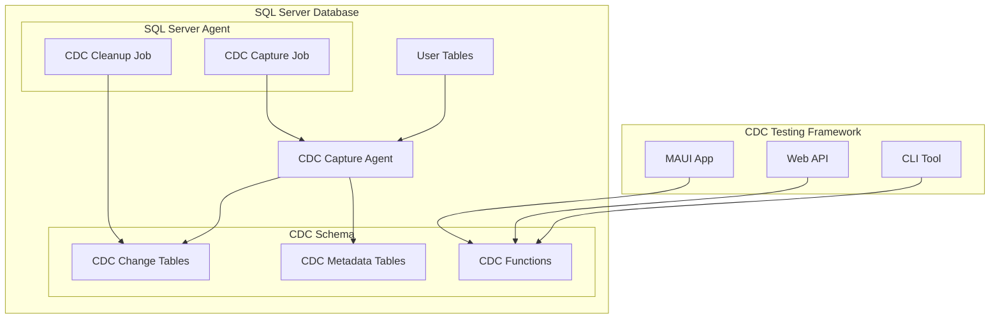

# Database Requirements and CDC Setup

## Overview

This document provides comprehensive information about database requirements, Change Data Capture (CDC) configuration, and best practices for setting up SQL Server environments for the CDC Testing Framework.

## SQL Server Requirements

### Supported Versions

- **SQL Server 2016** or later (Standard/Enterprise Edition)
- **SQL Server 2017** (Standard/Enterprise Edition)
- **SQL Server 2019** (Standard/Enterprise Edition) - Recommended
- **SQL Server 2022** (Standard/Enterprise Edition)

### Edition Requirements

CDC is **NOT available** in:

- SQL Server Express Edition
- SQL Server Web Edition
- SQL Server Workgroup Edition (deprecated)

CDC is **available** in:

- SQL Server Standard Edition
- SQL Server Enterprise Edition
- SQL Server Developer Edition (free for development/testing)

### Hardware Requirements

#### Minimum Requirements

- **CPU**: 2 cores, 2.0 GHz
- **RAM**: 4 GB
- **Storage**: 10 GB free space (plus space for CDC tables)
- **Network**: 100 Mbps for remote connections

#### Recommended Requirements

- **CPU**: 4+ cores, 2.5+ GHz
- **RAM**: 8+ GB
- **Storage**: SSD with 50+ GB free space
- **Network**: 1 Gbps for remote connections

#### Production Considerations

- **CPU**: 8+ cores for high-volume CDC operations
- **RAM**: 16+ GB for large databases
- **Storage**: High-performance SSD with adequate space for CDC growth
- **Backup**: Separate storage for CDC table backups

## CDC Architecture Overview

### CDC Components



### CDC System Tables

When CDC is enabled, SQL Server creates several system tables:

#### Core CDC Tables

- **`cdc.change_tables`** - Metadata about CDC-enabled tables
- **`cdc.index_columns`** - Information about tracking indexes
- **`cdc.captured_columns`** - Details about captured columns
- **`cdc.ddl_history`** - DDL change history
- **`cdc.lsn_time_mapping`** - LSN to time mapping

#### Change Tables

For each CDC-enabled table, SQL Server creates:

- **`cdc.[schema]_[table]_CT`** - Contains the actual change data
- Example: `cdc.dbo_Customers_CT` for table `dbo.Customers`

### CDC Functions

SQL Server provides built-in functions for querying CDC data:

#### Core Functions

- **`sys.fn_cdc_get_min_lsn()`** - Get minimum LSN for a capture instance
- **`sys.fn_cdc_get_max_lsn()`** - Get maximum LSN
- **`sys.fn_cdc_map_time_to_lsn()`** - Map time to LSN
- **`sys.fn_cdc_map_lsn_to_time()`** - Map LSN to time

#### Query Functions

- **`cdc.fn_cdc_get_all_changes_[schema]_[table]()`** - Get all changes
- **`cdc.fn_cdc_get_net_changes_[schema]_[table]()`** - Get net changes

## Database Setup

### 1. SQL Server Installation

#### Option A: SQL Server Developer Edition (Recommended for Development)

```bash
# Download SQL Server Developer Edition
# https://www.microsoft.com/en-us/sql-server/sql-server-downloads

# Install with default settings, ensuring:
# - Mixed Mode Authentication is enabled
# - SQL Server Agent is installed and configured to start automatically
```

#### Option B: Docker Container Setup

```bash
# Pull SQL Server 2019 image
docker pull mcr.microsoft.com/mssql/server:2019-latest

# Run SQL Server container with CDC support
docker run -e "ACCEPT_EULA=Y" \
  -e "SA_PASSWORD=YourStrong@Passw0rd" \
  -e "MSSQL_AGENT_ENABLED=true" \
  -p 1433:1433 \
  --name sql-cdc-server \
  -d mcr.microsoft.com/mssql/server:2019-latest
```

### 2. SQL Server Agent Configuration

CDC requires SQL Server Agent to be running:

```sql
-- Check SQL Server Agent status
SELECT
    servicename,
    status_desc,
    startup_type_desc
FROM sys.dm_server_services
WHERE servicename LIKE '%Agent%';

-- If Agent is not running, start it (requires elevated permissions)
-- Use SQL Server Configuration Manager or Services.msc on Windows
```

### 3. Database Creation and Configuration

```sql
-- Create test database
CREATE DATABASE CdcTestDB
ON (
    NAME = 'CdcTestDB',
    FILENAME = 'C:\Data\CdcTestDB.mdf',
    SIZE = 100MB,
    MAXSIZE = 1GB,
    FILEGROWTH = 10MB
)
LOG ON (
    NAME = 'CdcTestDB_Log',
    FILENAME = 'C:\Data\CdcTestDB_Log.ldf',
    SIZE = 10MB,
    MAXSIZE = 100MB,
    FILEGROWTH = 10%
);

-- Set database to FULL recovery model (required for CDC)
ALTER DATABASE CdcTestDB SET RECOVERY FULL;

-- Switch to the database
USE CdcTestDB;
```

### 4. User and Permission Setup

#### Create CDC User

```sql
-- Create login for CDC operations
CREATE LOGIN cdc_user WITH PASSWORD = 'YourStrong@Passw0rd';

-- Create database user
USE CdcTestDB;
CREATE USER cdc_user FOR LOGIN cdc_user;

-- Grant necessary permissions
ALTER ROLE db_owner ADD MEMBER cdc_user;

-- Alternative: Grant specific CDC permissions (more restrictive)
-- GRANT SELECT ON SCHEMA::cdc TO cdc_user;
-- EXEC sp_addrolemember 'db_ddladmin', 'cdc_user';
-- EXEC sp_addrolemember 'db_datareader', 'cdc_user';
-- EXEC sp_addrolemember 'db_datawriter', 'cdc_user';
```

#### Permission Requirements

For CDC operations, users need:

- **`db_owner`** role (simplest approach), OR
- **`db_ddladmin`** role (for CDC enable/disable operations)
- **`SELECT`** permission on `cdc` schema
- **`EXECUTE`** permission on CDC functions

## CDC Configuration

### 1. Enable CDC on Database

```sql
-- Enable CDC at database level
USE CdcTestDB;
EXEC sys.sp_cdc_enable_db;

-- Verify CDC is enabled
SELECT name, is_cdc_enabled
FROM sys.databases
WHERE name = 'CdcTestDB';
```

### 2. Create Sample Tables

```sql
-- Create sample tables with proper primary keys
CREATE TABLE Customers (
    CustomerID int IDENTITY(1,1) PRIMARY KEY,
    CustomerName nvarchar(100) NOT NULL,
    Email nvarchar(100),
    Phone nvarchar(20),
    Address nvarchar(200),
    City nvarchar(50),
    State nvarchar(50),
    ZipCode nvarchar(10),
    CreatedDate datetime2 DEFAULT GETDATE(),
    LastModified datetime2 DEFAULT GETDATE(),
    IsActive bit DEFAULT 1
);

CREATE TABLE Orders (
    OrderID int IDENTITY(1,1) PRIMARY KEY,
    CustomerID int NOT NULL,
    OrderDate datetime2 DEFAULT GETDATE(),
    TotalAmount decimal(10,2) NOT NULL,
    Status nvarchar(20) DEFAULT 'Pending',
    ShippingAddress nvarchar(200),
    Notes nvarchar(500),
    CreatedBy nvarchar(50) DEFAULT SYSTEM_USER,
    LastModified datetime2 DEFAULT GETDATE(),
    FOREIGN KEY (CustomerID) REFERENCES Customers(CustomerID)
);

CREATE TABLE OrderItems (
    OrderItemID int IDENTITY(1,1) PRIMARY KEY,
    OrderID int NOT NULL,
    ProductName nvarchar(100) NOT NULL,
    Quantity int NOT NULL,
    UnitPrice decimal(10,2) NOT NULL,
    LineTotal AS (Quantity * UnitPrice) PERSISTED,
    FOREIGN KEY (OrderID) REFERENCES Orders(OrderID)
);

-- Create indexes for better performance
CREATE INDEX IX_Orders_CustomerID ON Orders(CustomerID);
CREATE INDEX IX_Orders_OrderDate ON Orders(OrderDate);
CREATE INDEX IX_OrderItems_OrderID ON OrderItems(OrderID);
```

### 3. Enable CDC on Tables

```sql
-- Enable CDC on Customers table
EXEC sys.sp_cdc_enable_table
    @source_schema = N'dbo',
    @source_name = N'Customers',
    @role_name = NULL,
    @supports_net_changes = 1;

-- Enable CDC on Orders table
EXEC sys.sp_cdc_enable_table
    @source_schema = N'dbo',
    @source_name = N'Orders',
    @role_name = NULL,
    @supports_net_changes = 1;

-- Enable CDC on OrderItems table
EXEC sys.sp_cdc_enable_table
    @source_schema = N'dbo',
    @source_name = N'OrderItems',
    @role_name = NULL,
    @supports_net_changes = 1;

-- Verify CDC is enabled on tables
SELECT
    name,
    is_tracked_by_cdc
FROM sys.tables
WHERE is_tracked_by_cdc = 1;
```

### 4. Verify CDC Setup

```sql
-- Check CDC capture instances
SELECT
    capture_instance,
    object_name,
    source_schema,
    source_name,
    start_lsn,
    create_date
FROM cdc.change_tables;

-- Check CDC jobs
SELECT
    job.name,
    job.enabled,
    job.description
FROM msdb.dbo.sysjobs job
WHERE job.name LIKE '%cdc%';

-- View CDC functions created
SELECT
    ROUTINE_NAME,
    ROUTINE_TYPE
FROM INFORMATION_SCHEMA.ROUTINES
WHERE ROUTINE_SCHEMA = 'cdc'
    AND ROUTINE_NAME LIKE '%fn_cdc_get_%';
```

## Sample Data Population

```sql
-- Insert sample customers
INSERT INTO Customers (CustomerName, Email, Phone, Address, City, State, ZipCode) VALUES
('Acme Corporation', 'contact@acme.com', '555-0101', '123 Business St', 'New York', 'NY', '10001'),
('Beta Industries', 'info@beta.com', '555-0102', '456 Commerce Ave', 'Los Angeles', 'CA', '90001'),
('Gamma Solutions', 'hello@gamma.com', '555-0103', '789 Enterprise Blvd', 'Chicago', 'IL', '60601'),
('Delta Systems', 'support@delta.com', '555-0104', '321 Technology Dr', 'Austin', 'TX', '78701'),
('Epsilon Corp', 'sales@epsilon.com', '555-0105', '654 Innovation Way', 'Seattle', 'WA', '98101');

-- Insert sample orders
INSERT INTO Orders (CustomerID, TotalAmount, Status, ShippingAddress, Notes) VALUES
(1, 1500.00, 'Completed', '123 Business St, New York, NY 10001', 'Rush order'),
(2, 750.50, 'Pending', '456 Commerce Ave, Los Angeles, CA 90001', 'Standard shipping'),
(1, 2200.75, 'Processing', '123 Business St, New York, NY 10001', 'Large order'),
(3, 980.25, 'Shipped', '789 Enterprise Blvd, Chicago, IL 60601', 'Express shipping'),
(4, 1250.00, 'Completed', '321 Technology Dr, Austin, TX 78701', 'Bulk discount applied');

-- Insert sample order items
INSERT INTO OrderItems (OrderID, ProductName, Quantity, UnitPrice) VALUES
(1, 'Widget A', 10, 50.00),
(1, 'Widget B', 20, 25.00),
(1, 'Service Package', 1, 500.00),
(2, 'Widget A', 5, 50.00),
(2, 'Widget C', 15, 33.37),
(3, 'Premium Widget', 25, 75.00),
(3, 'Installation Service', 1, 450.75),
(4, 'Widget B', 30, 25.00),
(4, 'Support Package', 1, 280.25),
(5, 'Enterprise Widget', 10, 125.00);
```

## CDC Monitoring and Maintenance

### 1. Monitor CDC Performance

```sql
-- Check CDC capture job status
SELECT
    j.name AS job_name,
    ja.run_status,
    ja.run_date,
    ja.run_time,
    ja.run_duration,
    CASE ja.run_status
        WHEN 0 THEN 'Failed'
        WHEN 1 THEN 'Succeeded'
        WHEN 2 THEN 'Retry'
        WHEN 3 THEN 'Canceled'
        WHEN 4 THEN 'In Progress'
    END AS status_description
FROM msdb.dbo.sysjobs j
INNER JOIN msdb.dbo.sysjobactivity ja ON j.job_id = ja.job_id
WHERE j.name LIKE '%cdc%'
ORDER BY ja.run_date DESC, ja.run_time DESC;

-- Monitor CDC table sizes
SELECT
    t.name AS table_name,
    p.rows AS row_count,
    (p.reserved * 8) / 1024 AS reserved_mb,
    (p.data * 8) / 1024 AS data_mb,
    (p.index_size * 8) / 1024 AS index_mb
FROM sys.tables t
INNER JOIN sys.dm_db_partition_stats p ON t.object_id = p.object_id
WHERE t.schema_id = SCHEMA_ID('cdc')
    AND p.index_id IN (0, 1)
ORDER BY p.reserved DESC;
```

### 2. CDC Cleanup Configuration

```sql
-- Check current cleanup settings
SELECT
    capture_instance,
    low_water_mark,
    high_water_mark
FROM cdc.change_tables;

-- Configure cleanup retention (default is 3 days)
EXEC sys.sp_cdc_change_job
    @job_type = N'cleanup',
    @retention = 4320; -- 3 days in minutes (3 * 24 * 60)

-- Manual cleanup (if needed)
EXEC sys.sp_cdc_cleanup_change_table
    @capture_instance = N'dbo_Customers',
    @low_water_mark = NULL, -- Will use default low water mark
    @threshold = 5000; -- Max rows to delete in one batch
```

### 3. Backup Considerations

```sql
-- CDC tables are included in regular database backups
-- For point-in-time recovery, ensure transaction log backups are frequent

-- Example backup strategy
BACKUP DATABASE CdcTestDB
TO DISK = 'C:\Backups\CdcTestDB_Full.bak'
WITH COMPRESSION, CHECKSUM;

-- Transaction log backup (run frequently)
BACKUP LOG CdcTestDB
TO DISK = 'C:\Backups\CdcTestDB_Log.trn'
WITH COMPRESSION, CHECKSUM;
```

## Troubleshooting Common Issues

### 1. CDC Not Available

**Error**: "CDC is not supported on this edition of SQL Server"
**Solution**: Upgrade to Standard or Enterprise Edition

### 2. SQL Server Agent Not Running

**Error**: CDC capture job fails to run
**Solution**:

```sql
-- Check and start SQL Server Agent
-- Use SQL Server Configuration Manager or:
-- NET START SQLSERVERAGENT (from elevated command prompt)
```

### 3. Insufficient Permissions

**Error**: "User does not have permission to perform this action"
**Solution**:

```sql
-- Grant db_owner role or specific CDC permissions
ALTER ROLE db_owner ADD MEMBER [username];
```

### 4. Transaction Log Full

**Error**: "The transaction log for database is full"
**Solution**:

```sql
-- Backup transaction log
BACKUP LOG CdcTestDB TO DISK = 'C:\Temp\CdcTestDB_Log_Emergency.trn';

-- Or switch to SIMPLE recovery model temporarily (not recommended for production)
-- ALTER DATABASE CdcTestDB SET RECOVERY SIMPLE;
```

### 5. CDC Tables Growing Too Large

**Solution**:

```sql
-- Reduce retention period
EXEC sys.sp_cdc_change_job
    @job_type = N'cleanup',
    @retention = 1440; -- 1 day

-- Run cleanup manually
EXEC sys.sp_cdc_cleanup_change_table
    @capture_instance = N'dbo_Customers',
    @threshold = 10000;
```

## Performance Optimization

### 1. Index Optimization

```sql
-- Add indexes to CDC tables for better query performance
-- (These are automatically created, but you can add custom ones)
CREATE INDEX IX_CDC_Customers_StartLSN
ON cdc.dbo_Customers_CT(__$start_lsn);

CREATE INDEX IX_CDC_Orders_StartLSN_Operation
ON cdc.dbo_Orders_CT(__$start_lsn, __$operation);
```

### 2. Query Optimization

```sql
-- Use appropriate LSN ranges for better performance
DECLARE @from_lsn binary(10), @to_lsn binary(10);

-- Get LSN range for last hour
SELECT @to_lsn = sys.fn_cdc_get_max_lsn();
SELECT @from_lsn = sys.fn_cdc_map_time_to_lsn('smallest greater than or equal',
    DATEADD(hour, -1, GETDATE()));

-- Query with LSN range
SELECT * FROM cdc.fn_cdc_get_net_changes_dbo_Customers(@from_lsn, @to_lsn, 'all');
```

### 3. Resource Management

```sql
-- Monitor CDC impact on system resources
SELECT
    session_id,
    command,
    status,
    cpu_time,
    logical_reads,
    writes,
    last_wait_type
FROM sys.dm_exec_requests
WHERE command LIKE '%cdc%';
```

## Best Practices

### 1. Design Considerations

- Ensure all tables have appropriate primary keys before enabling CDC
- Consider the impact of CDC on transaction log size
- Plan for CDC table growth and cleanup strategies
- Use meaningful capture instance names for multiple CDC instances

### 2. Security

- Use dedicated service accounts for CDC operations
- Grant minimal necessary permissions
- Regularly audit CDC access and usage
- Encrypt sensitive data in CDC tables if required

### 3. Monitoring

- Set up alerts for CDC job failures
- Monitor CDC table sizes and growth rates
- Track CDC performance impact on source tables
- Implement automated cleanup procedures

### 4. Testing

- Test CDC functionality in development environments first
- Validate CDC data accuracy with known test scenarios
- Performance test CDC operations under expected load
- Document CDC configuration and procedures

This comprehensive setup guide provides everything needed to configure SQL Server and CDC for the testing framework, ensuring optimal performance and reliability.
