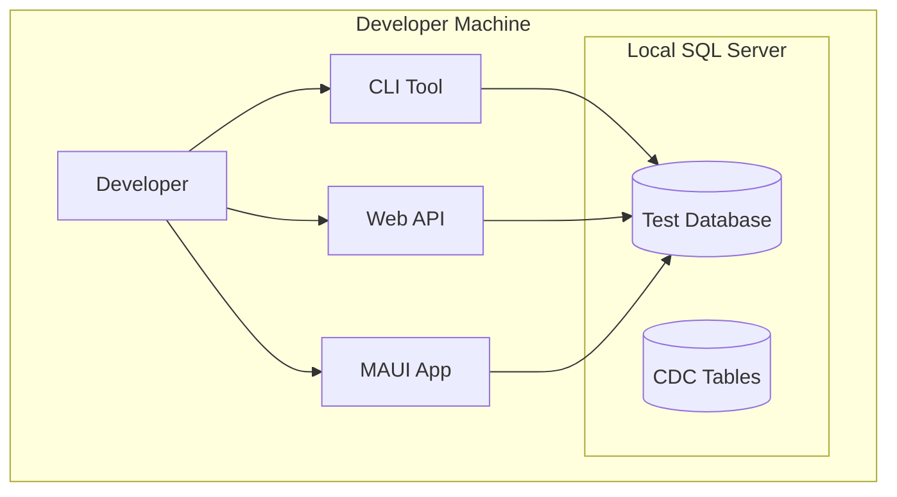
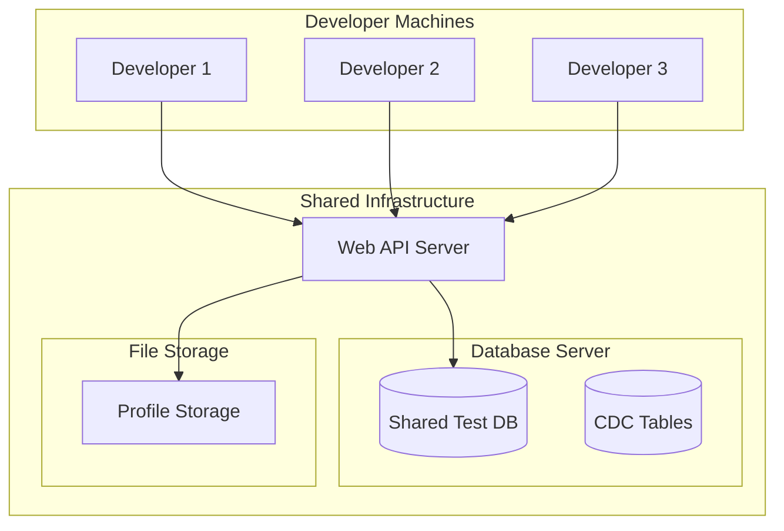
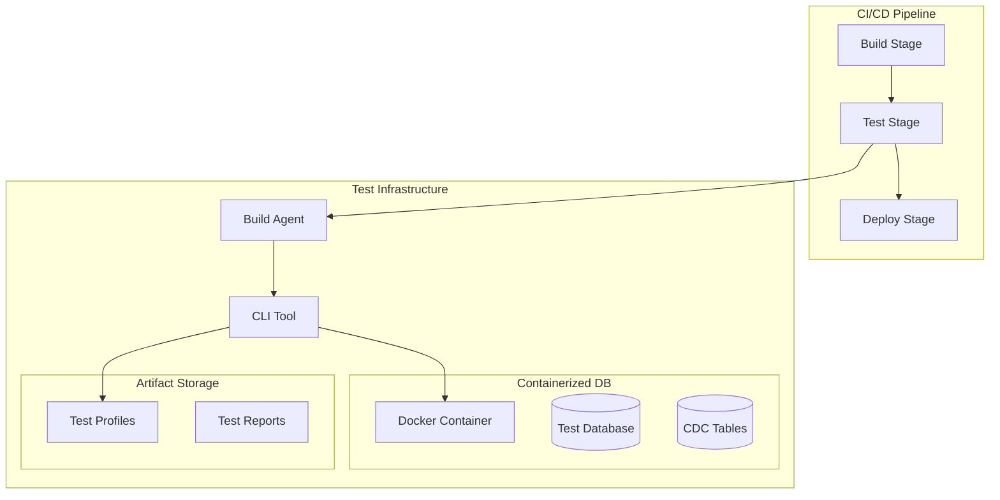
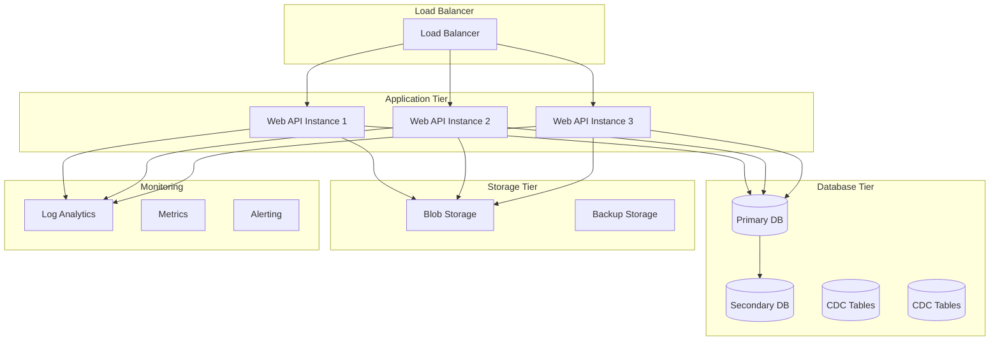

# Deployment and Configuration Guide

## Overview

This guide covers deployment strategies, configuration options, and production considerations for the CDC Testing Framework. The framework supports various deployment scenarios from local development to enterprise production environments.

## Deployment Architectures

### 1. Local Development Environment



**Use Case**: Individual developer testing and experimentation

**Components**:

- All applications run locally
- SQL Server Developer Edition or Docker container
- Direct database connections

### 2. Team Development Environment



**Use Case**: Team collaboration with shared resources

**Components**:

- Centralized Web API
- Shared database server
- Centralized profile storage
- Individual CLI tools

### 3. CI/CD Integration Environment



**Use Case**: Automated testing in build pipelines

**Components**:

- Containerized databases
- CLI automation
- Artifact storage
- Automated reporting

### 4. Enterprise Production Environment



**Use Case**: High-availability production testing environment

**Components**:

- Load-balanced API instances
- High-availability databases
- Distributed storage
- Comprehensive monitoring

## Component Deployment

### CLI Tool Deployment

#### Self-Contained Executable

```bash
# Windows
dotnet publish cdc-proto -c Release -r win-x64 --self-contained -p:PublishSingleFile=true

# Linux
dotnet publish cdc-proto -c Release -r linux-x64 --self-contained -p:PublishSingleFile=true

# macOS
dotnet publish cdc-proto -c Release -r osx-x64 --self-contained -p:PublishSingleFile=true
```

#### Framework-Dependent Deployment

```bash
# Requires .NET runtime on target machine
dotnet publish cdc-proto -c Release --no-self-contained
```

#### Docker Container

```dockerfile
# Dockerfile for CLI tool
FROM mcr.microsoft.com/dotnet/runtime:6.0 AS base
WORKDIR /app

FROM mcr.microsoft.com/dotnet/sdk:6.0 AS build
WORKDIR /src
COPY ["cdc-proto/cdc-utility.csproj", "cdc-proto/"]
COPY ["cdc-lib/cdc-lib.csproj", "cdc-lib/"]
RUN dotnet restore "cdc-proto/cdc-utility.csproj"
COPY . .
WORKDIR "/src/cdc-proto"
RUN dotnet build "cdc-utility.csproj" -c Release -o /app/build

FROM build AS publish
RUN dotnet publish "cdc-utility.csproj" -c Release -o /app/publish

FROM base AS final
WORKDIR /app
COPY --from=publish /app/publish .
ENTRYPOINT ["dotnet", "cdc-utility.dll"]
```

#### Usage in CI/CD

```yaml
# Azure DevOps Pipeline
- task: DotNetCoreCLI@2
  displayName: "Install CDC CLI Tool"
  inputs:
    command: "custom"
    custom: "tool"
    arguments: "install --global cdc-utility --add-source ./artifacts"

- task: PowerShell@2
  displayName: "Run CDC Tests"
  inputs:
    targetType: "inline"
    script: |
      cdc-utility init
      # Run test scenarios
      cdc-utility profile -out test-profile.json
      cdc-utility teardown
```

### Web API Deployment

#### IIS Deployment (Windows)

```xml
<!-- web.config -->
<?xml version="1.0" encoding="utf-8"?>
<configuration>
  <location path="." inheritInChildApplications="false">
    <system.webServer>
      <handlers>
        <add name="aspNetCore" path="*" verb="*" modules="AspNetCoreModuleV2" resourceType="Unspecified" />
      </handlers>
      <aspNetCore processPath="dotnet"
                  arguments=".\cdc-api.dll"
                  stdoutLogEnabled="false"
                  stdoutLogFile=".\logs\stdout"
                  hostingModel="inprocess" />
    </system.webServer>
  </location>
</configuration>
```

#### Docker Container

```dockerfile
# Dockerfile for Web API
FROM mcr.microsoft.com/dotnet/aspnet:6.0 AS base
WORKDIR /app
EXPOSE 80
EXPOSE 443

FROM mcr.microsoft.com/dotnet/sdk:6.0 AS build
WORKDIR /src
COPY ["cdc-api/cdc-api.csproj", "cdc-api/"]
COPY ["cdc-lib/cdc-lib.csproj", "cdc-lib/"]
RUN dotnet restore "cdc-api/cdc-api.csproj"
COPY . .
WORKDIR "/src/cdc-api"
RUN dotnet build "cdc-api.csproj" -c Release -o /app/build

FROM build AS publish
RUN dotnet publish "cdc-api.csproj" -c Release -o /app/publish

FROM base AS final
WORKDIR /app
COPY --from=publish /app/publish .
ENTRYPOINT ["dotnet", "cdc-api.dll"]
```

#### Kubernetes Deployment

```yaml
# k8s-deployment.yaml
apiVersion: apps/v1
kind: Deployment
metadata:
  name: cdc-api
spec:
  replicas: 3
  selector:
    matchLabels:
      app: cdc-api
  template:
    metadata:
      labels:
        app: cdc-api
    spec:
      containers:
        - name: cdc-api
          image: cdc-api:latest
          ports:
            - containerPort: 80
          env:
            - name: ConnectionStrings__DefaultConnection
              valueFrom:
                secretKeyRef:
                  name: cdc-secrets
                  key: connection-string
          resources:
            requests:
              memory: "256Mi"
              cpu: "250m"
            limits:
              memory: "512Mi"
              cpu: "500m"
---
apiVersion: v1
kind: Service
metadata:
  name: cdc-api-service
spec:
  selector:
    app: cdc-api
  ports:
    - protocol: TCP
      port: 80
      targetPort: 80
  type: LoadBalancer
```

#### Azure App Service

```json
{
  "ConnectionStrings": {
    "DefaultConnection": "@Microsoft.KeyVault(SecretUri=https://your-keyvault.vault.azure.net/secrets/connection-string/)"
  },
  "Logging": {
    "LogLevel": {
      "Default": "Information"
    },
    "ApplicationInsights": {
      "LogLevel": {
        "Default": "Information"
      }
    }
  }
}
```

### MAUI Application Deployment

#### Windows (MSIX Package)

```xml
<!-- Package.appxmanifest -->
<Package xmlns="http://schemas.microsoft.com/appx/manifest/foundation/windows10">
  <Identity Name="CDC.TestingFramework"
            Publisher="CN=YourCompany"
            Version="1.0.0.0" />
  <Properties>
    <DisplayName>CDC Testing Framework</DisplayName>
    <PublisherDisplayName>Your Company</PublisherDisplayName>
    <Logo>Images\StoreLogo.png</Logo>
  </Properties>
  <Dependencies>
    <TargetDeviceFamily Name="Windows.Universal" MinVersion="10.0.17763.0" MaxVersionTested="10.0.19041.0" />
  </Dependencies>
  <Applications>
    <Application Id="App" Executable="cdc-maui.exe" EntryPoint="Windows.FullTrustApplication">
      <uap:VisualElements DisplayName="CDC Testing Framework"
                          Square150x150Logo="Images\Square150x150Logo.png"
                          Square44x44Logo="Images\Square44x44Logo.png"
                          BackgroundColor="transparent">
      </uap:VisualElements>
    </Application>
  </Applications>
</Package>
```

#### macOS (App Bundle)

```bash
# Build for macOS
dotnet publish cdc-maui -f net6.0-maccatalyst -c Release

# Create installer package
productbuild --component "bin/Release/net6.0-maccatalyst/cdc-maui.app" /Applications "CDC-Testing-Framework.pkg"
```

#### Android (APK)

```bash
# Build APK
dotnet publish cdc-maui -f net6.0-android -c Release

# Sign APK (for distribution)
jarsigner -verbose -sigalg SHA1withRSA -digestalg SHA1 -keystore your-keystore.keystore bin/Release/net6.0-android/cdc-maui-Signed.apk your-alias
```

## Configuration Management

### Environment-Specific Configuration

#### Development Configuration

```json
{
  "Environment": "Development",
  "ConnectionStrings": {
    "DefaultConnection": "Server=localhost;Database=CdcTestDB_Dev;Integrated Security=true;TrustServerCertificate=true;"
  },
  "Logging": {
    "LogLevel": {
      "Default": "Debug",
      "Microsoft.AspNetCore": "Warning"
    }
  },
  "CdcSettings": {
    "RetentionDays": 1,
    "BatchSize": 1000,
    "TimeoutSeconds": 120
  }
}
```

#### Staging Configuration

```json
{
  "Environment": "Staging",
  "ConnectionStrings": {
    "DefaultConnection": "Server=staging-db;Database=CdcTestDB_Staging;User Id=cdc_user;Password=#{CDC_PASSWORD}#;TrustServerCertificate=true;"
  },
  "Logging": {
    "LogLevel": {
      "Default": "Information",
      "Microsoft.AspNetCore": "Warning"
    }
  },
  "CdcSettings": {
    "RetentionDays": 3,
    "BatchSize": 5000,
    "TimeoutSeconds": 300
  },
  "Storage": {
    "ProfileStoragePath": "/shared/profiles",
    "BackupEnabled": true
  }
}
```

#### Production Configuration

```json
{
  "Environment": "Production",
  "ConnectionStrings": {
    "DefaultConnection": "#{PRODUCTION_CONNECTION_STRING}#"
  },
  "Logging": {
    "LogLevel": {
      "Default": "Warning",
      "CDC": "Information"
    }
  },
  "CdcSettings": {
    "RetentionDays": 7,
    "BatchSize": 10000,
    "TimeoutSeconds": 600,
    "EnablePerformanceCounters": true
  },
  "Storage": {
    "ProfileStorageType": "AzureBlob",
    "ConnectionString": "#{STORAGE_CONNECTION_STRING}#",
    "ContainerName": "cdc-profiles"
  },
  "Monitoring": {
    "ApplicationInsights": {
      "InstrumentationKey": "#{AI_INSTRUMENTATION_KEY}#"
    }
  }
}
```

### Configuration Sources

#### File-Based Configuration

```csharp
// Program.cs
var builder = WebApplication.CreateBuilder(args);

builder.Configuration
    .SetBasePath(Directory.GetCurrentDirectory())
    .AddJsonFile("appsettings.json", optional: false, reloadOnChange: true)
    .AddJsonFile($"appsettings.{builder.Environment.EnvironmentName}.json", optional: true, reloadOnChange: true)
    .AddEnvironmentVariables()
    .AddCommandLine(args);
```

#### Environment Variables

```bash
# Set environment variables
export CDC_CONNECTION_STRING="Server=prod-db;Database=CdcTestDB;User Id=cdc_user;Password=SecurePassword;"
export CDC_RETENTION_DAYS="7"
export CDC_BATCH_SIZE="10000"
export ASPNETCORE_ENVIRONMENT="Production"
```

#### Azure Key Vault Integration

```csharp
// Program.cs
if (builder.Environment.IsProduction())
{
    var keyVaultEndpoint = builder.Configuration["KeyVaultEndpoint"];
    if (!string.IsNullOrEmpty(keyVaultEndpoint))
    {
        builder.Configuration.AddAzureKeyVault(
            new Uri(keyVaultEndpoint),
            new DefaultAzureCredential());
    }
}
```

#### Docker Secrets

```yaml
# docker-compose.yml
version: "3.8"
services:
  cdc-api:
    image: cdc-api:latest
    environment:
      - ConnectionStrings__DefaultConnection_FILE=/run/secrets/db_connection
    secrets:
      - db_connection
    ports:
      - "80:80"

secrets:
  db_connection:
    file: ./secrets/db_connection.txt
```

### Configuration Models

#### Strongly-Typed Configuration

```csharp
// CdcSettings.cs
public class CdcSettings
{
    public const string SectionName = "CdcSettings";

    public int RetentionDays { get; set; } = 3;
    public int BatchSize { get; set; } = 1000;
    public int TimeoutSeconds { get; set; } = 120;
    public bool EnablePerformanceCounters { get; set; } = false;
    public string[] TablesToExclude { get; set; } = Array.Empty<string>();
}

// StorageSettings.cs
public class StorageSettings
{
    public const string SectionName = "Storage";

    public string ProfileStorageType { get; set; } = "FileSystem";
    public string ProfileStoragePath { get; set; } = "./profiles";
    public string ConnectionString { get; set; } = "";
    public string ContainerName { get; set; } = "cdc-profiles";
    public bool BackupEnabled { get; set; } = false;
}

// Program.cs registration
builder.Services.Configure<CdcSettings>(
    builder.Configuration.GetSection(CdcSettings.SectionName));
builder.Services.Configure<StorageSettings>(
    builder.Configuration.GetSection(StorageSettings.SectionName));
```

## Security Configuration

### Connection String Security

#### Using Azure Key Vault

```csharp
// Secure connection string retrieval
public class SecureConnectionStringProvider
{
    private readonly IConfiguration _configuration;

    public SecureConnectionStringProvider(IConfiguration configuration)
    {
        _configuration = configuration;
    }

    public string GetConnectionString(string name)
    {
        // Try Key Vault first
        var keyVaultValue = _configuration[$"KeyVault:ConnectionStrings:{name}"];
        if (!string.IsNullOrEmpty(keyVaultValue))
            return keyVaultValue;

        // Fall back to regular configuration
        return _configuration.GetConnectionString(name);
    }
}
```

#### Connection String Encryption

```csharp
// Encrypt sensitive configuration sections
public static class ConfigurationEncryption
{
    public static void EncryptConnectionStrings()
    {
        var config = WebConfigurationManager.OpenWebConfiguration("~");
        var section = config.GetSection("connectionStrings") as ConnectionStringsSection;

        if (section != null && !section.SectionInformation.IsProtected)
        {
            section.SectionInformation.ProtectSection("DataProtectionConfigurationProvider");
            config.Save();
        }
    }
}
```

### Authentication and Authorization

#### API Key Authentication

```csharp
// ApiKeyAuthenticationHandler.cs
public class ApiKeyAuthenticationHandler : AuthenticationHandler<ApiKeyAuthenticationSchemeOptions>
{
    private const string ApiKeyHeaderName = "X-API-Key";

    protected override Task<AuthenticateResult> HandleAuthenticateAsync()
    {
        if (!Request.Headers.TryGetValue(ApiKeyHeaderName, out var apiKeyHeaderValues))
        {
            return Task.FromResult(AuthenticateResult.NoResult());
        }

        var providedApiKey = apiKeyHeaderValues.FirstOrDefault();
        var validApiKeys = Options.ApiKeys;

        if (validApiKeys.Contains(providedApiKey))
        {
            var claims = new[]
            {
                new Claim(ClaimTypes.Name, "CDC API User"),
                new Claim(ClaimTypes.NameIdentifier, providedApiKey)
            };

            var identity = new ClaimsIdentity(claims, Scheme.Name);
            var principal = new ClaimsPrincipal(identity);
            var ticket = new AuthenticationTicket(principal, Scheme.Name);

            return Task.FromResult(AuthenticateResult.Success(ticket));
        }

        return Task.FromResult(AuthenticateResult.Fail("Invalid API Key"));
    }
}
```

#### JWT Authentication

```csharp
// JWT configuration
builder.Services.AddAuthentication(JwtBearerDefaults.AuthenticationScheme)
    .AddJwtBearer(options =>
    {
        options.TokenValidationParameters = new TokenValidationParameters
        {
            ValidateIssuer = true,
            ValidateAudience = true,
            ValidateLifetime = true,
            ValidateIssuerSigningKey = true,
            ValidIssuer = builder.Configuration["Jwt:Issuer"],
            ValidAudience = builder.Configuration["Jwt:Audience"],
            IssuerSigningKey = new SymmetricSecurityKey(
                Encoding.UTF8.GetBytes(builder.Configuration["Jwt:Key"]))
        };
    });
```

## Monitoring and Logging

### Application Insights Integration

```csharp
// Program.cs
builder.Services.AddApplicationInsightsTelemetry(options =>
{
    options.ConnectionString = builder.Configuration["ApplicationInsights:ConnectionString"];
});

// Custom telemetry
builder.Services.AddSingleton<ITelemetryInitializer, CdcTelemetryInitializer>();
```

### Structured Logging

```csharp
// Serilog configuration
builder.Host.UseSerilog((context, configuration) =>
{
    configuration
        .ReadFrom.Configuration(context.Configuration)
        .Enrich.FromLogContext()
        .Enrich.WithMachineName()
        .Enrich.WithEnvironmentUserName()
        .WriteTo.Console()
        .WriteTo.File("logs/cdc-.txt", rollingInterval: RollingInterval.Day)
        .WriteTo.ApplicationInsights(TelemetryConfiguration.CreateDefault(), TelemetryConverter.Traces);
});
```

### Health Checks

```csharp
// Health check configuration
builder.Services.AddHealthChecks()
    .AddSqlServer(builder.Configuration.GetConnectionString("DefaultConnection"))
    .AddCheck<CdcHealthCheck>("cdc-status")
    .AddApplicationInsightsPublisher();

// Custom CDC health check
public class CdcHealthCheck : IHealthCheck
{
    private readonly SimpleDac _dac;

    public async Task<HealthCheckResult> CheckHealthAsync(HealthCheckContext context, CancellationToken cancellationToken = default)
    {
        try
        {
            var isCdcEnabled = _dac.ExecuteScalar<bool>("SELECT is_cdc_enabled FROM sys.databases WHERE name = DB_NAME()");

            if (isCdcEnabled)
                return HealthCheckResult.Healthy("CDC is enabled and operational");
            else
                return HealthCheckResult.Degraded("CDC is not enabled on the database");
        }
        catch (Exception ex)
        {
            return HealthCheckResult.Unhealthy("CDC health check failed", ex);
        }
    }
}
```

## Performance Optimization

### Database Connection Pooling

```csharp
// Connection string with pooling settings
var connectionString = "Server=localhost;Database=CdcTestDB;User Id=cdc_user;Password=password;" +
                      "Max Pool Size=100;Min Pool Size=5;Connection Timeout=30;Command Timeout=300;" +
                      "Pooling=true;TrustServerCertificate=true;";
```

### Caching Configuration

```csharp
// Memory caching for frequently accessed data
builder.Services.AddMemoryCache(options =>
{
    options.SizeLimit = 1000;
    options.CompactionPercentage = 0.25;
});

// Distributed caching for multi-instance deployments
builder.Services.AddStackExchangeRedisCache(options =>
{
    options.Configuration = builder.Configuration.GetConnectionString("Redis");
    options.InstanceName = "CDC-Framework";
});
```

### Background Services

```csharp
// Background service for CDC cleanup
public class CdcCleanupService : BackgroundService
{
    private readonly IServiceProvider _serviceProvider;
    private readonly ILogger<CdcCleanupService> _logger;
    private readonly TimeSpan _period = TimeSpan.FromHours(6);

    protected override async Task ExecuteAsync(CancellationToken stoppingToken)
    {
        using var timer = new PeriodicTimer(_period);

        while (!stoppingToken.IsCancellationRequested && await timer.WaitForNextTickAsync(stoppingToken))
        {
            using var scope = _serviceProvider.CreateScope();
            var dac = scope.ServiceProvider.GetRequiredService<SimpleDac>();

            try
            {
                // Perform CDC cleanup
                await CleanupOldCdcData(dac);
            }
            catch (Exception ex)
            {
                _logger.LogError(ex, "CDC cleanup failed");
            }
        }
    }
}
```

## Backup and Recovery

### Profile Backup Strategy

```csharp
// Automated profile backup
public class ProfileBackupService
{
    private readonly StorageSettings _storageSettings;

    public async Task BackupProfilesAsync()
    {
        var profileDirectory = _storageSettings.ProfileStoragePath;
        var backupDirectory = Path.Combine(profileDirectory, "backups", DateTime.UtcNow.ToString("yyyy-MM-dd"));

        Directory.CreateDirectory(backupDirectory);

        var profileFiles = Directory.GetFiles(profileDirectory, "*.json");

        foreach (var file in profileFiles)
        {
            var fileName = Path.GetFileName(file);
            var backupPath = Path.Combine(backupDirectory, fileName);
            File.Copy(file, backupPath, overwrite: true);
        }

        // Upload to cloud storage if configured
        if (_storageSettings.ProfileStorageType == "AzureBlob")
        {
            await UploadToAzureBlob(backupDirectory);
        }
    }
}
```

### Database Backup Integration

```sql
-- Automated CDC database backup
DECLARE @BackupPath NVARCHAR(500) = 'C:\Backups\CdcTestDB_' + FORMAT(GETDATE(), 'yyyyMMdd_HHmmss') + '.bak';

BACKUP DATABASE CdcTestDB
TO DISK = @BackupPath
WITH COMPRESSION, CHECKSUM, INIT;

-- Backup CDC-specific data
BACKUP DATABASE CdcTestDB
TO DISK = 'C:\Backups\CdcTestDB_CDC_Data.bak'
WITH COMPRESSION, CHECKSUM, DIFFERENTIAL;
```

This comprehensive deployment guide provides the foundation for deploying the CDC Testing Framework across various environments, from development to enterprise production scenarios.
