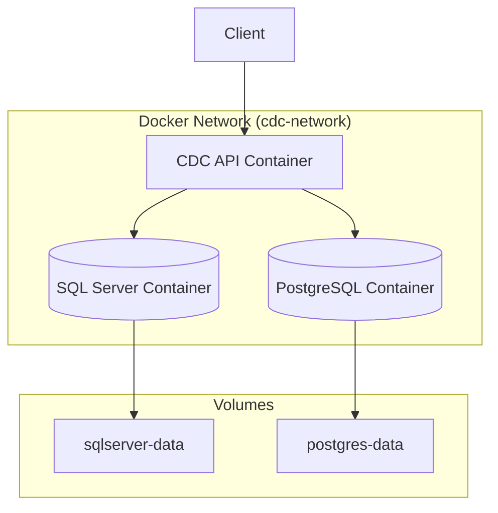

# Docker and Docker Compose Guide

This guide covers building and running the CDC Testing Framework using Docker and Docker Compose.

## Table of Contents

- [Overview](#overview)
- [Prerequisites](#prerequisites)
- [Quick Start](#quick-start)
- [Docker Compose Configurations](#docker-compose-configurations)
- [Building Docker Images](#building-docker-images)
- [Running with Docker Compose](#running-with-docker-compose)
- [Configuration](#configuration)
- [Networking](#networking)
- [Data Persistence](#data-persistence)
- [Troubleshooting](#troubleshooting)

## Overview

The CDC Testing Framework provides Docker support for:

- **Containerized API**: Run the Web API in a Docker container
- **Database Services**: SQL Server and PostgreSQL containers
- **Development Environment**: Hot-reload enabled development setup
- **Production Deployment**: Optimized production-ready configuration

### Architecture



## Prerequisites

- **Docker**: Version 20.10 or later
- **Docker Compose**: Version 2.0 or later
- **System Requirements**:
  - Minimum 4GB RAM (8GB recommended)
  - 10GB free disk space
  - Linux, macOS, or Windows with WSL2

### Installation

**Docker Desktop** (Windows/macOS):
```bash
# Download from https://www.docker.com/products/docker-desktop
```

**Docker Engine** (Linux):
```bash
# Ubuntu/Debian
curl -fsSL https://get.docker.com -o get-docker.sh
sudo sh get-docker.sh

# Install Docker Compose
sudo apt-get install docker-compose-plugin
```

## Quick Start

### 1. Clone and Configure

```bash
# Clone the repository
git clone <repository-url>
cd cdc-me

# Copy environment file
cp .env.example .env

# Edit .env with your settings (optional for defaults)
nano .env
```

### 2. Start Services

**Production Mode:**
```bash
docker-compose up -d
```

**Development Mode:**
```bash
docker-compose -f docker-compose.dev.yml up -d
```

### 3. Verify Services

```bash
# Check running containers
docker-compose ps

# View logs
docker-compose logs -f cdc-api

# Test API
curl http://localhost:8080/health
```

### 4. Access Services

- **API**: http://localhost:8080
- **Swagger UI**: http://localhost:8080/swagger
- **SQL Server**: localhost:1433
- **PostgreSQL**: localhost:5432
- **pgAdmin** (dev only): http://localhost:5050

## Docker Compose Configurations

### Production Configuration (`docker-compose.yml`)

Optimized for production deployment with:

- Multi-stage builds for smaller images
- Health checks for all services
- Automatic restarts
- Persistent data volumes
- Secure defaults

**Services:**
- `cdc-api`: CDC Testing Framework API
- `sqlserver`: SQL Server 2022 (test database)
- `postgres`: PostgreSQL 16 (trace database)

### Development Configuration (`docker-compose.dev.yml`)

Enhanced for development with:

- Hot-reload support
- Debug logging
- Source code mounting
- pgAdmin for database management
- Additional debugging ports

**Additional Services:**
- `pgadmin`: PostgreSQL management UI

## Building Docker Images

### Build API Image

**Using Docker:**
```bash
# Build with default settings
docker build -t cdc-api:latest .

# Build with specific .NET version
docker build --build-arg DOTNET_VERSION=9.0 -t cdc-api:latest .

# Build with version tag
docker build --build-arg VERSION=1.2.3 -t cdc-api:1.2.3 .

# Multi-architecture build
docker buildx build --platform linux/amd64,linux/arm64 -t cdc-api:latest .
```

**Using Docker Compose:**
```bash
# Build all services
docker-compose build

# Build specific service
docker-compose build cdc-api

# Build with no cache
docker-compose build --no-cache

# Build with specific version
VERSION=1.2.3 docker-compose build
```

### Build Arguments

| Argument | Default | Description |
|----------|---------|-------------|
| `DOTNET_VERSION` | `9.0` | .NET SDK/Runtime version |
| `VERSION` | `1.0.0` | Application version |
| `TARGETARCH` | Auto | Target architecture (amd64/arm64) |

## Running with Docker Compose

### Start Services

```bash
# Start all services (detached)
docker-compose up -d

# Start with logs
docker-compose up

# Start specific service
docker-compose up -d cdc-api

# Start with rebuild
docker-compose up -d --build
```

### Stop Services

```bash
# Stop all services
docker-compose stop

# Stop and remove containers
docker-compose down

# Stop and remove containers + volumes
docker-compose down -v

# Stop and remove containers + volumes + images
docker-compose down -v --rmi all
```

### View Logs

```bash
# All services
docker-compose logs -f

# Specific service
docker-compose logs -f cdc-api

# Last 100 lines
docker-compose logs --tail=100 cdc-api

# Since timestamp
docker-compose logs --since 2024-01-01T00:00:00 cdc-api
```

### Execute Commands

```bash
# Execute command in running container
docker-compose exec cdc-api dotnet --version

# Execute SQL Server command
docker-compose exec sqlserver /opt/mssql-tools/bin/sqlcmd -S localhost -U sa -P 'YourPassword' -Q "SELECT @@VERSION"

# Execute PostgreSQL command
docker-compose exec postgres psql -U cdcme -d cdcme -c "SELECT version();"

# Open shell in container
docker-compose exec cdc-api sh
docker-compose exec sqlserver bash
docker-compose exec postgres sh
```

### Scale Services

```bash
# Scale API to 3 instances
docker-compose up -d --scale cdc-api=3

# Note: Requires load balancer configuration
```

## Configuration

### Environment Variables

Create a `.env` file from `.env.example`:

```bash
cp .env.example .env
```

**Key Variables:**

```bash
# Application
VERSION=1.0.0
ASPNETCORE_ENVIRONMENT=Production
API_PORT=8080

# SQL Server
SQL_PORT=1433
SQL_SA_PASSWORD=YourStrong@Passw0rd
SQL_PID=Developer

# PostgreSQL
POSTGRES_PORT=5432
POSTGRES_DB=cdcme
POSTGRES_USER=cdcme
POSTGRES_PASSWORD=cdcme_password

# Connection Strings (for containers)
TEST_DB_CONNECTION=Server=sqlserver;Database=CdcTestDB;User Id=sa;Password=${SQL_SA_PASSWORD};TrustServerCertificate=true;
CDCME_DB_CONNECTION=Host=postgres;Database=${POSTGRES_DB};Username=${POSTGRES_USER};Password=${POSTGRES_PASSWORD}
```

### Override Configuration

Create `docker-compose.override.yml` for local customizations:

```yaml
version: '3.8'

services:
  cdc-api:
    ports:
      - "9090:8080"  # Custom port
    environment:
      - CustomSetting=Value
```

## Networking

### Network Configuration

All services run on the `cdc-network` bridge network:

```bash
# Inspect network
docker network inspect cdc-me_cdc-network

# List connected containers
docker network inspect cdc-me_cdc-network --format '{{range .Containers}}{{.Name}} {{end}}'
```

### Service Discovery

Services can communicate using service names:

- `cdc-api` → API service
- `sqlserver` → SQL Server
- `postgres` → PostgreSQL

**Example Connection Strings:**
```bash
# From API to SQL Server
Server=sqlserver;Database=CdcTestDB;...

# From API to PostgreSQL
Host=postgres;Database=cdcme;...
```

### Port Mapping

| Service | Internal Port | External Port | Description |
|---------|--------------|---------------|-------------|
| cdc-api | 8080 | 8080 | API HTTP |
| sqlserver | 1433 | 1433 | SQL Server |
| postgres | 5432 | 5432 | PostgreSQL |
| pgadmin | 80 | 5050 | pgAdmin UI (dev) |

## Data Persistence

### Volumes

Docker Compose creates named volumes for data persistence:

```bash
# List volumes
docker volume ls | grep cdc-me

# Inspect volume
docker volume inspect cdc-me_sqlserver-data

# Backup volume
docker run --rm -v cdc-me_sqlserver-data:/data -v $(pwd):/backup alpine tar czf /backup/sqlserver-backup.tar.gz /data

# Restore volume
docker run --rm -v cdc-me_sqlserver-data:/data -v $(pwd):/backup alpine tar xzf /backup/sqlserver-backup.tar.gz -C /
```

### Volume Management

```bash
# Remove all volumes (WARNING: Data loss!)
docker-compose down -v

# Remove specific volume
docker volume rm cdc-me_sqlserver-data

# Prune unused volumes
docker volume prune
```

### Backup Strategies

**SQL Server Backup:**
```bash
# Create backup directory
mkdir -p ./backups

# Backup database
docker-compose exec sqlserver /opt/mssql-tools/bin/sqlcmd -S localhost -U sa -P "$SQL_SA_PASSWORD" -Q "BACKUP DATABASE CdcTestDB TO DISK = '/backups/CdcTestDB.bak'"
```

**PostgreSQL Backup:**
```bash
# Backup database
docker-compose exec postgres pg_dump -U cdcme cdcme > ./backups/cdcme-backup.sql

# Restore database
docker-compose exec -T postgres psql -U cdcme cdcme < ./backups/cdcme-backup.sql
```

## Troubleshooting

### Common Issues

#### Container Won't Start

```bash
# Check logs
docker-compose logs cdc-api

# Check container status
docker-compose ps

# Inspect container
docker inspect cdc-me_cdc-api_1
```

#### Database Connection Issues

```bash
# Test SQL Server connection
docker-compose exec sqlserver /opt/mssql-tools/bin/sqlcmd -S localhost -U sa -P "$SQL_SA_PASSWORD" -Q "SELECT 1"

# Test PostgreSQL connection
docker-compose exec postgres psql -U cdcme -d cdcme -c "SELECT 1"

# Check network connectivity
docker-compose exec cdc-api ping sqlserver
docker-compose exec cdc-api ping postgres
```

#### Port Already in Use

```bash
# Find process using port
lsof -i :8080  # macOS/Linux
netstat -ano | findstr :8080  # Windows

# Change port in .env
API_PORT=9090
```

#### Out of Disk Space

```bash
# Check disk usage
docker system df

# Clean up
docker system prune -a --volumes

# Remove unused images
docker image prune -a

# Remove unused volumes
docker volume prune
```

#### SQL Server Agent Not Running

```bash
# Check agent status
docker-compose exec sqlserver /opt/mssql-tools/bin/sqlcmd -S localhost -U sa -P "$SQL_SA_PASSWORD" -Q "EXEC sp_helpsrvrolemember 'sysadmin'"

# Restart container
docker-compose restart sqlserver
```

### Health Checks

```bash
# Check health status
docker-compose ps

# View health check logs
docker inspect --format='{{json .State.Health}}' cdc-me_cdc-api_1 | jq

# Manual health check
curl http://localhost:8080/health
```

### Performance Tuning

**Increase Memory:**
```yaml
# docker-compose.override.yml
services:
  sqlserver:
    deploy:
      resources:
        limits:
          memory: 4G
        reservations:
          memory: 2G
```

**Optimize SQL Server:**
```bash
# Set max memory (MB)
docker-compose exec sqlserver /opt/mssql-tools/bin/sqlcmd -S localhost -U sa -P "$SQL_SA_PASSWORD" -Q "EXEC sp_configure 'max server memory', 2048; RECONFIGURE;"
```

### Debug Mode

**Enable Debug Logging:**
```bash
# Set environment variable
docker-compose exec cdc-api sh -c 'export Logging__LogLevel__Default=Debug'

# Or in docker-compose.override.yml
services:
  cdc-api:
    environment:
      - Logging__LogLevel__Default=Debug
      - Logging__LogLevel__Microsoft.AspNetCore=Information
```

## Advanced Usage

### Multi-Stage Deployment

```bash
# Build for staging
ASPNETCORE_ENVIRONMENT=Staging docker-compose -f docker-compose.yml -f docker-compose.staging.yml up -d

# Build for production
ASPNETCORE_ENVIRONMENT=Production docker-compose up -d
```

### CI/CD Integration

**GitHub Actions Example:**
```yaml
name: Docker Build and Test

on: [push]

jobs:
  test:
    runs-on: ubuntu-latest
    steps:
      - uses: actions/checkout@v3
      
      - name: Start services
        run: docker-compose up -d
      
      - name: Wait for services
        run: |
          timeout 60 bash -c 'until docker-compose exec -T cdc-api wget -q --spider http://localhost:8080/health; do sleep 2; done'
      
      - name: Run tests
        run: docker-compose exec -T cdc-api dotnet test
      
      - name: Stop services
        run: docker-compose down -v
```

### Custom Networks

```yaml
# docker-compose.override.yml
networks:
  cdc-network:
    driver: bridge
    ipam:
      config:
        - subnet: 172.28.0.0/16
```

## Best Practices

1. **Use `.env` files**: Never commit secrets to version control
2. **Regular backups**: Backup volumes before major changes
3. **Monitor resources**: Use `docker stats` to monitor resource usage
4. **Update images**: Regularly update base images for security patches
5. **Use health checks**: Ensure services are healthy before use
6. **Log rotation**: Configure log rotation to prevent disk space issues
7. **Network isolation**: Use separate networks for different environments
8. **Version tags**: Use specific version tags instead of `latest`

## Additional Resources

- [Docker Documentation](https://docs.docker.com/)
- [Docker Compose Documentation](https://docs.docker.com/compose/)
- [SQL Server on Docker](https://docs.microsoft.com/en-us/sql/linux/quickstart-install-connect-docker)
- [PostgreSQL on Docker](https://hub.docker.com/_/postgres)
- [CDC Testing Framework Documentation](./README.md)