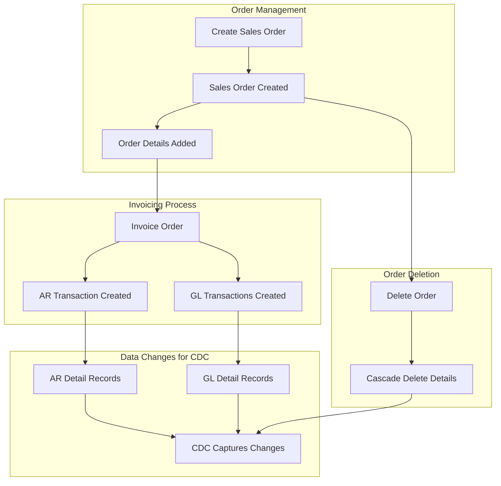

# ERP Test Database Design

## Overview

This document describes the design and implementation of a simplified ERP test database for the CDC Testing Framework. The database simulates a basic order-to-cash business flow with essential Accounts Receivable (AR) and General Ledger (GL) integration, specifically designed to generate rich CDC data for testing purposes.

## Business Process Flow

The ERP test database supports the following core business processes:

## Database Schema Design

### Table Structure Overview

The ERP test database consists of 7 core tables organized into 3 functional modules:

1. **Chart of Accounts Module**

   - `ChartOfAccounts` - GL account master data

2. **Order Management Module**

   - `SalesOrder` - Order header information
   - `SalesOrderDetail` - Order line items

3. **Financial Module**
   - `ArTransaction` - AR transaction headers (invoices, payments, credits)
   - `ArTransactionDetail` - AR transaction line items
   - `GlTransaction` - GL transaction headers
   - `GlTransactionDetail` - GL transaction line items

### Detailed Table Specifications

#### ChartOfAccounts

Standard ERP chart of accounts structure with hierarchical account organization.

**Columns:**

- `AccountId` (INT, PK, Identity) - Unique account identifier
- `AccountNumber` (VARCHAR(20), Unique) - Account number (e.g., "1000", "4000")
- `AccountName` (VARCHAR(100)) - Account description
- `AccountType` (VARCHAR(20)) - Asset, Liability, Equity, Revenue, Expense
- `ParentAccountId` (INT, FK) - Self-referencing for account hierarchy
- `IsActive` (BIT) - Account status
- `CreatedDate` (DATETIME2) - Record creation timestamp
- `ModifiedDate` (DATETIME2) - Last modification timestamp

**Sample Data:**

- 1000 - Cash and Cash Equivalents (Asset)
- 1200 - Accounts Receivable (Asset)
- 4000 - Sales Revenue (Revenue)
- 5000 - Cost of Goods Sold (Expense)

#### SalesOrder

Order header containing customer and order-level information.

**Columns:**

- `SalesOrderId` (INT, PK, Identity) - Unique order identifier
- `OrderNumber` (VARCHAR(20), Unique) - Business order number
- `CustomerName` (VARCHAR(100)) - Customer name
- `CustomerEmail` (VARCHAR(100)) - Customer email
- `OrderDate` (DATETIME2) - Order creation date
- `RequiredDate` (DATETIME2) - Customer requested delivery date
- `OrderStatus` (VARCHAR(20)) - Open, Invoiced, Cancelled, Deleted
- `SubTotal` (DECIMAL(18,2)) - Order subtotal
- `TaxAmount` (DECIMAL(18,2)) - Tax amount
- `TotalAmount` (DECIMAL(18,2)) - Total order amount
- `Notes` (VARCHAR(500)) - Order notes
- `CreatedBy` (VARCHAR(50)) - User who created the order
- `CreatedDate` (DATETIME2) - Record creation timestamp
- `ModifiedDate` (DATETIME2) - Last modification timestamp

#### SalesOrderDetail

Individual line items for each sales order.

**Columns:**

- `SalesOrderDetailId` (INT, PK, Identity) - Unique line item identifier
- `SalesOrderId` (INT, FK) - Reference to SalesOrder
- `LineNumber` (INT) - Line sequence number
- `ProductCode` (VARCHAR(50)) - Product identifier
- `ProductDescription` (VARCHAR(200)) - Product description
- `Quantity` (DECIMAL(18,4)) - Ordered quantity
- `UnitPrice` (DECIMAL(18,4)) - Price per unit
- `LineTotal` (DECIMAL(18,2)) - Calculated line total (Quantity × UnitPrice)
- `CreatedDate` (DATETIME2) - Record creation timestamp
- `ModifiedDate` (DATETIME2) - Last modification timestamp

#### ArTransaction

Accounts Receivable transaction headers for invoices, payments, and credits.

**Columns:**

- `ArTransactionId` (INT, PK, Identity) - Unique AR transaction identifier
- `TransactionNumber` (VARCHAR(20), Unique) - Business transaction number
- `TransactionType` (VARCHAR(20)) - Invoice, Payment, Credit, Adjustment
- `SalesOrderId` (INT, FK, Nullable) - Reference to originating sales order
- `CustomerName` (VARCHAR(100)) - Customer name
- `TransactionDate` (DATETIME2) - Transaction date
- `DueDate` (DATETIME2) - Payment due date
- `TransactionAmount` (DECIMAL(18,2)) - Total transaction amount
- `OutstandingAmount` (DECIMAL(18,2)) - Remaining unpaid amount
- `TransactionStatus` (VARCHAR(20)) - Open, Paid, Partially Paid, Cancelled
- `Description` (VARCHAR(200)) - Transaction description
- `CreatedBy` (VARCHAR(50)) - User who created the transaction
- `CreatedDate` (DATETIME2) - Record creation timestamp
- `ModifiedDate` (DATETIME2) - Last modification timestamp

#### ArTransactionDetail

Detailed line items for AR transactions.

**Columns:**

- `ArTransactionDetailId` (INT, PK, Identity) - Unique detail identifier
- `ArTransactionId` (INT, FK) - Reference to ArTransaction
- `LineNumber` (INT) - Line sequence number
- `SalesOrderDetailId` (INT, FK, Nullable) - Reference to originating order line
- `ProductCode` (VARCHAR(50)) - Product identifier
- `ProductDescription` (VARCHAR(200)) - Product description
- `Quantity` (DECIMAL(18,4)) - Invoiced quantity
- `UnitPrice` (DECIMAL(18,4)) - Price per unit
- `LineTotal` (DECIMAL(18,2)) - Line total amount
- `CreatedDate` (DATETIME2) - Record creation timestamp
- `ModifiedDate` (DATETIME2) - Last modification timestamp

#### GlTransaction

General Ledger transaction headers for all financial postings.

**Columns:**

- `GlTransactionId` (INT, PK, Identity) - Unique GL transaction identifier
- `TransactionNumber` (VARCHAR(20), Unique) - Business transaction number
- `TransactionType` (VARCHAR(20)) - Sales, Payment, Adjustment, etc.
- `SourceModule` (VARCHAR(20)) - AR, AP, Inventory, etc.
- `SourceTransactionId` (INT) - Reference to source transaction
- `TransactionDate` (DATETIME2) - Transaction date
- `PostingDate` (DATETIME2) - GL posting date
- `Description` (VARCHAR(200)) - Transaction description
- `TotalDebitAmount` (DECIMAL(18,2)) - Total debit amount
- `TotalCreditAmount` (DECIMAL(18,2)) - Total credit amount
- `IsPosted` (BIT) - Posting status
- `CreatedBy` (VARCHAR(50)) - User who created the transaction
- `CreatedDate` (DATETIME2) - Record creation timestamp
- `ModifiedDate` (DATETIME2) - Last modification timestamp

#### GlTransactionDetail

Individual GL account postings for each transaction.

**Columns:**

- `GlTransactionDetailId` (INT, PK, Identity) - Unique detail identifier
- `GlTransactionId` (INT, FK) - Reference to GlTransaction
- `LineNumber` (INT) - Line sequence number
- `AccountId` (INT, FK) - Reference to ChartOfAccounts
- `DebitAmount` (DECIMAL(18,2)) - Debit amount (null if credit)
- `CreditAmount` (DECIMAL(18,2)) - Credit amount (null if debit)
- `Description` (VARCHAR(200)) - Line description
- `CreatedDate` (DATETIME2) - Record creation timestamp
- `ModifiedDate` (DATETIME2) - Last modification timestamp

## Indexes and Constraints

### Primary Keys

All tables have identity-based primary keys for optimal CDC performance.

### Foreign Key Relationships

- `SalesOrderDetail.SalesOrderId` → `SalesOrder.SalesOrderId`
- `ArTransaction.SalesOrderId` → `SalesOrder.SalesOrderId`
- `ArTransactionDetail.ArTransactionId` → `ArTransaction.ArTransactionId`
- `ArTransactionDetail.SalesOrderDetailId` → `SalesOrderDetail.SalesOrderDetailId`
- `GlTransactionDetail.GlTransactionId` → `GlTransaction.GlTransactionId`
- `GlTransactionDetail.AccountId` → `ChartOfAccounts.AccountId`
- `ChartOfAccounts.ParentAccountId` → `ChartOfAccounts.AccountId`

### Performance Indexes

- `IX_SalesOrder_OrderNumber` - Unique index on OrderNumber
- `IX_SalesOrder_CustomerName` - Index for customer lookups
- `IX_SalesOrder_OrderDate` - Index for date range queries
- `IX_SalesOrderDetail_SalesOrderId` - Foreign key index
- `IX_ArTransaction_TransactionNumber` - Unique index on TransactionNumber
- `IX_ArTransaction_SalesOrderId` - Foreign key index
- `IX_ArTransaction_CustomerName` - Index for customer lookups
- `IX_ArTransactionDetail_ArTransactionId` - Foreign key index
- `IX_GlTransaction_TransactionNumber` - Unique index on TransactionNumber
- `IX_GlTransaction_TransactionDate` - Index for date range queries
- `IX_GlTransactionDetail_GlTransactionId` - Foreign key index
- `IX_GlTransactionDetail_AccountId` - Foreign key index
- `IX_ChartOfAccounts_AccountNumber` - Unique index on AccountNumber
- `IX_ChartOfAccounts_ParentAccountId` - Foreign key index

## Stored Procedures

### Order Management Procedures

#### `usp_CreateSalesOrder`

Creates a new sales order with order details.

**Parameters:**

- `@CustomerName` VARCHAR(100)
- `@CustomerEmail` VARCHAR(100)
- `@RequiredDate` DATETIME2
- `@OrderDetails` - Table-valued parameter containing order lines
- `@Notes` VARCHAR(500)
- `@CreatedBy` VARCHAR(50)

**Returns:**

- `@SalesOrderId` INT (OUTPUT) - Created order ID
- `@OrderNumber` VARCHAR(20) (OUTPUT) - Generated order number

#### `usp_DeleteSalesOrder`

Deletes a sales order and all related records.

**Parameters:**

- `@SalesOrderId` INT
- `@DeletedBy` VARCHAR(50)

**Business Rules:**

- Cannot delete invoiced orders
- Cascades to delete order details
- Updates order status to 'Deleted' before physical deletion

#### `usp_InvoiceSalesOrder`

Converts a sales order to an invoice, creating AR and GL transactions.

**Parameters:**

- `@SalesOrderId` INT
- `@InvoiceDate` DATETIME2
- `@DueDate` DATETIME2
- `@CreatedBy` VARCHAR(50)

**Returns:**

- `@ArTransactionId` INT (OUTPUT) - Created AR transaction ID
- `@GlTransactionId` INT (OUTPUT) - Created GL transaction ID

**Business Logic:**

1. Validates order exists and is not already invoiced
2. Creates AR transaction header and details
3. Creates GL transaction with proper debits/credits:
   - Debit: Accounts Receivable
   - Credit: Sales Revenue
4. Updates sales order status to 'Invoiced'

### Financial Procedures

#### `usp_PostGlTransaction`

Posts a GL transaction and updates posting status.

**Parameters:**

- `@GlTransactionId` INT
- `@PostingDate` DATETIME2
- `@PostedBy` VARCHAR(50)

#### `usp_GetAccountBalance`

Retrieves current balance for a GL account.

**Parameters:**

- `@AccountId` INT
- `@AsOfDate` DATETIME2

**Returns:**

- Account balance as of specified date

## Sample Data

The setup script includes comprehensive sample data:

### Chart of Accounts (12 accounts)

- Assets: Cash, Accounts Receivable, Inventory
- Liabilities: Accounts Payable, Accrued Expenses
- Equity: Retained Earnings, Common Stock
- Revenue: Sales Revenue, Service Revenue
- Expenses: Cost of Goods Sold, Operating Expenses

### Sample Orders (5 orders)

- Various customers and order amounts
- Multiple line items per order
- Different order statuses

### Sample Products

- Standard products with consistent pricing
- Service items
- Various quantities and unit prices

## CDC Testing Scenarios

This ERP database design supports comprehensive CDC testing scenarios:

### Scenario 1: Order Creation

**CDC Impact:** Inserts into SalesOrder and SalesOrderDetail tables
**Test Value:** Validates CDC capture of related table inserts

### Scenario 2: Order Invoicing

**CDC Impact:**

- Updates to SalesOrder (status change)
- Inserts into ArTransaction, ArTransactionDetail
- Inserts into GlTransaction, GlTransactionDetail
  **Test Value:** Complex multi-table transaction with updates and inserts

### Scenario 3: Order Deletion

**CDC Impact:**

- Updates to SalesOrder (status change)
- Deletes from SalesOrderDetail
- Final delete from SalesOrder
  **Test Value:** Cascade delete operations and status transitions

### Scenario 4: Financial Posting

**CDC Impact:** Updates to GlTransaction (posting status)
**Test Value:** Status field changes and audit trail updates

### Scenario 5: Account Hierarchy Changes

**CDC Impact:** Updates to ChartOfAccounts (parent relationships)
**Test Value:** Self-referencing foreign key changes

## Performance Considerations

### CDC Optimization

- All tables have clustered primary keys on identity columns
- Foreign key indexes support efficient CDC queries
- Minimal use of computed columns to reduce CDC overhead

### Query Performance

- Strategic indexing on frequently queried columns
- Proper data types to minimize storage overhead
- Normalized design to reduce data redundancy

### Scalability

- Identity columns support high-volume inserts
- Partitioning-ready design (by date columns)
- Efficient cascade delete operations

## Security and Compliance

### Audit Trail

- All tables include CreatedDate and ModifiedDate
- CreatedBy fields track user responsibility
- Status fields maintain business state history

### Data Integrity

- Comprehensive foreign key constraints
- Check constraints on status fields
- Calculated columns for data consistency

## Usage Instructions

### Setup Process

1. Execute `create-erp-test-objects.sql` to create all objects
2. Verify table creation and sample data
3. Enable CDC on all tables using the CDC Testing Framework
4. Run test scenarios using the stored procedures

### Cleanup Process

1. Execute `cleanup-erp-test-objects.sql` to remove all objects
2. Verify complete cleanup
3. Database is ready for fresh setup

### Testing Workflow

1. Create baseline CDC snapshot
2. Execute business scenarios using stored procedures
3. Capture CDC data profiles
4. Compare profiles to validate CDC functionality
5. Clean up and repeat with different scenarios

## File Structure

The ERP test database implementation consists of:

- `scripts/create-erp-test-objects.sql` - Complete setup script
- `scripts/cleanup-erp-test-objects.sql` - Complete teardown script
- `docs/erp-test-database.md` - This documentation file

## Integration with CDC Testing Framework

This ERP database integrates seamlessly with the existing CDC Testing Framework:

1. **Connection**: Uses TEST_DB_CONNECTION environment variable
2. **CDC Enablement**: Compatible with framework's CDC initialization
3. **Profile Generation**: Rich data changes for comprehensive profiling
4. **Comparison Testing**: Multiple scenarios for difference analysis
5. **Cleanup**: Complete teardown for repeatable testing

The design ensures that CDC testing scenarios generate meaningful business data changes that thoroughly exercise the framework's capabilities while maintaining the simplicity needed for focused testing.
