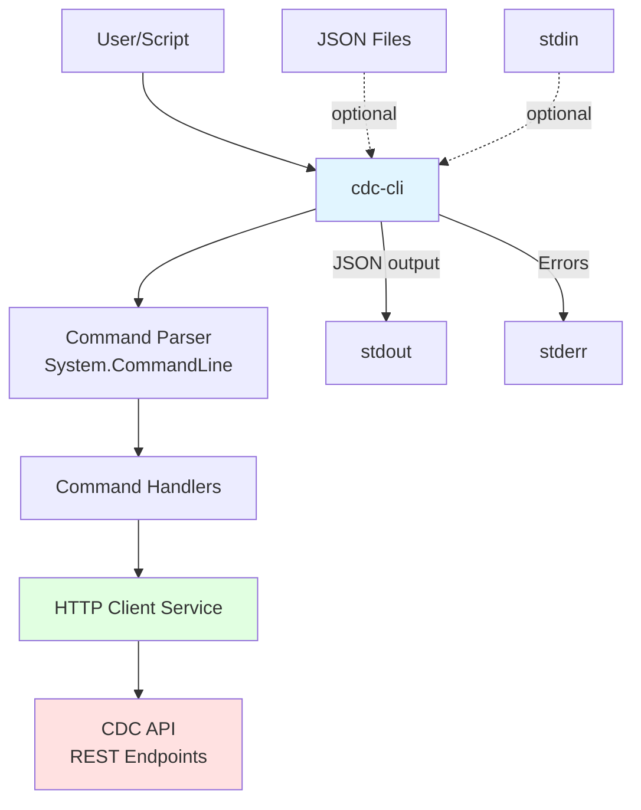
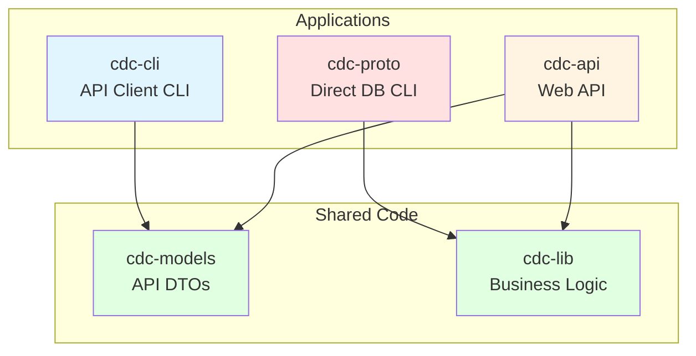

# CDC CLI API Client - Technical Design Document

## Executive Summary

This document outlines the design for `cdc-cli`, a new command-line client that communicates with the CDC API over HTTP/HTTPS. The tool will provide a clean command-line interface to all CDC API endpoints while sharing common code with the existing `cdc-proto` tool.

## Project Overview

### Purpose

Create a CLI tool that wraps the CDC REST API, allowing users to:
- Interact with CDC API endpoints from command line or scripts
- Pipe JSON payloads from stdin or read from files
- Output JSON responses to stdout for scripting/chaining
- Configure API base URL via command-line parameter or environment variable

### Key Differences from cdc-proto

| Aspect | cdc-proto | cdc-cli |
|--------|-----------|---------|
| **Communication** | Direct database connections | HTTP API calls |
| **Dependencies** | SQL Server drivers, PostgreSQL drivers | HTTP client library |
| **Use Case** | Database administrators, local development | API consumers, CI/CD pipelines, remote operations |
| **Configuration** | Database connection strings | API base URL |
| **Authentication** | Database credentials | API authentication (future) |

## Architecture

### High-Level Design



### Project Structure

```
cdc-cli/
├── cdc-cli.csproj
├── Program.cs                    # Entry point, DI setup
├── Commands/                     # Command implementations
│   ├── Cdc/
│   │   ├── CdcStartCommand.cs
│   │   ├── CdcStopCommand.cs
│   │   └── CdcCaptureCommand.cs
│   ├── Snapshot/
│   │   ├── SnapshotCreateCommand.cs
│   │   ├── SnapshotRestoreCommand.cs
│   │   ├── SnapshotListCommand.cs
│   │   ├── SnapshotInfoCommand.cs
│   │   └── SnapshotDeleteCommand.cs
│   ├── Trace/
│   │   ├── TraceStartCommand.cs
│   │   ├── TraceStopCommand.cs
│   │   ├── TraceStatusCommand.cs
│   │   ├── TraceListCommand.cs
│   │   ├── TraceExportCommand.cs
│   │   ├── TraceEventsCommand.cs
│   │   └── TraceDeleteCommand.cs
│   └── Workflow/
│       ├── WorkflowExecuteCommand.cs
│       ├── WorkflowStatusCommand.cs
│       └── WorkflowListCommand.cs
├── Services/
│   ├── ICdcApiClient.cs         # API client interface
│   ├── CdcApiClient.cs          # HTTP API client implementation
│   ├── IJsonHandler.cs          # JSON I/O interface
│   └── JsonHandler.cs           # JSON stdin/file/stdout handler
├── Models/                       # Shared DTOs (link to cdc-api models)
│   └── ApiModels.cs             # Request/Response models
└── Configuration/
    └── CliConfiguration.cs       # Configuration model
```

## Code Sharing Strategy

### Shared Libraries

1. **cdc-lib**: Already contains shared business logic
   - CDC utilities
   - Data models
   - Database abstractions (not needed for cdc-cli, but no harm)

2. **New: cdc-models** (optional, recommended):
   - Shared DTO/model classes between cdc-api and cdc-cli
   - API request/response models
   - Avoids duplication

### Code Organization



## Command-Line Interface Design

### Global Options

All commands support these global options:

```bash
--base-url <url>      # API base URL (default: from env var CDC_API_URL or http://localhost:5000)
--output <format>     # Output format: json (default), json-pretty, text
--verbose             # Enable verbose logging
--quiet               # Suppress all output except JSON response
--help                # Show help
```

### Configuration Precedence

1. Command-line parameter `--base-url`
2. Environment variable `CDC_API_URL`
3. Default: `http://localhost:5000`

### Command Structure

```
cdc-cli <resource> <action> [options] [--data <json> | --file <path> | < stdin]
```

Examples:
```bash
cdc-cli cdc start --session "test-1" --include "dbo.Orders"
cdc-cli cdc stop --data '{"sessionName":"test-1","captureName":"baseline"}'
cdc-cli snapshot create --file snapshot-request.json
cdc-cli trace status my-session --output json-pretty
```

## Detailed Command Specifications

### CDC Commands

#### `cdc start` - Start CDC Operations

**Endpoint**: `POST /api/cdc/start`

**Usage**:
```bash
# Using command-line parameters
cdc-cli cdc start \
  --session <session-name> \
  --include <table1> [--include <table2>...] \
  --exclude <table1> [--exclude <table2>...]

# Using JSON from file
cdc-cli cdc start --file start-cdc.json

# Using JSON from stdin
echo '{"sessionName":"test","tablesToInclude":["dbo.Orders"]}' | cdc-cli cdc start

# Using JSON string
cdc-cli cdc start --data '{"sessionName":"test","tablesToInclude":["dbo.Orders"]}'
```

**Parameters**:
- `--session, -s <name>`: Session name (required if not using --data/--file)
- `--include, -i <table>`: Table to include (can be repeated)
- `--exclude, -e <table>`: Table to exclude (can be repeated)
- `--data, -d <json>`: JSON payload as string
- `--file, -f <path>`: Path to JSON file

**Output**: JSON response to stdout

#### `cdc stop` - Stop CDC and Capture Data

**Endpoint**: `POST /api/cdc/stop`

**Usage**:
```bash
cdc-cli cdc stop \
  --session <session-name> \
  --capture <capture-name> \
  --type <capture-type>

# Or with JSON
cdc-cli cdc stop --data '{"sessionName":"test","captureName":"baseline","captureType":"Baseline"}'
```

**Parameters**:
- `--session, -s <name>`: Session name (required)
- `--capture, -c <name>`: Capture name (required)
- `--type, -t <type>`: Capture type (optional, default: "Baseline")

#### `cdc capture` - Capture Without Stopping

**Endpoint**: `POST /api/cdc/capture`

**Usage**: Same as `cdc stop`

### Snapshot Commands

#### `snapshot create` - Create Database Snapshot

**Endpoint**: `POST /api/snapshot`

**Usage**:
```bash
cdc-cli snapshot create \
  --database <database-name> \
  --snapshot <snapshot-name>

# Or with JSON
cdc-cli snapshot create --file create-snapshot.json
```

**Parameters**:
- `--database, -d <name>`: Database name (required)
- `--snapshot, -s <name>`: Snapshot name (required)

#### `snapshot restore` - Restore from Snapshot

**Endpoint**: `POST /api/snapshot/restore`

**Usage**:
```bash
cdc-cli snapshot restore \
  --database <database-name> \
  --snapshot <snapshot-name>
```

#### `snapshot list` - List Snapshots

**Endpoint**: `GET /api/snapshot/{databaseName}/snapshots`

**Usage**:
```bash
cdc-cli snapshot list --database <database-name>
```

#### `snapshot info` - Get Snapshot Information

**Endpoint**: `GET /api/snapshot/{databaseName}/snapshots/{snapshotName}`

**Usage**:
```bash
cdc-cli snapshot info \
  --database <database-name> \
  --snapshot <snapshot-name>
```

#### `snapshot delete` - Delete Snapshot

**Endpoint**: `DELETE /api/snapshot/{snapshotName}`

**Usage**:
```bash
cdc-cli snapshot delete --snapshot <snapshot-name>
```

### Trace Commands

#### `trace start` - Start Trace Session

**Endpoint**: `POST /api/trace/start`

**Usage**:
```bash
cdc-cli trace start \
  --session <session-name> \
  --database <database-name> \
  [--max-file-size <mb>] \
  [--max-files <count>] \
  [--events <event1,event2,...>]

# Or with JSON (for complex filter criteria)
cdc-cli trace start --file trace-config.json
```

**Parameters**:
- `--session, -s <name>`: Session name (required)
- `--database, -d <name>`: Database name (required)
- `--max-file-size <mb>`: Max file size in MB (optional)
- `--max-files <count>`: Max number of files (optional)
- `--events <list>`: Comma-separated list of events to capture (optional)

#### `trace stop` - Stop Trace Session

**Endpoint**: `POST /api/trace/stop`

**Usage**:
```bash
cdc-cli trace stop --session <session-name>
```

#### `trace status` - Get Trace Status

**Endpoint**: `GET /api/trace/status/{sessionName}`

**Usage**:
```bash
cdc-cli trace status <session-name>
```

#### `trace list` - List Trace Sessions

**Endpoint**: `GET /api/trace/sessions`

**Usage**:
```bash
cdc-cli trace list
```

#### `trace export` - Export Trace Data

**Endpoint**: `POST /api/trace/export`

**Usage**:
```bash
cdc-cli trace export --session <session-name>
```

#### `trace events` - Get Trace Events

**Endpoint**: `GET /api/trace/sessions/{sessionId}/events`

**Usage**:
```bash
cdc-cli trace events <session-id> \
  [--limit <count>] \
  [--offset <count>]
```

**Parameters**:
- `--limit <count>`: Maximum number of events (default: 100)
- `--offset <count>`: Number of events to skip (default: 0)

#### `trace delete` - Delete Trace Session

**Endpoint**: `DELETE /api/trace/sessions/{sessionId}`

**Usage**:
```bash
cdc-cli trace delete <session-id>
```

### Workflow Commands

#### `workflow execute` - Execute Test Workflow

**Endpoint**: `POST /api/testworkflow/execute`

**Usage**:
```bash
# Complex request - use JSON file
cdc-cli workflow execute --file workflow-config.json
```

This command requires a complex JSON payload, so file or stdin input is recommended.

#### `workflow status` - Get Workflow Status

**Endpoint**: `GET /api/testworkflow/status/{workflowId}`

**Usage**:
```bash
cdc-cli workflow status <workflow-id>
```

#### `workflow list` - List Workflow Executions

**Endpoint**: `GET /api/testworkflow/executions`

**Usage**:
```bash
cdc-cli workflow list
```

## JSON Input/Output Handling

### Input Methods

The CLI supports three input methods for JSON payloads:

1. **Command-line parameters**: Structured CLI parameters that are converted to JSON
2. **File input**: `--file <path>` reads JSON from a file
3. **Stdin**: Reads JSON from stdin if no --file or --data specified and command expects payload

### Input Priority

1. `--data <json>` (inline JSON string)
2. `--file <path>` (file-based JSON)
3. `stdin` (piped JSON)
4. Command-line parameters (converted to JSON)

### Output Formats

```bash
--output json           # Compact JSON (default, good for piping)
--output json-pretty    # Pretty-printed JSON (good for human reading)
--output text           # Human-readable text summary
```

### Error Handling

- Success responses: Write to stdout
- HTTP errors: Write to stderr with exit code 1
- Network errors: Write to stderr with exit code 2
- Validation errors: Write to stderr with exit code 3

## Implementation Plan

### Phase 1: Project Setup and Core Infrastructure

1. **Create cdc-cli project**
   - New .NET console project
   - Add System.CommandLine package
   - Add HttpClient dependencies
   - Reference cdc-lib

2. **Create shared models**
   - Option A: Create cdc-models library (recommended)
   - Option B: Link files from cdc-api/Models

3. **Implement core services**
   - `CdcApiClient`: HTTP client wrapper
   - `JsonHandler`: stdin/file/stdout handler
   - Configuration management

### Phase 2: CDC Commands

Implement CDC command group:
- `cdc start`
- `cdc stop`
- `cdc capture`

### Phase 3: Snapshot Commands

Implement Snapshot command group:
- `snapshot create`
- `snapshot restore`
- `snapshot list`
- `snapshot info`
- `snapshot delete`

### Phase 4: Trace Commands

Implement Trace command group:
- `trace start`
- `trace stop`
- `trace status`
- `trace list`
- `trace export`
- `trace events`
- `trace delete`

### Phase 5: Workflow Commands

Implement Workflow command group:
- `workflow execute`
- `workflow status`
- `workflow list`

### Phase 6: Testing and Documentation

- Unit tests for all commands
- Integration tests with API
- User documentation
- Example scripts

## Technical Implementation Details

### HTTP Client Service

```csharp
public interface ICdcApiClient
{
    Task<TResponse> PostAsync<TRequest, TResponse>(
        string endpoint, 
        TRequest request, 
        CancellationToken cancellationToken = default);
    
    Task<TResponse> GetAsync<TResponse>(
        string endpoint, 
        CancellationToken cancellationToken = default);
    
    Task<TResponse> DeleteAsync<TResponse>(
        string endpoint, 
        CancellationToken cancellationToken = default);
}

public class CdcApiClient : ICdcApiClient
{
    private readonly HttpClient _httpClient;
    private readonly string _baseUrl;
    private readonly ILogger _logger;
    
    public CdcApiClient(string baseUrl, ILogger logger)
    {
        _baseUrl = baseUrl.TrimEnd('/');
        _logger = logger;
        _httpClient = new HttpClient
        {
            BaseAddress = new Uri(_baseUrl),
            Timeout = TimeSpan.FromMinutes(5)
        };
    }
    
    // Implementation...
}
```

### JSON Handler Service

```csharp
public interface IJsonHandler
{
    Task<T?> ReadInputAsync<T>(
        string? dataString, 
        string? filePath, 
        bool allowStdin = true);
    
    Task WriteOutputAsync<T>(
        T data, 
        OutputFormat format = OutputFormat.Json);
    
    Task WriteErrorAsync(string message, int exitCode);
}

public enum OutputFormat
{
    Json,
    JsonPretty,
    Text
}
```

### Command Base Class

```csharp
public abstract class ApiCommandBase : Command
{
    protected readonly ICdcApiClient ApiClient;
    protected readonly IJsonHandler JsonHandler;
    protected readonly ILogger Logger;
    
    protected ApiCommandBase(
        string name,
        string description,
        ICdcApiClient apiClient,
        IJsonHandler jsonHandler,
        ILogger logger)
        : base(name, description)
    {
        ApiClient = apiClient;
        JsonHandler = jsonHandler;
        Logger = logger;
    }
    
    protected Option<string> CreateDataOption() =>
        new Option<string>(
            aliases: new[] { "--data", "-d" },
            description: "JSON payload as string");
    
    protected Option<string> CreateFileOption() =>
        new Option<string>(
            aliases: new[] { "--file", "-f" },
            description: "Path to JSON file");
    
    protected async Task<TRequest?> GetRequestAsync<TRequest>(
        string? data, 
        string? file)
    {
        return await JsonHandler.ReadInputAsync<TRequest>(
            data, 
            file, 
            allowStdin: true);
    }
}
```

### Example Command Implementation

```csharp
public class CdcStartCommand : ApiCommandBase
{
    public CdcStartCommand(
        ICdcApiClient apiClient,
        IJsonHandler jsonHandler,
        ILoggerFactory loggerFactory)
        : base(
            "start",
            "Start CDC operations on database tables",
            apiClient,
            jsonHandler,
            loggerFactory.CreateLogger<CdcStartCommand>())
    {
        // Option 1: JSON input
        var dataOption = CreateDataOption();
        var fileOption = CreateFileOption();
        
        // Option 2: CLI parameters
        var sessionOption = new Option<string>(
            aliases: new[] { "--session", "-s" },
            description: "Session name");
        
        var includeOption = new Option<string[]>(
            aliases: new[] { "--include", "-i" },
            description: "Tables to include (can be repeated)")
        { 
            AllowMultipleArgumentsPerToken = true 
        };
        
        var excludeOption = new Option<string[]>(
            aliases: new[] { "--exclude", "-e" },
            description: "Tables to exclude (can be repeated)")
        { 
            AllowMultipleArgumentsPerToken = true 
        };
        
        AddOption(dataOption);
        AddOption(fileOption);
        AddOption(sessionOption);
        AddOption(includeOption);
        AddOption(excludeOption);
        
        this.SetHandler(
            HandleCommandAsync,
            dataOption,
            fileOption,
            sessionOption,
            includeOption,
            excludeOption);
    }
    
    private async Task HandleCommandAsync(
        string? data,
        string? file,
        string? session,
        string[]? include,
        string[]? exclude)
    {
        try
        {
            StartCdcRequest? request;
            
            // Priority 1: JSON from --data or --file or stdin
            if (!string.IsNullOrEmpty(data) || !string.IsNullOrEmpty(file))
            {
                request = await GetRequestAsync<StartCdcRequest>(data, file);
            }
            // Priority 2: Build from CLI parameters
            else if (!string.IsNullOrEmpty(session))
            {
                request = new StartCdcRequest
                {
                    SessionName = session,
                    TablesToInclude = include?.ToList(),
                    TablesToExclude = exclude?.ToList()
                };
            }
            else
            {
                await JsonHandler.WriteErrorAsync(
                    "Either --session or --data/--file is required",
                    exitCode: 3);
                return;
            }
            
            if (request == null)
            {
                await JsonHandler.WriteErrorAsync(
                    "Failed to parse request",
                    exitCode: 3);
                return;
            }
            
            // Make API call
            var response = await ApiClient.PostAsync<StartCdcRequest, StartCdcResponse>(
                "/api/cdc/start",
                request);
            
            // Output response
            await JsonHandler.WriteOutputAsync(response);
        }
        catch (HttpRequestException ex)
        {
            await JsonHandler.WriteErrorAsync(
                $"API error: {ex.Message}",
                exitCode: 1);
        }
        catch (Exception ex)
        {
            Logger.LogError(ex, "Unexpected error");
            await JsonHandler.WriteErrorAsync(
                $"Error: {ex.Message}",
                exitCode: 1);
        }
    }
}
```

## Usage Examples

### Basic CDC Workflow

```bash
#!/bin/bash
# Set API URL
export CDC_API_URL="http://localhost:5000"

# Start CDC monitoring
cdc-cli cdc start \
  --session "test-session" \
  --include "dbo.Orders" \
  --include "dbo.Customers"

# Run test scenario
./run-test.sh

# Stop CDC and capture data
cdc-cli cdc stop \
  --session "test-session" \
  --capture "baseline" \
  --type "Baseline"
```

### JSON File Input

```bash
# create-snapshot.json
{
  "databaseName": "TestDB",
  "snapshotName": "baseline-snapshot"
}

# Execute command
cdc-cli snapshot create --file create-snapshot.json
```

### Piping JSON

```bash
# Generate JSON dynamically and pipe
cat <<EOF | cdc-cli cdc start
{
  "sessionName": "dynamic-test",
  "tablesToInclude": ["dbo.Orders", "dbo.Products"]
}
EOF
```

### Chaining Commands with jq

```bash
# Start CDC, capture session ID, use in later command
SESSION_ID=$(cdc-cli trace start \
  --session "trace-1" \
  --database "TestDB" | jq -r '.sessionId')

echo "Session ID: $SESSION_ID"

# Later, stop the trace using the session ID
cdc-cli trace delete "$SESSION_ID"
```

### CI/CD Integration

```yaml
# GitHub Actions example
- name: Start CDC Monitoring
  run: |
    cdc-cli cdc start \
      --base-url "${{ secrets.CDC_API_URL }}" \
      --session "ci-test-${{ github.run_id }}" \
      --include "dbo.Orders"

- name: Run Tests
  run: ./run-integration-tests.sh

- name: Capture CDC Data
  run: |
    cdc-cli cdc stop \
      --base-url "${{ secrets.CDC_API_URL }}" \
      --session "ci-test-${{ github.run_id }}" \
      --capture "ci-capture-${{ github.run_id }}" \
      --type "CI"
```

## Dependencies

### NuGet Packages

- **System.CommandLine** (2.0.0+): Command-line parsing
- **Microsoft.Extensions.Http** (8.0.0+): HTTP client factory
- **Microsoft.Extensions.Logging** (8.0.0+): Logging
- **Microsoft.Extensions.Configuration** (8.0.0+): Configuration
- **System.Text.Json** (8.0.0+): JSON serialization

### Project References

- **cdc-lib**: Shared business logic and models
- **cdc-models** (new, optional): Shared DTOs

## Testing Strategy

### Unit Tests

- Command parameter parsing
- JSON input/output handling
- Request building from CLI parameters
- Error handling scenarios

### Integration Tests

- API communication
- End-to-end command execution
- Error scenarios (network failures, API errors)

### Test Structure

```
cdc-cli.Tests/
├── Commands/
│   ├── CdcCommandTests.cs
│   ├── SnapshotCommandTests.cs
│   └── TraceCommandTests.cs
├── Services/
│   ├── CdcApiClientTests.cs
│   └── JsonHandlerTests.cs
└── Integration/
    └── EndToEndTests.cs
```

## Security Considerations

1. **API Authentication**: Future support for:
   - API keys
   - Bearer tokens
   - Client certificates

2. **HTTPS**: Support HTTPS connections with certificate validation

3. **Sensitive Data**: 
   - Don't log full payloads
   - Mask sensitive information in verbose output

4. **Input Validation**: Validate all inputs before making API calls

## Future Enhancements

1. **Authentication Support**
   - `--api-key` parameter
   - Token-based authentication
   - OAuth support

2. **Configuration File**
   - `~/.cdc-cli/config.json` for default settings
   - Profile support (dev, staging, prod)

3. **Response Caching**
   - Cache GET responses
   - Invalidation strategies

4. **Batch Operations**
   - Execute multiple commands from a script file
   - Transaction-like semantics

5. **Interactive Mode**
   - REPL-style interface
   - Tab completion
   - Command history

6. **Output Templates**
   - Custom output formatting
   - Table views for list commands

## Success Criteria

1. ✅ All API endpoints accessible via CLI
2. ✅ Support for JSON from file, stdin, and inline
3. ✅ JSON output to stdout for scripting
4. ✅ Configurable API base URL (parameter and env var)
5. ✅ Comprehensive error handling
6. ✅ Full test coverage (>80%)
7. ✅ Complete documentation
8. ✅ Cross-platform compatibility (Windows, Linux, macOS)

## Conclusion

The `cdc-cli` tool will provide a robust, scriptable interface to the CDC API, enabling automation and integration with CI/CD pipelines while sharing code effectively with the existing `cdc-proto` tool.
