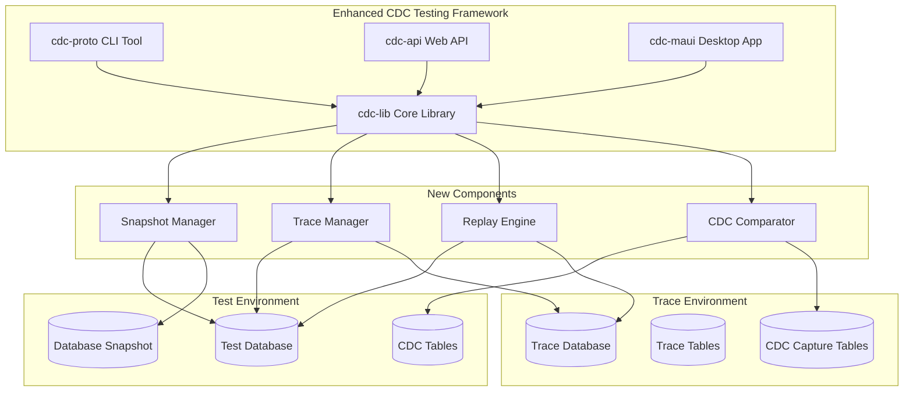

# SQL Tracing and Replicatable Testing Environment - Design Document

## Overview

This document outlines the design and implementation plan for extending the CDC Testing Framework with SQL tracing capabilities to create a comprehensive replicatable testing environment. The system will enable teams to capture, replay, and validate database changes with high precision and repeatability.

## Core Workflow

The enhanced system implements a 12-step workflow for comprehensive database testing:

1. **Create Named Snapshot** - Create a database snapshot as baseline (only 1 allowed)
2. **Enable CDC** - Turn on Change Data Capture on the test database
3. **Start Tracing** - Enable SQL tracing to a separate trace database
4. **Execute Scenarios** - Run test scenarios while capturing all changes
5. **Stop Trace** - Stop tracing and capture trace data
6. **Capture CDC Data** - Extract and store CDC data to trace database
7. **Restore Snapshot** - Restore database to baseline state
8. **Enable CDC** - Re-enable CDC for replay validation
9. **Replay Traces** - Execute captured SQL statements in order
10. **Capture CDC Data** - Extract CDC data from replay
11. **Compare CDC Captures** - Validate data consistency (ignoring time-dependent fields)
12. **Performance Testing** - Test optimized procedures against baseline

## System Architecture



## Database Schema Design

### Multi-Database Support

The system supports multiple database platforms:

- **Test Database**: SQL Server (where CDC and snapshots are managed)
- **Trace Database**: PostgreSQL or SQL Server (configurable, stores trace data and CDC captures)

This separation allows for:

- Isolation of trace data from test environment
- Scalable trace storage on different infrastructure
- Cross-platform compatibility for trace analysis

### Trace Database Schema

The trace database will contain the following tables. Schemas are provided for both PostgreSQL and SQL Server:

#### PostgreSQL Schema

```sql
-- TraceSessions table
CREATE TABLE trace_sessions (
    session_id UUID PRIMARY KEY DEFAULT gen_random_uuid(),
    session_name VARCHAR(255) NOT NULL UNIQUE,
    test_database VARCHAR(128) NOT NULL,
    snapshot_name VARCHAR(128),
    start_time TIMESTAMP WITH TIME ZONE NOT NULL DEFAULT NOW(),
    end_time TIMESTAMP WITH TIME ZONE,
    status VARCHAR(50) NOT NULL DEFAULT 'Active', -- Active, Completed, Failed
    created_by VARCHAR(128) NOT NULL DEFAULT current_user,
    description TEXT
);
```

#### SQL Server Schema

```sql
-- TraceSessions table
CREATE TABLE [dbo].[TraceSessions] (
    [SessionId] UNIQUEIDENTIFIER PRIMARY KEY DEFAULT NEWID(),
    [SessionName] NVARCHAR(255) NOT NULL UNIQUE,
    [TestDatabase] NVARCHAR(128) NOT NULL,
    [SnapshotName] NVARCHAR(128) NULL,
    [StartTime] DATETIME2(7) NOT NULL DEFAULT SYSUTCDATETIME(),
    [EndTime] DATETIME2(7) NULL,
    [Status] NVARCHAR(50) NOT NULL DEFAULT 'Active', -- Active, Completed, Failed
    [CreatedBy] NVARCHAR(128) NOT NULL DEFAULT SUSER_NAME(),
    [Description] NVARCHAR(MAX) NULL
);
```

#### TraceEvents Table

**PostgreSQL Schema:**

```sql
-- TraceEvents table
CREATE TABLE trace_events (
    event_id BIGSERIAL PRIMARY KEY,
    session_id UUID NOT NULL REFERENCES trace_sessions(session_id) ON DELETE CASCADE,
    event_time TIMESTAMP WITH TIME ZONE NOT NULL,
    event_name VARCHAR(128) NOT NULL,
    database_name VARCHAR(128),
    login_name VARCHAR(128),
    application_name VARCHAR(256),
    host_name VARCHAR(128),
    spid INTEGER,
    duration BIGINT,
    cpu_time BIGINT,
    reads BIGINT,
    writes BIGINT,
    sql_text TEXT,
    execution_order BIGINT NOT NULL,
    is_replayable BOOLEAN NOT NULL DEFAULT true
);

CREATE INDEX idx_trace_events_session_execution ON trace_events(session_id, execution_order);
CREATE INDEX idx_trace_events_event_time ON trace_events(event_time);
```

**SQL Server Schema:**

```sql
-- TraceEvents table
CREATE TABLE [dbo].[TraceEvents] (
    [EventId] BIGINT IDENTITY(1,1) PRIMARY KEY,
    [SessionId] UNIQUEIDENTIFIER NOT NULL,
    [EventTime] DATETIME2(7) NOT NULL,
    [EventName] NVARCHAR(128) NOT NULL,
    [DatabaseName] NVARCHAR(128) NULL,
    [LoginName] NVARCHAR(128) NULL,
    [ApplicationName] NVARCHAR(256) NULL,
    [HostName] NVARCHAR(128) NULL,
    [SPID] INT NULL,
    [Duration] BIGINT NULL,
    [CpuTime] BIGINT NULL,
    [Reads] BIGINT NULL,
    [Writes] BIGINT NULL,
    [SqlText] NVARCHAR(MAX) NULL,
    [ExecutionOrder] BIGINT NOT NULL,
    [IsReplayable] BIT NOT NULL DEFAULT 1,
    FOREIGN KEY ([SessionId]) REFERENCES [TraceSessions]([SessionId]) ON DELETE CASCADE
);

CREATE INDEX IX_TraceEvents_SessionId_ExecutionOrder ON [dbo].[TraceEvents] ([SessionId], [ExecutionOrder]);
CREATE INDEX IX_TraceEvents_EventTime ON [dbo].[TraceEvents] ([EventTime]);
```

#### CdcCaptures Table

**PostgreSQL Schema:**

```sql
-- CdcCaptures table
CREATE TABLE cdc_captures (
    capture_id UUID PRIMARY KEY DEFAULT gen_random_uuid(),
    session_id UUID NOT NULL REFERENCES trace_sessions(session_id) ON DELETE CASCADE,
    capture_type VARCHAR(50) NOT NULL, -- Baseline, Replay, Optimized
    capture_time TIMESTAMP WITH TIME ZONE NOT NULL DEFAULT NOW(),
    table_name VARCHAR(256) NOT NULL,
    capture_data JSONB NOT NULL, -- JSON data
    record_count INTEGER NOT NULL,
    data_hash VARCHAR(64) -- SHA256 hash for quick comparison
);

CREATE INDEX idx_cdc_captures_session_type ON cdc_captures(session_id, capture_type);
```

**SQL Server Schema:**

```sql
-- CdcCaptures table
CREATE TABLE [dbo].[CdcCaptures] (
    [CaptureId] UNIQUEIDENTIFIER PRIMARY KEY DEFAULT NEWID(),
    [SessionId] UNIQUEIDENTIFIER NOT NULL,
    [CaptureType] NVARCHAR(50) NOT NULL, -- Baseline, Replay, Optimized
    [CaptureTime] DATETIME2(7) NOT NULL DEFAULT SYSUTCDATETIME(),
    [TableName] NVARCHAR(256) NOT NULL,
    [CaptureData] NVARCHAR(MAX) NOT NULL, -- JSON data
    [RecordCount] INT NOT NULL,
    [DataHash] NVARCHAR(64) NULL, -- SHA256 hash for quick comparison
    FOREIGN KEY ([SessionId]) REFERENCES [TraceSessions]([SessionId]) ON DELETE CASCADE
);

CREATE INDEX IX_CdcCaptures_SessionId_CaptureType ON [dbo].[CdcCaptures] ([SessionId], [CaptureType]);
```

#### ComparisonResults Table

**PostgreSQL Schema:**

```sql
-- ComparisonResults table
CREATE TABLE comparison_results (
    comparison_id UUID PRIMARY KEY DEFAULT gen_random_uuid(),
    session_id UUID NOT NULL REFERENCES trace_sessions(session_id) ON DELETE CASCADE,
    left_capture_id UUID NOT NULL REFERENCES cdc_captures(capture_id),
    right_capture_id UUID NOT NULL REFERENCES cdc_captures(capture_id),
    comparison_time TIMESTAMP WITH TIME ZONE NOT NULL DEFAULT NOW(),
    table_name VARCHAR(256) NOT NULL,
    is_match BOOLEAN NOT NULL,
    difference_count INTEGER NOT NULL,
    difference_data JSONB, -- JSON diff data
    comparison_notes TEXT
);
```

**SQL Server Schema:**

```sql
-- ComparisonResults table
CREATE TABLE [dbo].[ComparisonResults] (
    [ComparisonId] UNIQUEIDENTIFIER PRIMARY KEY DEFAULT NEWID(),
    [SessionId] UNIQUEIDENTIFIER NOT NULL,
    [LeftCaptureId] UNIQUEIDENTIFIER NOT NULL,
    [RightCaptureId] UNIQUEIDENTIFIER NOT NULL,
    [ComparisonTime] DATETIME2(7) NOT NULL DEFAULT SYSUTCDATETIME(),
    [TableName] NVARCHAR(256) NOT NULL,
    [IsMatch] BIT NOT NULL,
    [DifferenceCount] INT NOT NULL,
    [DifferenceData] NVARCHAR(MAX) NULL, -- JSON diff data
    [ComparisonNotes] NVARCHAR(MAX) NULL,
    FOREIGN KEY ([SessionId]) REFERENCES [TraceSessions]([SessionId]) ON DELETE CASCADE,
    FOREIGN KEY ([LeftCaptureId]) REFERENCES [CdcCaptures]([CaptureId]),
    FOREIGN KEY ([RightCaptureId]) REFERENCES [CdcCaptures]([CaptureId])
);
```

### Database Abstraction Layer

To support both PostgreSQL and SQL Server for trace storage, the system will include:

#### Database Provider Interface

```csharp
public interface ITraceDataProvider
{
    Task<TraceSession> CreateSessionAsync(TraceConfiguration config);
    Task<IEnumerable<TraceEvent>> GetTraceEventsAsync(Guid sessionId);
    Task SaveCdcCaptureAsync(CdcCapture capture);
    Task<ComparisonResult> SaveComparisonResultAsync(ComparisonResult result);
    Task<bool> TestConnectionAsync();
    Task InitializeSchemaAsync();
}

public class PostgreSqlTraceProvider : ITraceDataProvider
{
    // Implementation using Npgsql
}

public class SqlServerTraceProvider : ITraceDataProvider
{
    // Implementation using SqlClient
}
```

#### Configuration Support

```csharp
public class TraceStorageConfiguration
{
    public string Provider { get; set; } = "PostgreSQL"; // PostgreSQL | SqlServer
    public string ConnectionString { get; set; } = string.Empty;
    public bool AutoCreateSchema { get; set; } = true;
    public int CommandTimeout { get; set; } = 30;
    public string SchemaName { get; set; } = "public"; // PostgreSQL schema or SQL Server schema
}
```

## Core Library Extensions

### 1. Snapshot Management (`SnapshotManager.cs`)

```csharp
public class SnapshotManager
{
    private readonly SimpleDac _dac;
    private readonly ILogger _logger;

    public SnapshotManager(SimpleDac dac, ILogger logger);

    // Create a named snapshot (only one allowed)
    public Task<string> CreateSnapshotAsync(string databaseName, string snapshotName);

    // Check if snapshot exists
    public Task<bool> SnapshotExistsAsync(string snapshotName);

    // Restore database from snapshot
    public Task RestoreFromSnapshotAsync(string databaseName, string snapshotName);

    // Drop existing snapshot
    public Task DropSnapshotAsync(string snapshotName);

    // Get snapshot information
    public Task<SnapshotInfo> GetSnapshotInfoAsync(string snapshotName);
}
```

### 2. Trace Management (`TraceManager.cs`)

```csharp
public class TraceManager
{
    private readonly SimpleDac _testDac;
    private readonly SimpleDac _traceDac;
    private readonly ILogger _logger;

    public TraceManager(SimpleDac testDac, SimpleDac traceDac, ILogger logger);

    // Start Extended Events session
    public Task<Guid> StartTraceAsync(TraceConfiguration config);

    // Stop trace and capture data
    public Task<TraceSession> StopTraceAsync(Guid sessionId);

    // Get trace status
    public Task<TraceStatus> GetTraceStatusAsync(Guid sessionId);

    // Export trace data to trace database
    public Task ExportTraceDataAsync(Guid sessionId, string sessionName);
}
```

### 3. Replay Engine (`ReplayEngine.cs`)

```csharp
public class ReplayEngine
{
    private readonly SimpleDac _testDac;
    private readonly SimpleDac _traceDac;
    private readonly ILogger _logger;

    public ReplayEngine(SimpleDac testDac, SimpleDac traceDac, ILogger logger);

    // Replay captured SQL statements
    public Task<ReplayResult> ReplayTraceAsync(Guid sessionId, ReplayOptions options);

    // Filter and prepare statements for replay
    public Task<IEnumerable<ReplayStatement>> PrepareStatementsAsync(Guid sessionId);

    // Execute single statement with error handling
    public Task<StatementResult> ExecuteStatementAsync(ReplayStatement statement);
}
```

### 4. CDC Comparator (`CdcComparator.cs`)

```csharp
public class CdcComparator
{
    private readonly SimpleDac _traceDac;
    private readonly ILogger _logger;
    private readonly ComparisonConfiguration _config;

    public CdcComparator(SimpleDac traceDac, ILogger logger, ComparisonConfiguration config);

    // Compare two CDC captures
    public Task<ComparisonResult> CompareCapturesAsync(Guid leftCaptureId, Guid rightCaptureId);

    // Normalize CDC data for comparison
    public Task<IDictionary<string, object>> NormalizeCdcDataAsync(IDictionary<string, object> data);

    // Generate detailed difference report
    public Task<DifferenceReport> GenerateDifferenceReportAsync(ComparisonResult result);
}
```

## Configuration Models

### TraceConfiguration

```csharp
public class TraceConfiguration
{
    public string DatabaseName { get; set; }
    public string SessionName { get; set; }
    public string[] EventTypes { get; set; } = { "sql_batch_completed", "rpc_completed" };
    public string[] ExcludePatterns { get; set; } = { "SELECT%", "sys.%", "INFORMATION_SCHEMA%" };
    public int RingBufferSizeMB { get; set; } = 64;
    public bool CaptureStatementText { get; set; } = true;
    public bool CapturePerformanceMetrics { get; set; } = true;
}
```

### ComparisonConfiguration

```csharp
public class ComparisonConfiguration
{
    public string[] ExcludedColumns { get; set; } =
    {
        "__$start_lsn", "__$end_lsn", "__$seqval", "__$update_mask",
        "LastModified", "CreatedDate", "Timestamp", "ModifiedDate"
    };

    public TimeSpan DateTimeToleranceWindow { get; set; } = TimeSpan.FromHours(24);
    public bool IgnoreIdentityColumns { get; set; } = true;
    public bool IgnoreComputedColumns { get; set; } = true;
    public string[] CustomExcludePatterns { get; set; } = Array.Empty<string>();
}
```

## CLI Command Extensions

### New CLI Commands

#### 1. Snapshot Commands

```bash
# Create snapshot
cdc-proto snapshot create --database TestDB --name baseline_snapshot

# Restore from snapshot
cdc-proto snapshot restore --database TestDB --snapshot baseline_snapshot

# List snapshots
cdc-proto snapshot list

# Drop snapshot
cdc-proto snapshot drop --name baseline_snapshot
```

#### 2. Trace Commands

```bash
# Start trace session
cdc-proto trace start --database TestDB --session "performance_test_1" --trace-db "Server=trace-server;Database=TraceDB;..."

# Stop trace session
cdc-proto trace stop --session-id {guid}

# Get trace status
cdc-proto trace status --session-id {guid}

# Export trace data
cdc-proto trace export --session-id {guid} --output trace_data.json
```

#### 3. Test Workflow Commands

```bash
# Complete test workflow
cdc-proto test-workflow run --config workflow_config.json

# Replay trace
cdc-proto replay execute --session-id {guid} --target-database TestDB

# Compare CDC captures
cdc-proto compare cdc --left-capture {guid} --right-capture {guid} --output comparison.json
```

## Web API Extensions

### New API Endpoints

#### Snapshot Management

```csharp
[ApiController]
[Route("api/snapshots")]
public class SnapshotController : ControllerBase
{
    [HttpPost("create")]
    public async Task<ActionResult<SnapshotInfo>> CreateSnapshot([FromBody] CreateSnapshotRequest request);

    [HttpPost("restore")]
    public async Task<IActionResult> RestoreSnapshot([FromBody] RestoreSnapshotRequest request);

    [HttpGet]
    public async Task<ActionResult<IEnumerable<SnapshotInfo>>> ListSnapshots();

    [HttpDelete("{snapshotName}")]
    public async Task<IActionResult> DropSnapshot(string snapshotName);
}
```

#### Trace Management

```csharp
[ApiController]
[Route("api/traces")]
public class TraceController : ControllerBase
{
    [HttpPost("start")]
    public async Task<ActionResult<TraceSession>> StartTrace([FromBody] TraceConfiguration config);

    [HttpPost("stop/{sessionId}")]
    public async Task<ActionResult<TraceSession>> StopTrace(Guid sessionId);

    [HttpGet("status/{sessionId}")]
    public async Task<ActionResult<TraceStatus>> GetTraceStatus(Guid sessionId);

    [HttpPost("export/{sessionId}")]
    public async Task<IActionResult> ExportTraceData(Guid sessionId);
}
```

#### Test Workflow (Composite Operations)

The TestWorkflowController provides high-level composite operations that orchestrate multiple underlying service objects. This controller uses dependency injection to access the same business logic that individual controllers use, ensuring consistency and avoiding code duplication.

```csharp
[ApiController]
[Route("api/test-workflow")]
public class TestWorkflowController : ControllerBase
{
    private readonly SnapshotManager _snapshotManager;
    private readonly TraceManager _traceManager;
    private readonly ReplayEngine _replayEngine;
    private readonly CdcComparator _cdcComparator;
    private readonly ILogger<TestWorkflowController> _logger;

    public TestWorkflowController(
        SnapshotManager snapshotManager,
        TraceManager traceManager,
        ReplayEngine replayEngine,
        CdcComparator cdcComparator,
        ILogger<TestWorkflowController> logger)
    {
        _snapshotManager = snapshotManager;
        _traceManager = traceManager;
        _replayEngine = replayEngine;
        _cdcComparator = cdcComparator;
        _logger = logger;
    }

    // Executes a complete test workflow using underlying service objects
    [HttpPost("execute")]
    public async Task<ActionResult<WorkflowResult>> ExecuteWorkflow([FromBody] WorkflowConfiguration config);

    // Replays a trace session using ReplayEngine directly
    [HttpPost("replay/{sessionId}")]
    public async Task<ActionResult<ReplayResult>> ReplayTrace(Guid sessionId, [FromBody] ReplayOptions options);

    // Compares CDC captures using CdcComparator directly
    [HttpPost("compare")]
    public async Task<ActionResult<ComparisonResult>> CompareCdcCaptures([FromBody] ComparisonRequest request);
}
```

**Architecture Pattern**: This controller uses the same underlying service objects that individual controllers use:

- **SnapshotController** uses `SnapshotManager` → **TestWorkflowController** uses same `SnapshotManager`
- **TraceController** uses `TraceManager` → **TestWorkflowController** uses same `TraceManager`
- **ReplayController** uses `ReplayEngine` → **TestWorkflowController** uses same `ReplayEngine`

**Purpose**: This controller provides "one-click" operations for common testing workflows. For example, `ExecuteWorkflow` might internally:

1. Call `_snapshotManager.CreateSnapshotAsync()`
2. Call `_traceManager.StartTraceAsync()`
3. Wait for external test execution
4. Call `_traceManager.StopTraceAsync()`
5. Call `_cdcComparator.CompareCapturesAsync()`
6. Return consolidated results

**Benefits**:

- **No code duplication** - Uses exact same business logic as individual controllers
- **Consistency** - Same validation, error handling, and business rules
- **Maintainability** - Changes to business logic automatically apply to both individual and composite operations
- **Testability** - Can unit test the workflow logic independently
- **Performance** - No HTTP overhead between internal operations

This makes it easier for CI/CD systems and automated testing tools to integrate with the system while maintaining clean architecture principles.

## Implementation Phases

### Phase 1: Core Infrastructure

1. **Database Schema Setup** - Create trace database schema
2. **Snapshot Manager** - Implement database snapshot operations
3. **Basic Trace Manager** - Implement Extended Events management
4. **Configuration Models** - Define all configuration classes

### Phase 2: CLI Integration

1. **Snapshot CLI Commands** - Implement snapshot create/restore/list/drop
2. **Trace CLI Commands** - Implement trace start/stop/status/export
3. **Basic Workflow CLI** - Implement simple test workflow command

### Phase 3: Replay and Comparison

1. **Replay Engine** - Implement SQL statement replay functionality
2. **CDC Comparator** - Implement CDC data comparison with normalization
3. **Advanced CLI Commands** - Implement replay and comparison commands

### Phase 4: Web API Integration

1. **Snapshot API Endpoints** - Implement REST endpoints for snapshot management
2. **Trace API Endpoints** - Implement REST endpoints for trace management
3. **Workflow API Endpoints** - Implement REST endpoints for complete workflows

### Phase 5: Testing and Documentation

1. **Integration Tests** - Create comprehensive test suite
2. **Documentation Updates** - Update all documentation with new capabilities
3. **Usage Examples** - Create detailed workflow examples and guides

## Key Implementation Considerations

### 1. Error Handling and Resilience

- Comprehensive error handling for database operations
- Automatic cleanup of failed operations
- Retry logic for transient failures
- Detailed logging for troubleshooting

### 2. Performance Optimization

- Efficient trace data filtering and processing
- Optimized CDC data comparison algorithms
- Streaming for large data sets
- Connection pooling and resource management

### 3. Security and Permissions

- Secure handling of connection strings
- Proper SQL Server permissions validation
- Audit logging for all operations
- Input validation and SQL injection prevention

### 4. Scalability Considerations

- Support for large trace datasets
- Efficient storage and retrieval of CDC data
- Parallel processing where appropriate
- Memory-efficient data processing

### 5. Configuration Management

- Flexible configuration options
- Environment-specific settings
- Validation of configuration parameters
- Default values for common scenarios

## Success Criteria

The implementation will be considered successful when:

1. **Functional Requirements Met**

   - All 12 workflow steps execute successfully
   - CDC data comparisons accurately identify differences
   - Trace replay produces consistent results
   - Snapshot operations work reliably

2. **Performance Requirements Met**

   - Trace capture has minimal impact on test database performance
   - CDC comparisons complete in reasonable time
   - Replay operations execute efficiently
   - Memory usage remains within acceptable limits

3. **Usability Requirements Met**

   - CLI commands are intuitive and well-documented
   - API endpoints provide comprehensive functionality
   - Error messages are clear and actionable
   - Configuration is straightforward

4. **Reliability Requirements Met**
   - System handles failures gracefully
   - Operations can be resumed after interruption
   - Data integrity is maintained throughout
   - Cleanup operations work correctly

This design provides a comprehensive foundation for implementing the SQL tracing and replicatable testing environment while maintaining consistency with the existing CDC framework architecture.
