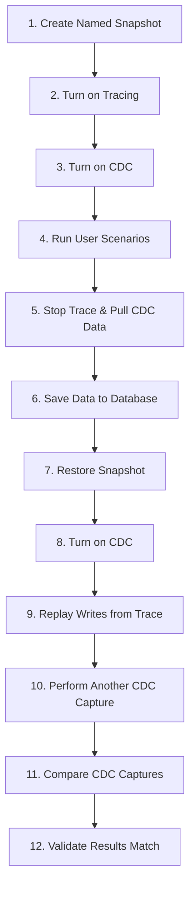

# Usage Examples and Workflows

## Overview

This document provides practical examples and workflows for using the CDC Testing Framework in various scenarios. These examples demonstrate how to implement the repeatable testing environment concept described in the project's research goals.

## Core Testing Workflow

The fundamental workflow implements the 12-step process outlined in the project requirements:

### Complete Testing Cycle



## Example 1: Basic Performance Optimization Testing

This example demonstrates testing a stored procedure optimization while ensuring data consistency.

### Scenario Setup

You have a stored procedure `sp_ProcessOrders` that you want to optimize. You need to ensure the optimized version produces identical data changes.

### Step-by-Step Implementation

#### 1. Database Snapshot Creation

```sql
-- Create a named snapshot of your test database
CREATE DATABASE TestDB_Snapshot ON
(NAME = 'TestDB', FILENAME = 'C:\Snapshots\TestDB_Snapshot.ss')
AS SNAPSHOT OF TestDB;
```

#### 2. Initialize CDC

```bash
cd cdc-proto
dotnet run -- init
```

#### 3. Run Baseline Scenario

```sql
-- Execute your original stored procedure
EXEC sp_ProcessOrders @StartDate = '2024-01-01', @EndDate = '2024-01-31';
```

#### 4. Capture Baseline Profile

```bash
dotnet run -- profile -out baseline-original.json
```

#### 5. Restore Database from Snapshot

```sql
-- Restore database from snapshot
USE master;
ALTER DATABASE TestDB SET SINGLE_USER WITH ROLLBACK IMMEDIATE;
RESTORE DATABASE TestDB FROM DATABASE_SNAPSHOT = 'TestDB_Snapshot';
ALTER DATABASE TestDB SET MULTI_USER;
```

#### 6. Re-initialize CDC

```bash
dotnet run -- init
```

#### 7. Run Optimized Scenario

```sql
-- Execute your optimized stored procedure
EXEC sp_ProcessOrders_Optimized @StartDate = '2024-01-01', @EndDate = '2024-01-31';
```

#### 8. Capture Optimized Profile

```bash
dotnet run -- profile -out baseline-optimized.json
```

#### 9. Compare Results

```bash
dotnet run -- diff -left baseline-original.json -right baseline-optimized.json -out optimization-comparison.json
```

#### 10. Analyze Results

```bash
# Check if there are any differences (should be empty for identical results)
jq '.[] | select(.diff | length > 0)' optimization-comparison.json
```

### Expected Outcome

If the optimization is correct, the comparison should show no differences in the actual data changes, only in CDC metadata fields like timestamps.

## Example 2: Multi-Scenario Testing with Docker

This example uses Docker containers for rapid database reset cycles.

### Docker Setup

```bash
# Create a custom SQL Server image with your test data
cat > Dockerfile << EOF
FROM mcr.microsoft.com/mssql/server:2019-latest
COPY init-scripts/ /opt/mssql-tools/bin/
EOF

# Build the image
docker build -t test-sqlserver .

# Run container
docker run -e "ACCEPT_EULA=Y" -e "SA_PASSWORD=TestPass123!" \
  -p 1433:1433 --name test-db -d test-sqlserver
```

### Automated Testing Script

```bash
#!/bin/bash
# automated-cdc-test.sh

SCENARIOS=("scenario1" "scenario2" "scenario3")
CONTAINER_NAME="test-db"

for scenario in "${SCENARIOS[@]}"; do
    echo "Testing scenario: $scenario"

    # Reset container
    docker stop $CONTAINER_NAME
    docker rm $CONTAINER_NAME
    docker run -e "ACCEPT_EULA=Y" -e "SA_PASSWORD=TestPass123!" \
      -p 1433:1433 --name $CONTAINER_NAME -d test-sqlserver

    # Wait for SQL Server to be ready
    sleep 30

    # Initialize CDC
    dotnet run --project cdc-proto -- init

    # Run scenario
    ./run-scenario.sh $scenario

    # Generate profile
    dotnet run --project cdc-proto -- profile -out "profile-$scenario.json"

    echo "Completed scenario: $scenario"
done

# Compare all scenarios
dotnet run --project cdc-proto -- diff \
  -left profile-scenario1.json \
  -right profile-scenario2.json \
  -out scenario1-vs-scenario2.json
```

## Example 3: Web API Integration Testing

This example shows how to use the Web API for automated testing in CI/CD pipelines.

### CI/CD Pipeline Configuration (Azure DevOps)

```yaml
# azure-pipelines.yml
trigger:
  - main

pool:
  vmImage: "windows-latest"

variables:
  buildConfiguration: "Release"

stages:
  - stage: Build
    jobs:
      - job: Build
        steps:
          - task: DotNetCoreCLI@2
            displayName: "Restore packages"
            inputs:
              command: "restore"
              projects: "**/*.csproj"

          - task: DotNetCoreCLI@2
            displayName: "Build solution"
            inputs:
              command: "build"
              projects: "**/*.csproj"
              arguments: "--configuration $(buildConfiguration)"

  - stage: Test
    jobs:
      - job: CDCTests
        steps:
          - task: DockerCompose@0
            displayName: "Start SQL Server"
            inputs:
              containerregistrytype: "Container Registry"
              dockerComposeFile: "docker-compose.test.yml"
              action: "Run services"

          - task: DotNetCoreCLI@2
            displayName: "Start CDC API"
            inputs:
              command: "run"
              projects: "cdc-api/cdc-api.csproj"
              arguments: "--urls http://localhost:5000"
            condition: succeededOrFailed()

          - task: PowerShell@2
            displayName: "Run CDC Tests"
            inputs:
              targetType: "inline"
              script: |
                # Reset database via API
                Invoke-RestMethod -Uri "http://localhost:5000/Cdc" -Method Post

                # Initialize CDC via CLI
                dotnet run --project cdc-proto -- init

                # Run test scenarios
                ./scripts/run-test-scenarios.ps1

                # Generate and compare profiles
                dotnet run --project cdc-proto -- profile -out test-profile.json

                # Validate results
                $profile = Get-Content test-profile.json | ConvertFrom-Json
                if ($profile.PSObject.Properties.Count -eq 0) {
                    Write-Error "No CDC data captured"
                    exit 1
                }
```

### PowerShell Test Script

```powershell
# scripts/run-test-scenarios.ps1

param(
    [string]$ApiUrl = "http://localhost:5000",
    [string]$DatabaseConnection = "Server=localhost;Database=TestDB;User Id=sa;Password=TestPass123!;"
)

function Invoke-CdcOperation {
    param([string]$Operation, [hashtable]$Parameters = @{})

    $body = $Parameters | ConvertTo-Json
    $response = Invoke-RestMethod -Uri "$ApiUrl/Cdc/$Operation" -Method Post -Body $body -ContentType "application/json"
    return $response
}

function Test-Scenario {
    param([string]$ScenarioName, [scriptblock]$ScenarioCode)

    Write-Host "Running scenario: $ScenarioName"

    # Reset database
    Invoke-CdcOperation -Operation "reset"
    Start-Sleep -Seconds 10

    # Initialize CDC
    & dotnet run --project ../cdc-proto -- init

    # Execute scenario
    & $ScenarioCode

    # Generate profile
    $profileFile = "profile-$ScenarioName.json"
    & dotnet run --project ../cdc-proto -- profile -out $profileFile

    Write-Host "Completed scenario: $ScenarioName"
    return $profileFile
}

# Define test scenarios
$scenarios = @{
    "OrderProcessing" = {
        # Simulate order processing workflow
        Invoke-Sqlcmd -ConnectionString $DatabaseConnection -Query @"
            INSERT INTO Orders (CustomerID, TotalAmount) VALUES (1, 1500.00);
            UPDATE Orders SET Status = 'Processing' WHERE Status = 'Pending';
            DELETE FROM Orders WHERE TotalAmount < 100;
"@
    }

    "CustomerUpdates" = {
        # Simulate customer data updates
        Invoke-Sqlcmd -ConnectionString $DatabaseConnection -Query @"
            UPDATE Customers SET Email = 'newemail@domain.com' WHERE CustomerID = 1;
            INSERT INTO Customers (CustomerName, Email) VALUES ('New Customer', 'new@customer.com');
"@
    }
}

# Run all scenarios
$profileFiles = @()
foreach ($scenario in $scenarios.GetEnumerator()) {
    $profileFile = Test-Scenario -ScenarioName $scenario.Key -ScenarioCode $scenario.Value
    $profileFiles += $profileFile
}

# Compare scenarios
if ($profileFiles.Count -ge 2) {
    & dotnet run --project ../cdc-proto -- diff -left $profileFiles[0] -right $profileFiles[1] -out scenario-comparison.json

    # Analyze differences
    $differences = Get-Content scenario-comparison.json | ConvertFrom-Json
    $diffCount = ($differences.PSObject.Properties | Measure-Object).Count

    Write-Host "Found $diffCount table(s) with differences"

    if ($diffCount -gt 0) {
        Write-Host "Differences detected between scenarios - this may be expected"
        $differences | ConvertTo-Json -Depth 10 | Write-Host
    }
}
```

## Example 4: MAUI Application Workflow

This example demonstrates using the desktop application for interactive testing.

### Interactive Testing Session

```csharp
// Enhanced MainPage.xaml.cs for workflow support
public partial class MainPage : ContentPage
{
    private List<string> _profileHistory = new List<string>();
    private string _currentWorkflow = "";

    private async void OnStartWorkflow(object sender, EventArgs e)
    {
        _currentWorkflow = workflowNameEntry.Text;
        if (string.IsNullOrWhiteSpace(_currentWorkflow))
        {
            await DisplayAlert("Error", "Please enter a workflow name", "OK");
            return;
        }

        try
        {
            // Reset database if needed
            if (resetDatabaseSwitch.IsToggled)
            {
                await ResetDatabase();
            }

            // Initialize CDC
            await InitializeCdc();

            // Update UI
            workflowStatusLabel.Text = $"Workflow '{_currentWorkflow}' started - ready for testing";
            captureProfileButton.IsEnabled = true;

        }
        catch (Exception ex)
        {
            await DisplayAlert("Error", $"Failed to start workflow: {ex.Message}", "OK");
        }
    }

    private async void OnCaptureProfile(object sender, EventArgs e)
    {
        try
        {
            var timestamp = DateTime.Now.ToString("yyyyMMdd-HHmmss");
            var profileName = $"{_currentWorkflow}-{timestamp}";

            // Generate profile
            var profile = await GenerateProfile();

            // Save profile
            var fileName = $"{profileName}.json";
            var filePath = Path.Combine(FileSystem.AppDataDirectory, fileName);
            await File.WriteAllTextAsync(filePath, profile.ToJson(true));

            // Add to history
            _profileHistory.Add(fileName);
            UpdateProfileHistory();

            await DisplayAlert("Success", $"Profile captured: {fileName}", "OK");

        }
        catch (Exception ex)
        {
            await DisplayAlert("Error", $"Failed to capture profile: {ex.Message}", "OK");
        }
    }

    private async void OnCompareProfiles(object sender, EventArgs e)
    {
        if (_profileHistory.Count < 2)
        {
            await DisplayAlert("Error", "Need at least 2 profiles to compare", "OK");
            return;
        }

        // Show profile selection dialog
        var leftProfile = await DisplayActionSheet("Select baseline profile", "Cancel", null, _profileHistory.ToArray());
        if (leftProfile == "Cancel") return;

        var rightProfile = await DisplayActionSheet("Select comparison profile", "Cancel", null, _profileHistory.ToArray());
        if (rightProfile == "Cancel") return;

        try
        {
            // Load profiles
            var leftPath = Path.Combine(FileSystem.AppDataDirectory, leftProfile);
            var rightPath = Path.Combine(FileSystem.AppDataDirectory, rightProfile);

            var leftData = File.ReadAllText(leftPath).FromJson<IDictionary<string, IEnumerable<IDictionary<string, object>>>>();
            var rightData = File.ReadAllText(rightPath).FromJson<IDictionary<string, IEnumerable<IDictionary<string, object>>>>();

            // Compare profiles
            var tables = await GetTables();
            var differ = new ProfileDiffer();
            var differences = differ.Diff(tables, leftData, rightData);

            // Save comparison
            var comparisonFile = $"comparison-{DateTime.Now:yyyyMMdd-HHmmss}.json";
            var comparisonPath = Path.Combine(FileSystem.AppDataDirectory, comparisonFile);
            await File.WriteAllTextAsync(comparisonPath, differences.ToJson(true));

            // Show results
            var diffCount = differences.Values.Sum(v => ((List<Diff>)((IDictionary<string, object>)v)["diff"]).Count);
            await DisplayAlert("Comparison Complete",
                $"Found {diffCount} differences\nSaved as: {comparisonFile}", "OK");

        }
        catch (Exception ex)
        {
            await DisplayAlert("Error", $"Failed to compare profiles: {ex.Message}", "OK");
        }
    }
}
```

## Example 5: Batch Processing with Multiple Databases

This example shows how to test changes across multiple database environments.

### Multi-Database Testing Script

```bash
#!/bin/bash
# multi-db-test.sh

DATABASES=("TestDB_Dev" "TestDB_Staging" "TestDB_Prod_Copy")
SERVERS=("dev-server" "staging-server" "prod-copy-server")
TEST_SCENARIO="quarterly-report-optimization"

for i in "${!DATABASES[@]}"; do
    db="${DATABASES[$i]}"
    server="${SERVERS[$i]}"

    echo "Testing on $server/$db"

    # Update connection string for current database
    sed -i "s/Server=.*/Server=$server;Database=$db;/" cdc-proto/Program.cs

    # Rebuild with new connection string
    dotnet build cdc-proto/

    # Initialize CDC
    dotnet run --project cdc-proto -- init

    # Run test scenario
    sqlcmd -S $server -d $db -i "test-scenarios/$TEST_SCENARIO.sql"

    # Generate profile
    dotnet run --project cdc-proto -- profile -out "profile-$db.json"

    # Cleanup
    dotnet run --project cdc-proto -- teardown

    echo "Completed testing on $server/$db"
done

# Compare results across environments
echo "Comparing results across environments..."

# Dev vs Staging
dotnet run --project cdc-proto -- diff \
  -left profile-TestDB_Dev.json \
  -right profile-TestDB_Staging.json \
  -out dev-vs-staging.json

# Staging vs Prod Copy
dotnet run --project cdc-proto -- diff \
  -left profile-TestDB_Staging.json \
  -right profile-TestDB_Prod_Copy.json \
  -out staging-vs-prod.json

echo "Multi-database testing complete"
```

## Example 6: Performance Regression Testing

This example demonstrates how to detect performance regressions while ensuring data consistency.

### Performance Testing Workflow

```csharp
// PerformanceTestRunner.cs
public class PerformanceTestRunner
{
    private readonly SimpleDac _dac;
    private readonly ILogger _logger;

    public async Task<PerformanceTestResult> RunPerformanceTest(
        string testName,
        Func<Task> testAction,
        string baselineProfilePath = null)
    {
        var stopwatch = Stopwatch.StartNew();
        var startTime = DateTime.UtcNow;

        try
        {
            // Initialize CDC
            CdcDataUtilities.EnableCdcOnDatabase(_dac);
            var tables = CdcDataUtilities.GetTables(_dac);
            CdcDataUtilities.EnableTableCdc(_dac, tables, _logger);

            // Run the test action
            await testAction();

            stopwatch.Stop();

            // Generate profile
            var profile = CdcDataUtilities.BuildNetProfile(_dac, tables, _logger);
            var profileJson = profile.ToJson(true);

            // Save current profile
            var currentProfilePath = $"profile-{testName}-{DateTime.Now:yyyyMMdd-HHmmss}.json";
            await File.WriteAllTextAsync(currentProfilePath, profileJson);

            var result = new PerformanceTestResult
            {
                TestName = testName,
                ExecutionTime = stopwatch.Elapsed,
                StartTime = startTime,
                EndTime = DateTime.UtcNow,
                ProfilePath = currentProfilePath,
                Success = true
            };

            // Compare with baseline if provided
            if (!string.IsNullOrEmpty(baselineProfilePath) && File.Exists(baselineProfilePath))
            {
                result.BaselineComparison = await CompareWithBaseline(
                    baselineProfilePath, currentProfilePath, tables);
            }

            return result;
        }
        catch (Exception ex)
        {
            stopwatch.Stop();
            return new PerformanceTestResult
            {
                TestName = testName,
                ExecutionTime = stopwatch.Elapsed,
                StartTime = startTime,
                EndTime = DateTime.UtcNow,
                Success = false,
                Error = ex.Message
            };
        }
        finally
        {
            // Cleanup CDC
            try
            {
                CdcDataUtilities.DisableCdcOnDatabase(_dac);
            }
            catch (Exception ex)
            {
                _logger.LogWarning(ex, "Failed to cleanup CDC");
            }
        }
    }

    private async Task<BaselineComparison> CompareWithBaseline(
        string baselineProfilePath,
        string currentProfilePath,
        IEnumerable<SqlTable> tables)
    {
        var baselineProfile = (await File.ReadAllTextAsync(baselineProfilePath))
            .FromJson<IDictionary<string, IEnumerable<IDictionary<string, object>>>>();
        var currentProfile = (await File.ReadAllTextAsync(currentProfilePath))
            .FromJson<IDictionary<string, IEnumerable<IDictionary<string, object>>>>();

        var differ = new ProfileDiffer();
        var differences = differ.Diff(tables, baselineProfile, currentProfile);

        var comparisonPath = $"comparison-{DateTime.Now:yyyyMMdd-HHmmss}.json";
        await File.WriteAllTextAsync(comparisonPath, differences.ToJson(true));

        var totalDifferences = differences.Values
            .Sum(v => ((List<Diff>)((IDictionary<string, object>)v)["diff"]).Count);

        return new BaselineComparison
        {
            BaselineProfilePath = baselineProfilePath,
            CurrentProfilePath = currentProfilePath,
            ComparisonPath = comparisonPath,
            TotalDifferences = totalDifferences,
            IsIdentical = totalDifferences == 0
        };
    }
}

public class PerformanceTestResult
{
    public string TestName { get; set; }
    public TimeSpan ExecutionTime { get; set; }
    public DateTime StartTime { get; set; }
    public DateTime EndTime { get; set; }
    public string ProfilePath { get; set; }
    public bool Success { get; set; }
    public string Error { get; set; }
    public BaselineComparison BaselineComparison { get; set; }
}

public class BaselineComparison
{
    public string BaselineProfilePath { get; set; }
    public string CurrentProfilePath { get; set; }
    public string ComparisonPath { get; set; }
    public int TotalDifferences { get; set; }
    public bool IsIdentical { get; set; }
}
```

### Usage Example

```csharp
// Program.cs for performance testing
class Program
{
    static async Task Main(string[] args)
    {
        var connectionString = "Server=localhost;Database=TestDB;Integrated Security=true;";
        var loggerFactory = LoggerFactory.Create(builder => builder.AddConsole());
        var logger = loggerFactory.CreateLogger<Program>();
        var dac = new SimpleDac(connectionString, logger);

        var testRunner = new PerformanceTestRunner(dac, logger);

        // Test original implementation
        var originalResult = await testRunner.RunPerformanceTest(
            "original-implementation",
            async () =>
            {
                // Run original stored procedure
                await dac.ExecuteCommandAsync("EXEC sp_GenerateQuarterlyReport @Year = 2024, @Quarter = 1");
            });

        Console.WriteLine($"Original implementation: {originalResult.ExecutionTime.TotalSeconds:F2} seconds");

        // Reset database state here (restore from snapshot)

        // Test optimized implementation
        var optimizedResult = await testRunner.RunPerformanceTest(
            "optimized-implementation",
            async () =>
            {
                // Run optimized stored procedure
                await dac.ExecuteCommandAsync("EXEC sp_GenerateQuarterlyReport_Optimized @Year = 2024, @Quarter = 1");
            },
            originalResult.ProfilePath); // Compare with original

        Console.WriteLine($"Optimized implementation: {optimizedResult.ExecutionTime.TotalSeconds:F2} seconds");

        if (optimizedResult.BaselineComparison != null)
        {
            if (optimizedResult.BaselineComparison.IsIdentical)
            {
                var improvement = originalResult.ExecutionTime.TotalSeconds - optimizedResult.ExecutionTime.TotalSeconds;
                var improvementPercent = (improvement / originalResult.ExecutionTime.TotalSeconds) * 100;

                Console.WriteLine($"✅ Data consistency verified!");
                Console.WriteLine($"⚡ Performance improvement: {improvement:F2} seconds ({improvementPercent:F1}%)");
            }
            else
            {
                Console.WriteLine($"❌ Data inconsistency detected: {optimizedResult.BaselineComparison.TotalDifferences} differences");
                Console.WriteLine($"📄 See comparison file: {optimizedResult.BaselineComparison.ComparisonPath}");
            }
        }
    }
}
```

## Best Practices

### 1. Snapshot Management

- Create snapshots before each test cycle
- Use descriptive snapshot names with timestamps
- Clean up old snapshots regularly to save disk space

### 2. Profile Organization

- Use consistent naming conventions for profiles
- Include timestamps and scenario descriptions
- Store profiles in organized directory structures

### 3. Difference Analysis

- Always exclude CDC system fields from comparisons
- Consider time-sensitive fields that may legitimately differ
- Document expected differences for complex scenarios

### 4. Performance Considerations

- Monitor CDC overhead on production-like systems
- Use appropriate hardware for performance testing
- Consider network latency in distributed scenarios

### 5. Automation

- Integrate CDC testing into CI/CD pipelines
- Use configuration files for different environments
- Implement proper error handling and logging

These examples provide a comprehensive foundation for implementing CDC-based testing workflows in various scenarios, from simple optimization validation to complex multi-environment testing strategies.
