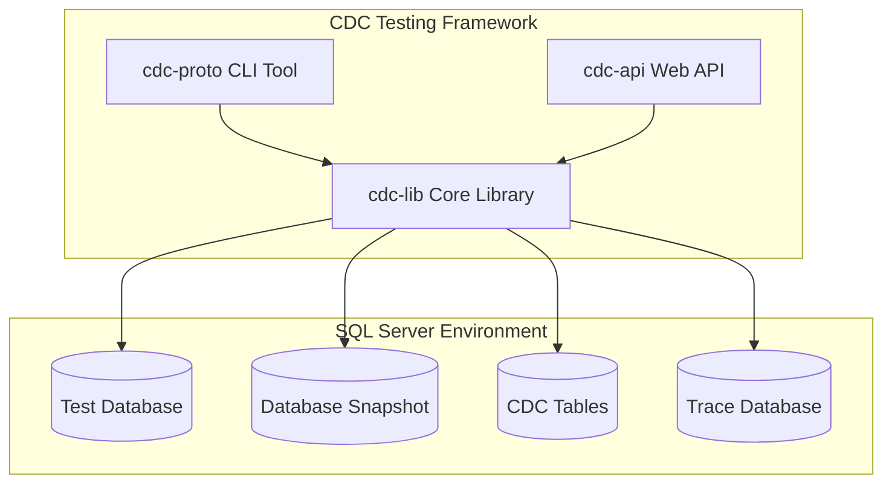

# CDC Testing Framework

> **Note**
>
> This is a research project used to explore what's possible in Microsoft SQL Server using **Snapshots**, **CDC**, and **Traces**.
> The project was started by a human, but the bots have taken over — all new code is AI-generated. The project is not fully functional and is only marginally useful.
>
> **⚠️ SECURITY WARNING - INTERNAL USE ONLY ⚠️**
>
> **cdcme** is intended as **internal tooling** operating against **disposable test resources only**.
>
> **Security Limitations:**
>
> - ❌ **NO AUTHENTICATION** - API endpoints are completely unprotected
> - ❌ **NO AUTHORIZATION** - Anyone with network access can execute operations
> - ❌ **NOT FOR PRODUCTION** - Do not connect to production databases or databases with sensitive data
> - ❌ **NOT EXTERNALLY EXPOSED** - Must run on isolated internal networks only
> - ⚠️ **SQL INJECTION PROTECTIONS** - While SQL injection vulnerabilities have been mitigated, this tool should still only be used in controlled environments
>
> **Recommended Security Practices:**
>
> - Run only on isolated development/test networks
> - Use strong, unique passwords (see `.env.example` for guidance)
> - Never expose the API to the internet
> - Only connect to disposable test databases
> - Implement network-level access controls (firewall rules, VPNs)
> - Consider adding authentication before any broader deployment
>
> **Tested so far:**
>
> - **Snapshots**: create, restore, delete, list
> - **Trace**: enable/disable and persist traces to the `cdcme` database
> - **CDC**: enable/disable and compare two captures
>   - **Pass**: captures are identical
>   - **Fail**: differences detected

A comprehensive .NET solution for database change validation using SQL Server's Change Data Capture (CDC) functionality. This framework enables teams to create repeatable testing environments for validating data consistency across different implementations, optimizations, and database changes.

## Quick Start

### Prerequisites

- .NET 9.0 SDK or later
- Docker (for running SQL Server)
- Git

### Setup for Development

1. **Clone the repository**
   ```bash
   git clone <repository-url>
   cd cdc-me
   ```

2. **Set up local linting** (prevents CI failures)
   ```bash
   # The pre-commit hook is already installed
   # Just make sure it's executable
   chmod +x .git/hooks/pre-commit
   
   # Test the lint check
   ./scripts/lint-check.sh
   ```

3. **Configure your editor** - See [Local Lint Setup Guide](docs/local-lint-setup.md)

4. **Start development**
   ```bash
   # Format code automatically
   dotnet format cdc-me.sln
   
   # Build and test
   dotnet build cdc-me.sln
   dotnet test cdc-me.sln
   ```

📖 **Important:** Read the [Local Lint Setup Guide](docs/local-lint-setup.md) to ensure you catch all lint failures locally before creating PRs.

## Use Case

The initial use case was developed to support entire rewrites of stored procedures. The basic idea is:

1. Capture a snapshot
2. Turn on CDC
3. Run your test workload against the test database with the original proc
4. Turn off CDC and capture the change data
5. refactor the proc
6. restore the snapshot
7. apply the refactored proc
8. Turn on CDC
9. Run your workload against the database with the rewritten proc applied
10. Turn off CDC and capture the change data
11. Run the CDC endpoint to compare the old and new captured data. The endpoint expects identical captures and will pass/fails based upon that

## 🎯 Project Overview

The CDC Testing Framework implements a sophisticated workflow for database testing that captures, replays, and compares database changes to ensure data consistency. Originally developed as research into building repeatable testing environments, it provides tools for:

- **Database Change Capture**: Monitor and record all data modifications using SQL Server CDC
- **Profile Generation**: Create detailed snapshots of database changes for analysis
- **Change Comparison**: Compare profiles to identify differences and validate consistency
- **Performance Testing**: Ensure optimizations maintain data integrity while improving performance
- **Automated Workflows**: Support for CI/CD integration and automated testing scenarios

## 🏗️ Architecture

The framework consists of four main components:



### Components

- **[`cdc-lib`](docs/cdc-library.md)** - Core library with CDC operations, data models, and utilities
- **[`cdc-proto`](docs/cli-tool.md)** - Command-line interface for CDC operations
- **[`cdc-api`](docs/web-api.md)** - RESTful Web API for HTTP-based CDC operations

## 🚀 Quick Start

### Prerequisites

**Option 1: Docker (Recommended)**

- **Docker**: Version 20.10 or later
- **Docker Compose**: Version 2.0 or later
- **System**: 4GB RAM minimum (8GB recommended)

**Option 2: Local Development**

- **.NET 9.0** or later
- **SQL Server 2016+** (Standard/Enterprise/Developer Edition)
- **SQL Server Agent** (must be running)
- **PostgreSQL 16+** (for trace database)

### Installation

#### Using Docker Compose (Recommended)

1. **Clone the repository:**

```bash
git clone <repository-url>
cd cdc-me
```

2. **Configure environment:**

```bash
# Copy environment template
cp .env.example .env

# Edit .env with your settings (optional, defaults work for local development)
nano .env
```

3. **Start all services:**

```bash
# Production mode
docker-compose up -d

# Development mode (with hot-reload and pgAdmin)
docker-compose -f docker-compose.dev.yml up -d
```

4. **Verify services are running:**

```bash
# Check container status
docker-compose ps

# Test API
curl http://localhost:8080/health

# View logs
docker-compose logs -f cdc-api
```

5. **Access the application:**

- **API**: http://localhost:8080
- **Swagger UI**: http://localhost:8080/swagger
- **pgAdmin** (dev only): http://localhost:5050

**See the [Docker Guide](docs/docker.md) for detailed Docker usage, troubleshooting, and advanced configurations.**

#### Local Development Setup

1. **Clone the repository:**

```bash
git clone <repository-url>
cd cdc-me
```

2. **Restore dependencies:**

```bash
dotnet restore
```

3. **Build the solution:**

```bash
dotnet build
```

4. **Set up your databases:**

```sql
-- SQL Server: Create test database
CREATE DATABASE CdcTestDB;

-- Enable CDC
USE CdcTestDB;
EXEC sys.sp_cdc_enable_db;
```

```sql
-- PostgreSQL: Create trace database
CREATE DATABASE cdcme;

-- Run initialization script
\i scripts/create-trace-database-postgresql.sql
```

5. **Configure connection strings:**

Update [`cdc-api/appsettings.json`](cdc-api/appsettings.json) or set environment variables:

```bash
export TEST_DB_CONNECTION="Server=localhost;Database=CdcTestDB;User Id=sa;Password=YourPassword;TrustServerCertificate=true;"
export CDCME_DB_CONNECTION="Host=localhost;Database=cdcme;Username=cdcme;Password=your_password"
```

### Basic Usage

#### Using the CLI Tool

```bash
# Navigate to CLI project
cd cdc-proto

# Initialize CDC on your database
dotnet run -- init

# Make some data changes in your database...

# Generate a profile
dotnet run -- profile -out baseline.json

# Make more changes or run optimized procedures...

# Generate comparison profile
dotnet run -- profile -out optimized.json

# Compare the profiles
dotnet run -- diff -left baseline.json -right optimized.json -out differences.json

# Clean up
dotnet run -- teardown
```

#### Using the Web API

```bash
# Start the API
cd cdc-api
dotnet run

# Access Swagger UI
# Navigate to: https://localhost:7297/swagger
```

## 📖 Documentation

### Getting Started

- **[Getting Started Guide](docs/getting-started.md)** - Complete setup and first-run instructions
- **[Docker Guide](docs/docker.md)** - Docker and Docker Compose usage
- **[Database Setup](docs/database-setup.md)** - SQL Server and CDC configuration
- **[Usage Examples](docs/usage-examples.md)** - Practical workflows and scenarios

### Component Documentation

- **[Architecture Overview](docs/architecture.md)** - System design and component relationships
- **[CDC Library](docs/cdc-library.md)** - Core library API and functionality
- **[CLI Tool](docs/cli-tool.md)** - Command-line interface reference
- **[Web API](docs/web-api.md)** - REST API endpoints and usage

### Deployment & Operations

- **[Docker Guide](docs/docker.md)** - Container deployment and orchestration
- **[Deployment](docs/deployment.md)** - Production deployment strategies
- **[Troubleshooting](docs/troubleshooting.md)** - Common issues and solutions

## 🔄 Core Workflow

The framework implements a 12-step testing workflow:

1. **Create Named Snapshot** - Establish baseline database state
2. **Turn on Tracing** - Enable SQL Server tracing (planned feature)
3. **Turn on CDC** - Enable Change Data Capture
4. **Run User Scenarios** - Execute test workflows
5. **Stop Trace & Pull CDC Data** - Capture change data
6. **Save Data to Database** - Store captured changes
7. **Restore Snapshot** - Reset to baseline state
8. **Turn on CDC** - Re-enable CDC
9. **Replay Writes from Trace** - Replay captured operations (planned)
10. **Perform Another CDC Capture** - Generate comparison data
11. **Compare CDC Captures** - Analyze differences
12. **Validate Results Match** - Ensure data consistency

## 💡 Use Cases

### Performance Optimization Testing

Validate that stored procedure optimizations produce identical results:

```bash
# Capture baseline with original procedure
dotnet run -- init
# Run original procedure...
dotnet run -- profile -out original.json

# Reset database and test optimized version
# Restore database snapshot...
dotnet run -- init
# Run optimized procedure...
dotnet run -- profile -out optimized.json

# Compare results
dotnet run -- diff -left original.json -right optimized.json -out comparison.json
```

### Multi-Environment Validation

Ensure consistency across development, staging, and production environments:

```bash
# Test across multiple database environments
for env in dev staging prod; do
    # Update connection string for environment
    dotnet run -- init
    # Run test scenarios...
    dotnet run -- profile -out "profile-$env.json"
done

# Compare environments
dotnet run -- diff -left profile-dev.json -right profile-staging.json -out dev-vs-staging.json
```

### Regression Testing

Detect unintended data changes in application updates:

```bash
# Capture baseline before changes
dotnet run -- profile -out before-update.json

# Deploy application changes...
# Run test scenarios...

# Capture post-change profile
dotnet run -- profile -out after-update.json

# Identify any unintended changes
dotnet run -- diff -left before-update.json -right after-update.json -out regression-check.json
```

## 🛠️ Development

### Building from Source

```bash
# Clone repository
git clone <repository-url>
cd cdc-me

# Restore packages
dotnet restore

# Build all projects
dotnet build

# Run tests (when available)
dotnet test
```

### Project Structure

```
cdc-me/
├── cdc-lib/           # Core CDC library
├── cdc-proto/         # CLI application
├── cdc-api/           # Web API
├── docs/              # Documentation
└── readme.md          # This file
```

### Contributing

1. Fork the repository
2. Create a feature branch
3. Make your changes
4. Add tests for new functionality
5. Update documentation
6. Submit a pull request

## 🔧 Configuration

### Connection Strings

Update connection strings in each component:

**CLI Tool** (`cdc-proto/Program.cs`):

```csharp
var connectionString = "Server=localhost;Database=YourDB;User Id=sa;Password=YourPassword;TrustServerCertificate=true;";
```

**Web API** (`cdc-api/appsettings.json`):

```json
{
  "ConnectionStrings": {
    "DefaultConnection": "Server=localhost;Database=YourDB;User Id=sa;Password=YourPassword;TrustServerCertificate=true;"
  }
}
```

## 📊 Features

### Current Features

- ✅ Database CDC enablement and management
- ✅ Change data capture and profiling
- ✅ Profile comparison and difference analysis
- ✅ Command-line interface with multiple commands
- ✅ RESTful Web API
- ✅ JSON-based profile storage and exchange
- ✅ Comprehensive error handling and logging

### Planned Features

- 🔄 SQL Server trace integration
- 🔄 Automated trace replay functionality
- 🔄 Database snapshot management
- 🔄 Enhanced Web API endpoints
- 🔄 Real-time CDC monitoring
- 🔄 Performance metrics collection
- 🔄 CI/CD pipeline integration
- 🔄 Cloud storage integration

## 🐛 Troubleshooting

### Common Issues

**"CDC is not enabled for database"**

```sql
-- Enable CDC on your database
USE YourDatabase;
EXEC sys.sp_cdc_enable_db;
```

**"Login failed for user"**

```sql
-- Create user and grant permissions
CREATE LOGIN cdc_user WITH PASSWORD = 'YourPassword';
USE YourDatabase;
CREATE USER cdc_user FOR LOGIN cdc_user;
ALTER ROLE db_owner ADD MEMBER cdc_user;
```

**"Table does not have a primary key"**

```sql
-- Add primary key to table
ALTER TABLE YourTable ADD ID int IDENTITY(1,1) PRIMARY KEY;
```

For more detailed troubleshooting, see the [Troubleshooting Guide](docs/troubleshooting.md).

## 📋 Requirements

### SQL Server Requirements

- **Version**: SQL Server 2016 or later
- **Edition**: Standard, Enterprise, or Developer (CDC not available in Express)
- **Services**: SQL Server Agent must be running
- **Permissions**: `db_owner` role or specific CDC permissions

### .NET Requirements

- **.NET SDK**: 6.0 or later
- **Frameworks**:
  - .NET 6.0 (CLI, API, Library)

### Platform Support

- **Windows**: Full support (all components)
- **macOS**: CLI, API, Library
- **Linux**: CLI, API, Library

## 📄 License

This project is licensed under the MIT License - see the [LICENSE](LICENSE) file for details.

## 🤝 Support

- **Documentation**: Check the [`docs/`](docs/) folder for detailed guides
- **Issues**: Report bugs and request features via GitHub Issues
- **Discussions**: Join community discussions for questions and ideas

## 🔗 Related Resources

- [SQL Server Change Data Capture Documentation](https://docs.microsoft.com/en-us/sql/relational-databases/track-changes/about-change-data-capture-sql-server)
- [ASP.NET Core Web API Documentation](https://docs.microsoft.com/en-us/aspnet/core/web-api/)
- [System.CommandLine Documentation](https://docs.microsoft.com/en-us/dotnet/standard/commandline/)

---

**Note**: This is a research project exploring repeatable database testing environments. While functional, it's designed for development and testing scenarios rather than production use without proper evaluation and testing in your specific environment.
